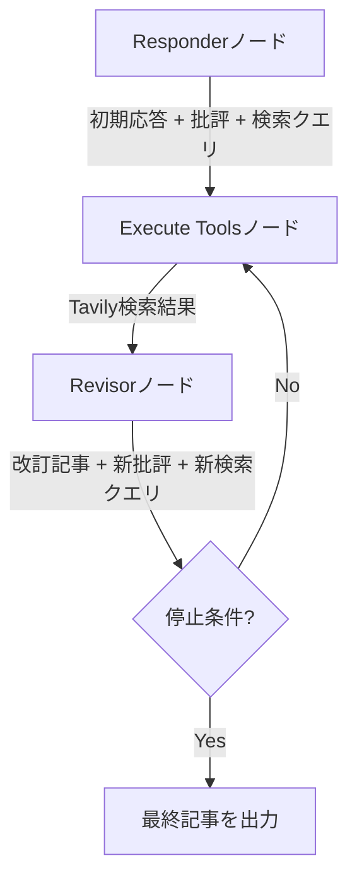

import Quiz from '@/components/content/Quiz.astro'

## 概要

このレクチャーでは，Reflexionエージェントの概要を説明します．前セクションのReflectionエージェントを拡張し，検索ツールによるリアルタイムデータ取得と高度なプロンプトエンジニアリングを組み合わせたアーキテクチャです．

## Reflexionとは

Reflexion論文（Northeastern大，MIT，Princeton大の共同研究）に基づくアーキテクチャです．批評を生成するだけでなく，その批評を実際に活用してLLMの出力を改善する高度な手法です．

## プロジェクトの目標

- 与えられたトピックについて詳細な記事を生成
- Webからリアルタイム情報を動的に取得
- 参照データの引用（citations）を含める
- 品質向上のための批評ループを実装

## アーキテクチャ

1. Responderノード: 初期応答の生成 + 批評 + 検索クエリの提案
2. Execute Toolsノード: Tavily検索エンジンで検索クエリを実行
3. Revisorノード: 初期応答 + 批評 + 検索結果を基に記事を改訂
4. サイクル: 改訂→検索→再改訂を停止条件まで繰り返す

## 使用技術

- GPT-4 Turbo: 強力な推論と文章生成
- Function Calling: 構造化出力の取得
- Tavily: LLMに最適化された検索エンジン
- LangSmith: トレーシング

## まとめ

- ReflexionエージェントはReflectionエージェントに検索エンジンを追加した高度なアーキテクチャ
- 批評→検索→改訂のサイクルで品質を継続的に向上
- Function Callingで構造化された出力（記事，批評，検索クエリ）を取得
- 実際のWebデータで記事をグラウンディング（裏付け）する

<Quiz questions={[
  {
    question: "ReflexionエージェントがReflectionエージェントと異なる最大のポイントは何ですか?",
    options: [
      "GPT-4 Turboを使用すること",
      "検索エンジンでリアルタイムデータを取得して記事を裏付けること",
      "Pydanticで出力を構造化すること",
      "LangSmithでトレーシングすること"
    ],
    answer: 1,
    explanation: "Reflexionエージェントは，Reflectionエージェントの批評サイクルに加えて，Tavily検索エンジンを使ったリアルタイムデータ取得で記事をグラウンディング（裏付け）する点が最大の違いです．"
  },
  {
    question: "Reflexion論文の共同研究機関はどれですか?",
    options: [
      "Stanford大，MIT，Google",
      "Northeastern大，MIT，Princeton大",
      "Oxford大，Cambridge大，MIT",
      "Harvard大，MIT，CMU"
    ],
    answer: 1,
    explanation: "Reflexion論文はNortheastern大，MIT，Princeton大の共同研究によるものです．"
  },
  {
    question: "Reflexionエージェントが出力に含める要素でないものはどれですか?",
    options: [
      "詳細な記事本文",
      "参照データの引用（citations）",
      "画像やグラフの自動生成",
      "改善のための批評"
    ],
    answer: 2,
    explanation: "Reflexionエージェントは記事本文，引用，批評，検索クエリを出力しますが，画像やグラフの自動生成は行いません．"
  },
  {
    question: "このプロジェクトで使用する検索エンジンはどれですか?",
    options: [
      "Google Search API",
      "Bing Search API",
      "Tavily",
      "DuckDuckGo"
    ],
    answer: 2,
    explanation: "TavilyはLLMに最適化された検索エンジンで，このプロジェクトではWebからのリアルタイム情報取得に使用されます．"
  },
  {
    question: "Function Callingの役割として正しいものはどれですか?",
    options: [
      "外部APIを直接呼び出す",
      "LLMの出力を構造化された形式で取得する",
      "複数のLLMを並列実行する",
      "検索エンジンの結果をフィルタリングする"
    ],
    answer: 1,
    explanation: "Function Callingは，LLMの出力を構造化されたスキーマ（記事，批評，検索クエリ）に従った形式で取得するために使用されます．"
  }
]} />
