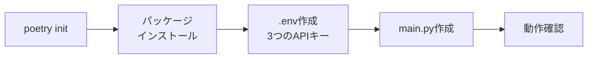

import Quiz from '@/components/content/Quiz.astro'

## 概要

このレクチャーでは，Reflexionエージェントプロジェクトの環境をセットアップします．

## セットアップ手順



### 1. プロジェクト初期化

```bash
mkdir reflexion-agent && cd reflexion-agent
poetry init
```

### 2. 依存パッケージのインストール

```bash
poetry add python-dotenv black isort langchain langchain-openai langgraph
```

### 3. 環境変数の設定（.envファイル）

```
OPENAI_API_KEY=your_key
TAVILY_API_KEY=your_key
LANGCHAIN_API_KEY=your_key
LANGCHAIN_TRACING_V2=true
LANGCHAIN_PROJECT=reflexion-agent
```

- OpenAI: GPT-4 Turbo用
- Tavily: 検索エンジン用
- LangSmith: トレーシング用

### 4. ボイラープレートコード

```python
from dotenv import load_dotenv
load_dotenv()

if __name__ == "__main__":
    print("Hello Reflexion")
```

## まとめ

- Poetryで仮想環境を構築し，必要なパッケージをインストール
- OpenAI，Tavily，LangSmithの3つのAPIキーを設定
- PyCharmでプロジェクトを開き，仮想環境を正しく指定

<Quiz questions={[
  {
    question: "Reflexionエージェントのセットアップで追加で必要なAPIキーはどれですか?",
    options: [
      "Google API キー",
      "Tavily API キー",
      "Anthropic API キー",
      "Hugging Face API キー"
    ],
    answer: 1,
    explanation: "ReflexionエージェントではReflectionエージェントのAPIキーに加えて，検索エンジン用のTavily APIキーが追加で必要です．"
  },
  {
    question: "LANGCHAIN_PROJECTの設定値として適切なものはどれですか?",
    options: [
      "reflection-agent",
      "reflexion-agent",
      "langchain-project",
      "default"
    ],
    answer: 1,
    explanation: "LANGCHAIN_PROJECTはLangSmithでのプロジェクト名の表示に使われ，このプロジェクトではreflexion-agentと設定します．"
  },
  {
    question: "このプロジェクトで必要なAPIキーの数はいくつですか?",
    options: [
      "1つ",
      "2つ",
      "3つ",
      "4つ"
    ],
    answer: 2,
    explanation: "OpenAI APIキー，Tavily APIキー，LangChain APIキーの3つが必要です．"
  },
  {
    question: "Poetry initコマンドの目的は何ですか?",
    options: [
      "Pythonをインストールする",
      "仮想環境を初期化しpyproject.tomlを作成する",
      "依存パッケージを自動検出する",
      "Gitリポジトリを初期化する"
    ],
    answer: 1,
    explanation: "poetry initはPythonプロジェクトの仮想環境を初期化し，依存関係管理のためのpyproject.tomlファイルを作成します．"
  },
  {
    question: "ボイラープレートコードでload_dotenvを呼び出す目的は何ですか?",
    options: [
      "Pythonのバージョンを確認する",
      ".envファイルの環境変数をプロセスに読み込む",
      "依存パッケージを自動更新する",
      "ログファイルを初期化する"
    ],
    answer: 1,
    explanation: "load_dotenvは.envファイルに記述されたAPIキーなどの環境変数をPythonプロセスの環境変数として読み込みます．"
  }
]} />
