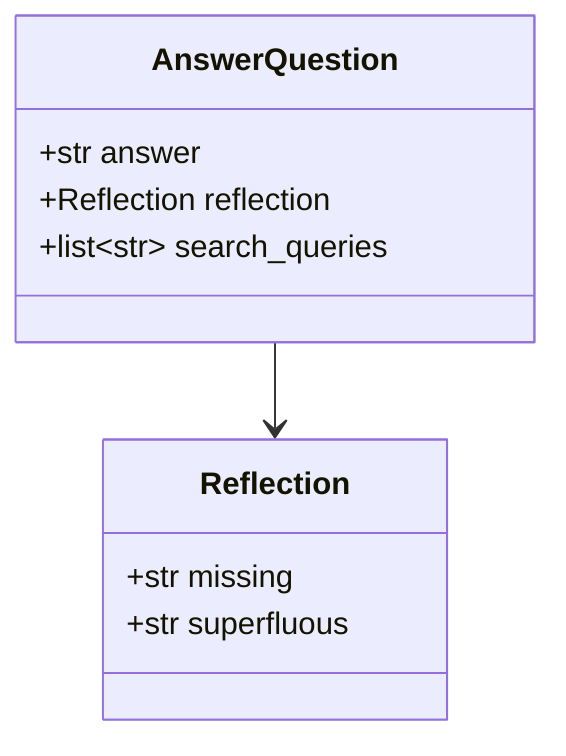

import Quiz from '@/components/content/Quiz.astro'

## 概要

このレクチャーでは，Reflexionエージェントのfirst_responder_chainを実装します．Function Callingを活用した構造化出力とプロンプトエンジニアリングテクニックを学びます．

## プロンプトテンプレート

```python
actor_prompt_template = ChatPromptTemplate.from_messages([
    ("system",
     "You are an expert researcher. "
     "Current time: {time}. "
     "1. {first_instructions}\n"
     "2. Reflect and critique your answer. Be severe to maximize improvement.\n"
     "3. Recommend search queries to research information and improve your answer."),
    MessagesPlaceholder(variable_name="messages"),
]).partial(time=lambda: datetime.datetime.now().isoformat())
```

3つのパートで構成: 回答生成，自己批評，検索クエリ提案

## Pydanticスキーマによる構造化出力



```python
class Reflection(BaseModel):
    missing: str = Field(description="欠落している重要な情報")
    superfluous: str = Field(description="不要な情報")

class AnswerQuestion(BaseModel):
    answer: str = Field(description="250語の回答")
    reflection: Reflection = Field(description="回答に対する振り返り")
    search_queries: list[str] = Field(description="1〜3個の検索クエリ")
```

Pydanticクラスのフィールド説明がLLMの出力をグラウンディングする効果を持ちます．

## チェーンの構築

```python
first_responder_chain = (
    actor_prompt_template.partial(first_instructions="Provide a detailed 250 word answer.")
    | llm.bind_tools(tools=[AnswerQuestion], tool_choice="AnswerQuestion")
)
```

`tool_choice="AnswerQuestion"`により，LLMは必ずAnswerQuestion形式で応答します．

## プロンプトテンプレートの再利用

`{first_instructions}`プレースホルダーにより，同じテンプレートを初回応答（生成指示）とリバイザー（改訂指示）の両方で再利用できます．

## まとめ

- Function Callingを使ってLLMの出力をPydanticオブジェクトに構造化
- Pydanticフィールドの説明がLLMの出力をグラウンディング
- `tool_choice`パラメータで出力スキーマを強制
- プロンプトテンプレートのpartial()で柔軟な再利用を実現

<Quiz questions={[
  {
    question: "tool_choiceパラメータの役割は何ですか?",
    options: [
      "使用するLLMモデルを選択する",
      "LLMが必ず指定されたスキーマで応答するよう強制する",
      "検索エンジンのツールを選択する",
      "並列実行するツールの数を制限する"
    ],
    answer: 1,
    explanation: "tool_choice='AnswerQuestion'とすることで，LLMは必ずAnswerQuestion形式の構造化された出力を返すよう強制されます．"
  },
  {
    question: "Pydanticフィールドのdescriptionが持つ効果は何ですか?",
    options: [
      "ドキュメントの自動生成のみ",
      "LLMの出力をグラウンディングする効果",
      "バリデーションルールの定義",
      "データベーススキーマの生成"
    ],
    answer: 1,
    explanation: "Pydanticフィールドのdescriptionは，Function Callingを通じてLLMに渡され，出力の内容をグラウンディング（方向付け）する効果を持ちます．"
  },
  {
    question: "プロンプトテンプレートのpartial()メソッドの用途は何ですか?",
    options: [
      "プロンプトの一部を事前に埋めて再利用可能にする",
      "プロンプトを複数のLLMに分散送信する",
      "プロンプトの文字数を制限する",
      "プロンプトのキャッシュを有効にする"
    ],
    answer: 0,
    explanation: "partial()はプロンプトテンプレートの一部のプレースホルダーを事前に値で埋め，残りを後から埋められるようにするメソッドです．これにより同じテンプレートを異なる用途で再利用できます．"
  },
  {
    question: "Reflectionクラスが持つフィールドはどれですか?",
    options: [
      "answer と search_queries",
      "missing と superfluous",
      "references と citations",
      "critique と suggestion"
    ],
    answer: 1,
    explanation: "Reflectionクラスはmissing（欠落している重要な情報）とsuperfluous（不要な情報）の2つのフィールドを持ちます．"
  },
  {
    question: "プロンプトテンプレートで時刻を動的に挿入する方法はどれですか?",
    options: [
      "テンプレート文字列に直接記述する",
      "partial()にlambda関数を渡す",
      "MessagesPlaceholderを使う",
      "環境変数から読み込む"
    ],
    answer: 1,
    explanation: "partial(time=lambda: datetime.datetime.now().isoformat())のように，lambda関数をpartial()に渡すことで，実行時に動的に現在時刻を挿入できます．"
  }
]} />
