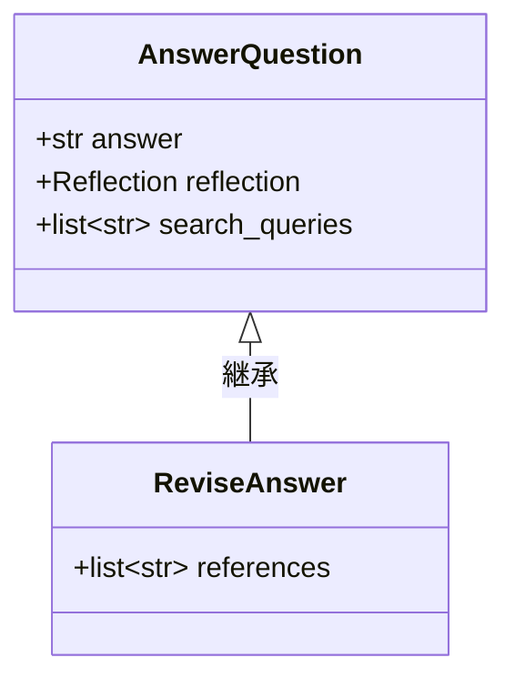

import Quiz from '@/components/content/Quiz.astro'

## 概要

このレクチャーでは，Revisorエージェント（改訂エージェント）を実装します．批評と検索結果を基に記事を改訂し，引用を追加するチェーンを構築します．

## 改訂指示

```
Revise your previous answer using the new information.
You should use the previous critique to add important information to your answer.
You must include numerical citations in your revised answer to ensure it can be verified.
Add a reference section to the bottom of your answer in the form of URLs.
You should use the previous critique to remove superfluous information.
```

## ReviseAnswerスキーマ



```python
class ReviseAnswer(AnswerQuestion):
    references: list[str] = Field(description="引用URLのリスト")
```

`AnswerQuestion`を継承し，referencesフィールドを追加します．これにより，answer，reflection，search_queries に加えて，引用のURLリストが出力に含まれます．

## Revisorチェーン

```python
revisor_chain = (
    actor_prompt_template.partial(first_instructions=revision_instructions)
    | llm.bind_tools(tools=[ReviseAnswer], tool_choice="ReviseAnswer")
)
```

同じプロンプトテンプレートを使い，`first_instructions`に改訂指示を注入します．

## まとめ

- Revisorは批評と検索結果を統合して記事を改訂する
- AnswerQuestionクラスを継承したReviseAnswerで引用フィールドを追加
- 同一のプロンプトテンプレートを再利用し，指示部分のみ差し替え
- Function Callingでスキーマを強制し，構造化された改訂出力を取得

<Quiz questions={[
  {
    question: "ReviseAnswerクラスがAnswerQuestionクラスを継承する理由は何ですか?",
    options: [
      "コードの実行速度を向上させるため",
      "answer，reflection，search_queriesのフィールドを再利用しつつreferencesを追加するため",
      "AnswerQuestionクラスを無効にするため",
      "異なるLLMモデルを使用するため"
    ],
    answer: 1,
    explanation: "ReviseAnswerはAnswerQuestionを継承することで，既存のanswer，reflection，search_queriesフィールドを再利用し，引用URLのためのreferencesフィールドのみを追加しています．"
  },
  {
    question: "改訂指示で要求されている内容に含まれないものはどれですか?",
    options: [
      "数値的な引用の追加",
      "参照セクション（URL）の追加",
      "不要な情報の削除",
      "ツイートのハッシュタグの追加"
    ],
    answer: 3,
    explanation: "改訂指示では，数値的な引用の追加，参照URLの追加，不要な情報の削除が要求されますが，ハッシュタグの追加は含まれていません．"
  },
  {
    question: "Revisorチェーンでfirst_instructionsに注入されるのは何ですか?",
    options: [
      "生成指示",
      "改訂指示（revision_instructions）",
      "検索クエリ",
      "批評結果"
    ],
    answer: 1,
    explanation: "Revisorチェーンではactor_prompt_templateのfirst_instructionsプレースホルダーに改訂指示（revision_instructions）が注入されます．"
  },
  {
    question: "同一のプロンプトテンプレートを再利用できる仕組みはどれですか?",
    options: [
      "MessagesPlaceholderの動的切り替え",
      "first_instructionsプレースホルダーによる指示の差し替え",
      "LLMモデルの自動選択",
      "ToolNodeの再利用"
    ],
    answer: 1,
    explanation: "actor_prompt_templateのfirst_instructionsプレースホルダーに異なる指示を注入することで，初回応答用とRevisor用でテンプレートを再利用できます．"
  },
  {
    question: "ReviseAnswerの出力に含まれるフィールドの数はいくつですか?",
    options: [
      "2つ（answer, references）",
      "3つ（answer, reflection, references）",
      "4つ（answer, reflection, search_queries, references）",
      "5つ（answer, reflection, search_queries, references, critique）"
    ],
    answer: 2,
    explanation: "ReviseAnswerは継承したanswer，reflection，search_queriesの3フィールドに加えて，referencesフィールドを持つため合計4つのフィールドがあります．"
  }
]} />
