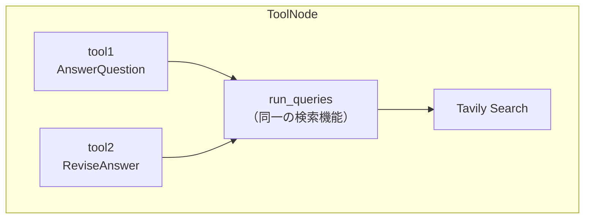

import Quiz from '@/components/content/Quiz.astro'

## 概要

このレクチャーでは，ToolNodeを使って検索クエリを並列実行する仕組みを実装します．StructuredToolを活用して，同じ検索機能に異なる名前を付けるテクニックも学びます．

## 検索ツールの初期化

```python
from langchain_community.tools.tavily_search import TavilySearchResults

search = TavilySearchResults(max_results=5)
```

## ツールの二重化テクニック



同じ検索機能に対して2つの異なる名前のツールを作成します．

```python
from langchain_core.tools import StructuredTool

tool1 = StructuredTool.from_function(
    func=run_queries,
    name=AnswerQuestion.__name__,
)
tool2 = StructuredTool.from_function(
    func=run_queries,
    name=ReviseAnswer.__name__,
)
```

理由: 初期調査フェーズと改訂調査フェーズを明確に区別し，デバッグと評価を容易にするためです．

## ToolNodeの作成

```python
from langgraph.prebuilt import ToolNode

execute_tools = ToolNode(tools=[tool1, tool2])
```

ToolNodeは以下を自動的に行います．

- ステートの最後のメッセージを確認
- ツール呼び出しがあれば実行
- 複数のツール呼び出しを並列実行可能

## まとめ

- StructuredToolで同一機能に異なる名前のツールを作成（デバッグ容易性向上）
- ToolNodeがツール実行の複雑さを抽象化（並列実行を含む）
- Tavilyのbatch機能で複数の検索クエリを並列実行

<Quiz questions={[
  {
    question: "同じ検索機能に異なる名前のツールを作成する理由は何ですか?",
    options: [
      "検索速度を向上させるため",
      "初期調査フェーズと改訂調査フェーズを区別しデバッグを容易にするため",
      "異なる検索エンジンを使い分けるため",
      "ツール数の制限を回避するため"
    ],
    answer: 1,
    explanation: "同じ検索機能に異なる名前（AnswerQuestion，ReviseAnswer）を付けることで，初期調査と改訂調査を明確に区別し，デバッグと評価が容易になります．"
  },
  {
    question: "ToolNodeが自動的に行うことに含まれないものはどれですか?",
    options: [
      "ステートの最後のメッセージを確認",
      "ツール呼び出しがあれば実行",
      "複数のツール呼び出しを並列実行",
      "ツールの結果をLLMに自動送信"
    ],
    answer: 3,
    explanation: "ToolNodeはメッセージ確認，ツール実行，並列実行を自動的に行いますが，結果のLLMへの送信はグラフのエッジ定義に基づいて次のノードで処理されます．"
  },
  {
    question: "StructuredToolの主な用途は何ですか?",
    options: [
      "LLMのプロンプトを構造化する",
      "関数をツールとしてラップし，カスタム名を付ける",
      "データベースのスキーマを定義する",
      "検索結果をフィルタリングする"
    ],
    answer: 1,
    explanation: "StructuredTool.from_functionは，既存の関数をツールとしてラップし，カスタム名や説明を付与するために使用されます．"
  },
  {
    question: "TavilySearchResultsのmax_resultsパラメータの値は何に設定されていますか?",
    options: [
      "1",
      "3",
      "5",
      "10"
    ],
    answer: 2,
    explanation: "TavilySearchResultsのmax_resultsは5に設定されており，各検索クエリに対して最大5件の結果を返します．"
  },
  {
    question: "ToolNodeに渡されるツールのリストの要素数はいくつですか?",
    options: [
      "1つ",
      "2つ",
      "3つ",
      "5つ"
    ],
    answer: 1,
    explanation: "ToolNodeにはtool1（AnswerQuestion名）とtool2（ReviseAnswer名）の2つのツールがリストとして渡されます．"
  }
]} />
