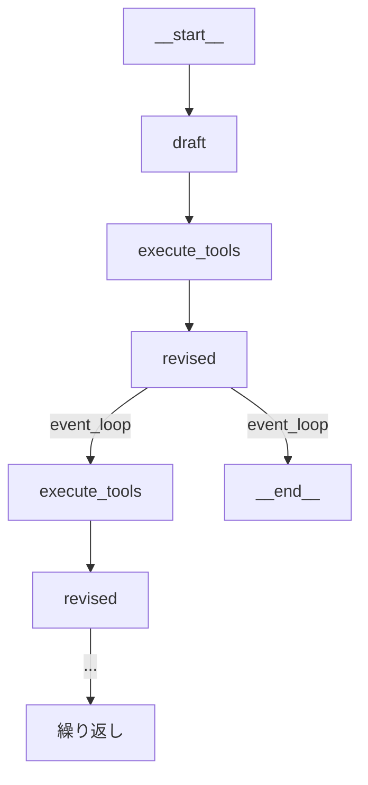

import Quiz from '@/components/content/Quiz.astro'

## 概要

このレクチャーでは，これまでに実装した全コンポーネント（Responder，Revisor，ToolNode）をLangGraphグラフとして組み立て，Reflexionエージェントを完成させます．

## ノードの実装

### Draftノード（初回応答）

```python
def draft_node(state: MessagesState):
    response = first_responder_chain.invoke({"messages": state["messages"]})
    return {"messages": [response]}
```

### Revisedノード（改訂）

```python
def revised_node(state: MessagesState):
    response = revisor_chain.invoke({"messages": state["messages"]})
    return {"messages": [response]}
```

## イテレーション制御

```python
MAX_ITERATIONS = 2

def event_loop(state: MessagesState) -> Literal["execute_tools", "__end__"]:
    num_tool_calls = sum(
        1 for msg in state["messages"]
        if hasattr(msg, "tool_calls") and msg.tool_calls
    )
    if num_tool_calls > MAX_ITERATIONS:
        return END
    return "execute_tools"
```

ツール呼び出しの回数をカウントし，最大イテレーション数を超えたら終了します．

## グラフの構築

```python
builder = StateGraph(MessagesState)
builder.add_node("draft", draft_node)
builder.add_node("execute_tools", execute_tools)
builder.add_node("revised", revised_node)

builder.add_edge(START, "draft")
builder.add_edge("draft", "execute_tools")
builder.add_edge("execute_tools", "revised")
builder.add_conditional_edges("revised", event_loop, ["execute_tools", END])

app = builder.compile()
```

## フロー



START → draft → execute_tools → revised → (条件分岐) → execute_tools → revised → ... → END

## まとめ

- 3つのノード（draft，execute_tools，revised）と条件付きエッジでグラフを構成
- ツール呼び出し回数による停止条件を条件付きエッジで実装
- Mermaid図でグラフ構造を可視化可能
- 将来的にはLLM as a Judgeで停止条件を動的に判断することも可能

<Quiz questions={[
  {
    question: "event_loop関数で停止条件として使われるメトリクスは何ですか?",
    options: [
      "実行時間",
      "トークン消費量",
      "ツール呼び出しの回数",
      "メッセージの文字数"
    ],
    answer: 2,
    explanation: "event_loop関数は，ステート内のツール呼び出し回数をカウントし，MAX_ITERATIONSを超えたら終了を返します．"
  },
  {
    question: "MAX_ITERATIONSの値はいくつに設定されていますか?",
    options: [
      "1",
      "2",
      "3",
      "5"
    ],
    answer: 1,
    explanation: "MAX_ITERATIONSは2に設定されており，ツール呼び出し回数が2を超えると終了します．"
  },
  {
    question: "draftノードからexecute_toolsノードへのエッジの種類は何ですか?",
    options: [
      "条件付きエッジ",
      "確定的エッジ",
      "双方向エッジ",
      "自己ループエッジ"
    ],
    answer: 1,
    explanation: "draftからexecute_toolsへは常に遷移する確定的エッジです．条件付きエッジはrevisedノードからの分岐のみです．"
  },
  {
    question: "MessagesStateを使う利点は何ですか?",
    options: [
      "カスタムのステートスキーマを定義する必要がない",
      "メッセージの暗号化が自動で行われる",
      "LLMの応答速度が向上する",
      "検索クエリが自動生成される"
    ],
    answer: 0,
    explanation: "MessagesStateはLangGraphが提供するビルトインのステートスキーマで，messagesフィールドとadd_messagesリデューサーが事前定義されているため，カスタムスキーマを定義する手間が省けます．"
  },
  {
    question: "条件付きエッジの遷移先として指定されているのはどれですか?",
    options: [
      "draftとrevised",
      "execute_toolsとdraft",
      "execute_toolsと__end__",
      "revisedと__start__"
    ],
    answer: 2,
    explanation: "revisedノードからの条件付きエッジは，execute_tools（継続）または__end__（終了）に遷移します．"
  }
]} />
