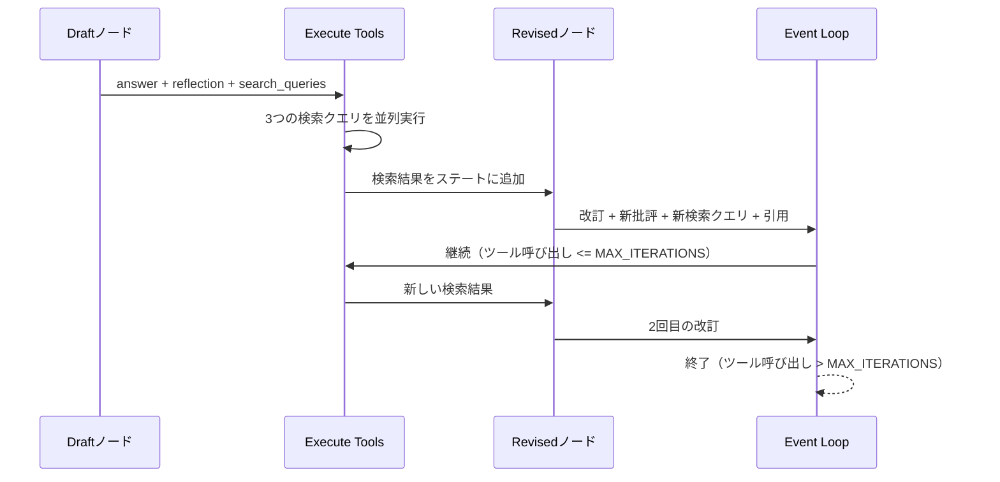

import Quiz from '@/components/content/Quiz.astro'

## 概要

このレクチャーでは，Reflexionエージェントを実行し，LangSmithでトレースを詳細に分析します．約50秒の実行時間で35Kトークンを消費する複雑なグラフ実行の全貌を追跡します．

## 実行結果

入力: 「AI-Powered SOC / autonomous SOC problem domain, list startups that have raised capital」

出力にはスタートアップの分類（Leaders，Scale-Up，Innovators）と詳細な情報が含まれ，数値的な引用付きで信頼性の高い記事が生成されます．

## LangSmithでのトレース分析

### ノード実行の流れ

1. Draftノード: 初期応答の生成（answer + reflection + search_queries）
2. Execute Toolsノード: 3つの検索クエリを並列実行
3. Revisedノード: 検索結果と批評に基づく改訂 + 新しい批評 + 新しい検索クエリ + 引用
4. Event Loop: 停止条件のチェック
5. Execute Toolsノード: 新しい検索クエリを並列実行
6. Revisedノード: 2回目の改訂
7. 繰り返し...

### 注目ポイント

- 検索クエリは各イテレーションで異なる内容が生成される
- ToolNodeは複数の検索を並列実行（同一の開始時刻で確認可能）
- MAX_ITERATIONS=2の場合，ステートの更新タイミングにより実際には3回のイテレーションが実行される

## イテレーション回数の注意点

`event_loop`関数はrevisedノードの実行後に呼ばれますが，revisedノードのステート更新は`event_loop`の後に反映されます．このため，MAX_ITERATIONS=2でも実際には3回のイテレーションが実行されます．

## 次のセクションへの橋渡し

次のAgentic RAGセクションでは，マジックナンバーによるイテレーション制限の代わりに，LLM as a Judgeアーキテクチャを使って動的に停止条件を判断する手法を学びます．

## まとめ

- Reflexionエージェントは約50秒で35Kトークンを消費する複雑な処理を実行
- LangSmithで各ノードの実行，検索クエリ，並列実行を詳細にトレース可能
- 検索クエリはイテレーションごとに進化し，より関連性の高い情報を取得
- イテレーション回数の制御はステート更新のタイミングに注意が必要
- 次のセクションではLLM as a Judgeで動的な停止条件を実装

<Quiz questions={[
  {
    question: "Reflexionエージェントの実行にかかる時間と消費トークン数はどのくらいですか?",
    options: [
      "約10秒，5Kトークン",
      "約30秒，20Kトークン",
      "約50秒，35Kトークン",
      "約120秒，100Kトークン"
    ],
    answer: 2,
    explanation: "Reflexionエージェントは約50秒の実行時間で35Kトークンを消費する複雑な処理を実行します．"
  },
  {
    question: "MAX_ITERATIONS=2の場合，実際に実行されるイテレーション回数は何回ですか?",
    options: [
      "1回",
      "2回",
      "3回",
      "4回"
    ],
    answer: 2,
    explanation: "event_loop関数はrevisedノードの後に呼ばれますが，ステート更新のタイミングの関係で，MAX_ITERATIONS=2でも実際には3回のイテレーションが実行されます．"
  },
  {
    question: "ToolNodeの並列実行を確認できる方法はどれですか?",
    options: [
      "コンソールのログ出力",
      "LangSmithのトレースで同一開始時刻を確認",
      "ファイルに書き出されたタイムスタンプ",
      "Pythonのデバッガーのブレークポイント"
    ],
    answer: 1,
    explanation: "LangSmithのトレースで，複数の検索クエリが同一の開始時刻で実行されていることを確認することで，並列実行を検証できます．"
  },
  {
    question: "次のAgentic RAGセクションで学ぶ手法は何ですか?",
    options: [
      "より高速な検索エンジンの使用",
      "LLM as a Judgeによる動的な停止条件判断",
      "GPT-5の使用による品質向上",
      "手動での品質評価"
    ],
    answer: 1,
    explanation: "次のセクションでは，マジックナンバーによるイテレーション制限の代わりに，LLM as a Judgeアーキテクチャを使って動的に停止条件を判断する手法を学びます．"
  },
  {
    question: "検索クエリがイテレーションごとに変化する理由は何ですか?",
    options: [
      "ランダムに生成されるため",
      "批評に基づいて不足情報を補う新しいクエリが生成されるため",
      "検索エンジンが自動的にクエリを最適化するため",
      "ユーザーが手動で変更するため"
    ],
    answer: 1,
    explanation: "各イテレーションで新しい批評が生成され，その批評に基づいて不足情報を補うためのより関連性の高い検索クエリが生成されます．"
  }
]} />
