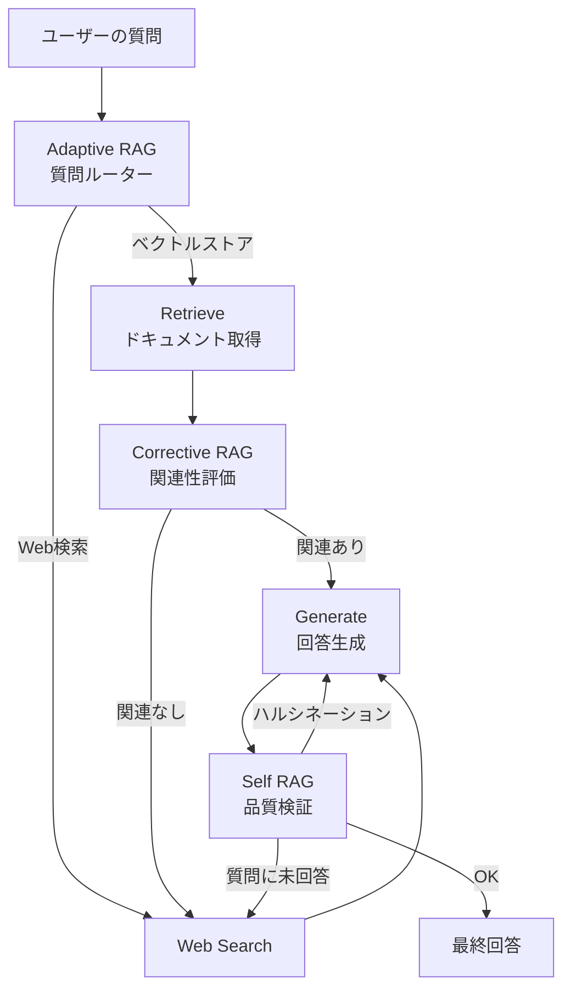

import Quiz from '@/components/content/Quiz.astro'

## 概要

このレクチャーでは，本セクション全体で構築する高度なRAGワークフローの全体像を紹介します．通常のRAGシステムよりもはるかに高品質な結果を生み出すために，LangGraphを活用したアドバンストなRAGパイプラインを実装していきます．

## プロジェクトの背景

このプロジェクトは，LangChainとMistralのCookbookにインスパイアされています．しかし，元のCookbookはJupyterノートブック中心の構成であり，ソフトウェアエンジニアリングの観点が不足していました．そのため，コードをリファクタリングし，より本番環境向けの設計（保守性・可読性・テスト容易性・拡張性）に改善しています．

## 3つの研究論文に基づくアプローチ

このセクションで実装するアドバンストRAGワークフローは，以下の3つの研究論文に基づいています．

### Corrective RAG（CRAG）
取得したドキュメントが本当にクエリに関連しているかを検証し，関連性のないドキュメントをフィルタリングします．必要に応じて外部検索で情報を補完します．

### Self RAG
生成された回答がドキュメントに基づいているか（ハルシネーションがないか）を検証し，さらに回答がユーザーの質問に適切に答えているかを確認します．

### Adaptive RAG
質問ルーターを使用して，ユーザーの質問を適切なデータストア（ベクトルストアまたはウェブ検索）にルーティングします．

## ワークフローの主要な要素

- ドキュメントの取得後にリフレクション（自己反省）を行い，関連性を評価する
- 関連性のないドキュメントをフィルタリングし，外部情報で補完する
- 生成された回答がドキュメントに基づいているか検証する
- 回答がユーザーの質問に適切に答えているか確認する
- 質問の種類に応じてデータストアをルーティングする

## まとめ

- LangGraphを使用して，Corrective RAG・Self RAG・Adaptive RAGの3つの研究論文に基づく高度なRAGワークフローを構築する
- 通常のRAGよりも高品質な結果を得るために，リフレクション（自己反省）の仕組みを導入する
- コードはGitHubリポジトリで公開されており，各動画に対応するブランチから参照可能

<Quiz questions={[
  {
    question: "Corrective RAGの核心的な機能は何ですか?",
    options: [
      "LLMの応答速度を向上させる",
      "取得したドキュメントの関連性を検証しフィルタリングする",
      "ユーザーの質問を自動翻訳する",
      "ベクトルストアのインデックスを最適化する"
    ],
    answer: 1,
    explanation: "Corrective RAGは，取得したドキュメントがクエリに関連しているかを検証し，関連性のないドキュメントをフィルタリングして外部検索で補完する手法です．"
  },
  {
    question: "Self RAGが検証する2つの観点はどれですか?",
    options: [
      "応答速度とトークン消費量",
      "ハルシネーションの有無と回答の適切性",
      "文法の正確さと文章の長さ",
      "ドキュメントの新しさと信頼性"
    ],
    answer: 1,
    explanation: "Self RAGは，生成された回答がドキュメントに基づいているか（ハルシネーション検出）と，回答がユーザーの質問に適切に答えているかの2つを検証します．"
  },
  {
    question: "Adaptive RAGの役割は何ですか?",
    options: [
      "LLMモデルを動的に切り替える",
      "ユーザーの質問を適切なデータストアにルーティングする",
      "ドキュメントのチャンクサイズを自動調整する",
      "生成された回答を自動的にフォーマットする"
    ],
    answer: 1,
    explanation: "Adaptive RAGは質問ルーターを使用して，ユーザーの質問をベクトルストアまたはWeb検索の適切なデータストアにルーティングします．"
  },
  {
    question: "このプロジェクトの元となったCookbookの改善点は何ですか?",
    options: [
      "より高速なLLMモデルを使用",
      "ソフトウェアエンジニアリングの観点からリファクタリング",
      "より多くのドキュメントをインジェスト",
      "グラフの可視化機能を追加"
    ],
    answer: 1,
    explanation: "元のCookbookはJupyterノートブック中心でしたが，本番環境向けの設計（保守性・可読性・テスト容易性・拡張性）にリファクタリングされています．"
  },
  {
    question: "このRAGワークフローで使用されるリフレクション機能の目的は何ですか?",
    options: [
      "コードの自動デバッグ",
      "RAGの回答品質を自己評価して向上させる",
      "ユーザーの質問を言い換える",
      "ベクトルストアの精度を測定する"
    ],
    answer: 1,
    explanation: "リフレクション（自己反省）の仕組みにより，ドキュメントの関連性評価や回答の品質検証を行い，通常のRAGよりも高品質な結果を生み出します．"
  }
]} />
