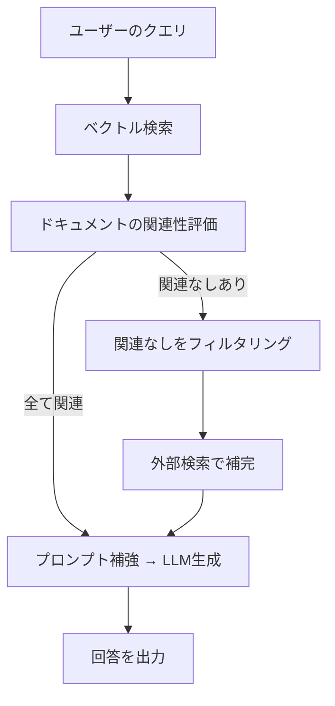

import Quiz from '@/components/content/Quiz.astro'

## 概要

このレクチャーでは，Corrective RAG（CRAG）研究論文の基本概念を解説します．取得したドキュメントの関連性を自己評価し，関連性のないドキュメントをフィルタリングした上で，外部検索で情報を補完する手法を紹介します．

## Corrective RAGの基本フロー

Corrective RAGは，通常のRAGフローに「自己評価」のステップを追加することで，回答品質を大幅に向上させます．

### ステップ1: ベクトル検索
ユーザーのクエリを受け取り，ベクトルストアでセマンティック検索を実行して，関連するドキュメントを取得します．

### ステップ2: ドキュメントの関連性評価
取得した各ドキュメントについて，元のクエリに対する関連性を評価します．これがCorrective RAGの核心部分です．

### ステップ3a: 全ドキュメントが関連する場合（ハッピーフロー）
すべてのドキュメントが関連していると判断された場合は，通常のRAGと同様にプロンプトを補強してLLMに送信します．

### ステップ3b: 関連性のないドキュメントがある場合
関連性のないドキュメントが見つかった場合は以下を実行します．
- 関連性のないドキュメントをフィルタリングして除外する
- インターネットで外部検索を実行し，追加情報を取得する
- 外部検索の結果を含めてプロンプトを補強し，LLMに送信する

## 品質向上のメカニズム

この手法により，以下の理由で回答品質が向上します．

- 無関係なドキュメントがコンテキストに含まれることを防ぐ
- 情報が不足している場合にリアルタイムの外部情報で補完する
- LLMに送信されるコンテキストの品質を事前に保証する

## まとめ

- Corrective RAGは，取得したドキュメントの関連性を自己評価するアドバンストRAG手法
- 関連性のないドキュメントをフィルタリングし，外部検索で情報を補完する
- 通常のRAGよりも高品質な回答を生成できる

<Quiz questions={[
  {
    question: "Corrective RAGが通常のRAGに追加するステップは何ですか?",
    options: [
      "プロンプトの最適化",
      "ドキュメントの関連性を自己評価するステップ",
      "LLMモデルの自動選択",
      "ベクトルの次元削減"
    ],
    answer: 1,
    explanation: "Corrective RAGは通常のRAGフローに「自己評価」のステップを追加し，取得したドキュメントの関連性を検証することで品質を向上させます．"
  },
  {
    question: "関連性のないドキュメントが検出された場合の対処法はどれですか?",
    options: [
      "そのまま無視してLLMに送信する",
      "フィルタリングして除外し，外部検索で補完する",
      "ユーザーに質問の変更を求める",
      "ベクトルストアのインデックスを再構築する"
    ],
    answer: 1,
    explanation: "関連性のないドキュメントはフィルタリングして除外し，インターネットで外部検索を実行して追加情報を取得します．"
  },
  {
    question: "Corrective RAGで品質が向上する理由に含まれないものはどれですか?",
    options: [
      "無関係なドキュメントのフィルタリング",
      "外部情報によるコンテキスト補完",
      "LLMのモデルサイズの自動調整",
      "送信コンテキストの品質の事前保証"
    ],
    answer: 2,
    explanation: "Corrective RAGは無関係ドキュメントのフィルタリング，外部情報補完，コンテキスト品質の保証で品質を向上させますが，LLMモデルサイズの自動調整は行いません．"
  },
  {
    question: "ステップ2のドキュメント関連性評価で使用される基準は何ですか?",
    options: [
      "ドキュメントの文字数",
      "元のクエリに対する意味的な関連性",
      "ドキュメントの作成日時",
      "ドキュメントのファイルサイズ"
    ],
    answer: 1,
    explanation: "各ドキュメントは元のユーザークエリに対するキーワードや意味的（セマンティック）な関連性で評価されます．"
  },
  {
    question: "ハッピーフロー（全ドキュメントが関連する場合）の処理はどれですか?",
    options: [
      "外部検索を追加で実行する",
      "通常のRAGと同様にプロンプトを補強してLLMに送信する",
      "ドキュメントを再度ベクトル化する",
      "ユーザーに確認を求める"
    ],
    answer: 1,
    explanation: "全ドキュメントが関連していると判断された場合は，追加処理なしで通常のRAGと同様にプロンプトを補強してLLMに送信します．"
  }
]} />
