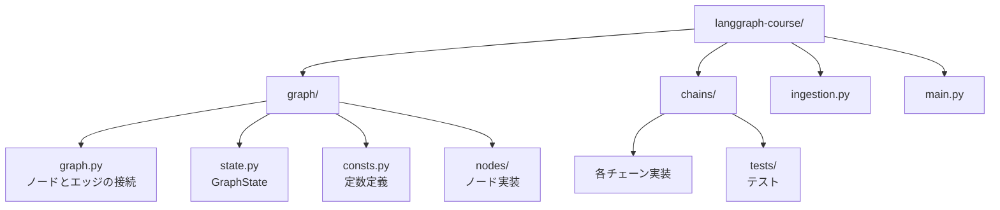

import Quiz from '@/components/content/Quiz.astro'

## 概要

このレクチャーでは，Agentic RAGプロジェクトのリポジトリ構造を設計します．コードの可読性，保守性，テスト容易性を重視した構造にすることで，本番環境にも適用可能な堅牢なアプリケーションを構築します．

## リポジトリ構造の設計方針

リポジトリ構造はアーキテクチャを反映すべきという考え方に基づき，グラフのノードとエッジの構造がそのままディレクトリ構造に対応するよう設計します．

## ディレクトリ構成



```
langgraph-course/
├── graph/
│   ├── __init__.py
│   ├── graph.py          # ノードとエッジの接続
│   ├── state.py          # GraphStateオブジェクト
│   ├── consts.py         # 定数定義
│   └── nodes/            # ノード実装パッケージ
│       └── __init__.py
├── chains/               # チェーン実装パッケージ
│   ├── __init__.py
│   └── tests/
│       ├── __init__.py
│       └── test_chains.py  # テスト実装
├── ingestion.py          # ベクトルストアへのインジェスション
└── main.py               # エントリポイント
```

### 各パッケージの役割

- `graph/graph.py`: すべてのノードとエッジの接続を管理
- `graph/state.py`: グラフ実行中に変更されるGraphStateオブジェクトを定義
- `graph/consts.py`: ノード名などの定数を管理
- `graph/nodes/`: 各ノードの実装ファイルを格納（1ファイル = 1ノード）
- `chains/`: 各チェーンの実装ファイルを格納（1ファイル = 1チェーン，ノードと対応）
- `chains/tests/`: チェーンに対するテストを格納

## テスト環境の設定

Pytestの命名規約に従い，テストディレクトリは`tests`で始まり，テストファイルは`test_`プレフィックスを付けます．

```python
# chains/tests/test_chains.py
def test_foo() -> None:
    assert 1 == 1
```

```bash
# テストの実行
pytest . -s -v
```

## まとめ

- リポジトリ構造はグラフアーキテクチャを反映するように設計する
- `graph`パッケージにノード・エッジ・状態を管理し，`chains`パッケージにチェーン実装を配置する
- Pytestを使用してテストを管理し，品質を保証する
- この構造により，新しいノードやエッジの追加が容易になる

<Quiz questions={[
  {
    question: "リポジトリ構造の設計方針として正しいものはどれですか?",
    options: [
      "ファイルタイプ（.py, .json等）ごとにフォルダ分けする",
      "グラフのノードとエッジの構造がディレクトリ構造に対応する",
      "全てのコードを1つのファイルにまとめる",
      "テストコードは別リポジトリに配置する"
    ],
    answer: 1,
    explanation: "リポジトリ構造はアーキテクチャを反映すべきという考え方に基づき，グラフのノードとエッジの構造がそのままディレクトリ構造に対応するよう設計します．"
  },
  {
    question: "graph/state.pyの役割は何ですか?",
    options: [
      "ノードの実装ロジックを格納する",
      "グラフ実行中に変更されるGraphStateオブジェクトを定義する",
      "環境変数を管理する",
      "テストの設定を管理する"
    ],
    answer: 1,
    explanation: "graph/state.pyはグラフ実行中にノード間で受け渡されるGraphStateオブジェクトを定義するファイルです．"
  },
  {
    question: "graph/nodesディレクトリの設計方針はどれですか?",
    options: [
      "全ノードを1つのファイルにまとめる",
      "1ファイル = 1ノードで実装する",
      "テストとノードを同じファイルに書く",
      "ノードを機能カテゴリ別にグループ化する"
    ],
    answer: 1,
    explanation: "graph/nodesディレクトリでは1ファイル = 1ノードの方針で各ノードの実装ファイルを格納します．"
  },
  {
    question: "Pytestの命名規約として正しいものはどれですか?",
    options: [
      "テストファイルは_testサフィックスを付ける",
      "テストファイルはtest_プレフィックスを付ける",
      "テストファイルはspecプレフィックスを付ける",
      "テストファイルに特別な命名規約はない"
    ],
    answer: 1,
    explanation: "Pytestの命名規約では，テストディレクトリはtestsで始まり，テストファイルにはtest_プレフィックスを付けます．"
  },
  {
    question: "chainsパッケージとgraph/nodesパッケージの関係はどれですか?",
    options: [
      "同じ機能を重複して実装する",
      "chainsがチェーン実装を，nodesが対応するノードでチェーンを呼び出す",
      "chainsがnodesを継承する",
      "互いに独立で関連がない"
    ],
    answer: 1,
    explanation: "chainsパッケージにチェーン実装を配置し，graph/nodesパッケージの各ノードがそれぞれ対応するチェーンを呼び出す構造になっています．"
  }
]} />
