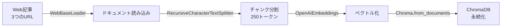

import Quiz from '@/components/content/Quiz.astro'

## 概要

このレクチャーでは，Webから記事をロードし，チャンクに分割してChromaDBにインデックスするインジェスションパイプラインを実装します．本セクションではリトリーバル部分の高度な技術に焦点を当てるため，インジェスションはシンプルなデフォルト設定で実装します．

## インジェスションパイプラインの構成



### インポートと初期設定

```python
from dotenv import load_dotenv
from langchain.text_splitter import RecursiveCharacterTextSplitter
from langchain_community.document_loaders import WebBaseLoader
from langchain_community.vectorstores import Chroma
from langchain_openai import OpenAIEmbeddings

load_dotenv()
```

### ドキュメントの読み込み

3つのWeb記事をインジェスト対象とします．

- 自律型エージェント（メモリ，プランニング，推論）に関する記事
- プロンプトエンジニアリング技術に関する記事
- LLMセキュリティに対する敵対的攻撃に関する記事

```python
urls = [
    "https://lilianweng.github.io/posts/2023-06-23-agent/",
    "https://lilianweng.github.io/posts/2023-03-15-prompt-engineering/",
    "https://lilianweng.github.io/posts/2023-10-25-adv-attack-llm/",
]

docs = [WebBaseLoader(url).load() for url in urls]
docs_list = [item for sublist in docs for item in sublist]
```

### テキスト分割

```python
text_splitter = RecursiveCharacterTextSplitter.from_tiktoken_encoder(
    chunk_size=250, chunk_overlap=0
)
doc_splits = text_splitter.split_documents(docs_list)
```

### ChromaDBへのインデックス

```python
# インデックスの作成（初回のみ実行）
vectorstore = Chroma.from_documents(
    documents=doc_splits,
    collection_name="rag-chroma",
    embedding=OpenAIEmbeddings(),
    persist_directory="./.chroma",
)

# ディスクからの読み込み（2回目以降）
retriever = Chroma(
    collection_name="rag-chroma",
    persist_directory="./.chroma",
    embedding_function=OpenAIEmbeddings(),
).as_retriever()
```

## まとめ

- `WebBaseLoader`を使用してWebからドキュメントをロードする
- `RecursiveCharacterTextSplitter`でドキュメントをチャンクに分割する
- `ChromaDB`をオープンソースのベクトルストアとして使用し，ローカルディスクに永続化する
- `as_retriever()`メソッドでリトリーバーオブジェクトを作成し，セマンティック検索が可能になる

<Quiz questions={[
  {
    question: "RecursiveCharacterTextSplitterで設定されたchunk_sizeはいくつですか?",
    options: [
      "100トークン",
      "250トークン",
      "500トークン",
      "1000トークン"
    ],
    answer: 1,
    explanation: "RecursiveCharacterTextSplitterのchunk_sizeは250に設定されており，各チャンクは最大250トークンに分割されます．"
  },
  {
    question: "インジェスト対象の3つの記事のトピックに含まれないものはどれですか?",
    options: [
      "自律型エージェント",
      "プロンプトエンジニアリング",
      "LLMセキュリティへの敵対的攻撃",
      "GPTモデルのファインチューニング"
    ],
    answer: 3,
    explanation: "インジェスト対象は，自律型エージェント，プロンプトエンジニアリング，LLMセキュリティの敵対的攻撃に関する3つの記事です．"
  },
  {
    question: "ChromaDBの永続化に使用されるディレクトリはどこですか?",
    options: [
      "./data",
      "./db",
      "./.chroma",
      "./vectorstore"
    ],
    answer: 2,
    explanation: "ChromaDBの永続化ディレクトリはpersist_directory='./.chroma'として設定されています．"
  },
  {
    question: "as_retriever()メソッドの目的は何ですか?",
    options: [
      "ベクトルストアを削除する",
      "ベクトルストアをリトリーバーオブジェクトに変換する",
      "ドキュメントをベクトル化する",
      "チャンクサイズを変更する"
    ],
    answer: 1,
    explanation: "as_retriever()メソッドはChromaDBベクトルストアをリトリーバーオブジェクトに変換し，セマンティック検索を行えるようにします．"
  },
  {
    question: "chunk_overlapが0に設定されている理由は何ですか?",
    options: [
      "メモリ使用量を最小化するため",
      "本セクションではリトリーバル高度化に焦点を当てるため，インジェスションはシンプルにしている",
      "ChromaDBがオーバーラップをサポートしていないため",
      "重複するチャンクはエラーの原因になるため"
    ],
    answer: 1,
    explanation: "本セクションではリトリーバル部分の高度な技術に焦点を当てるため，インジェスションはシンプルなデフォルト設定で実装しています．"
  }
]} />
