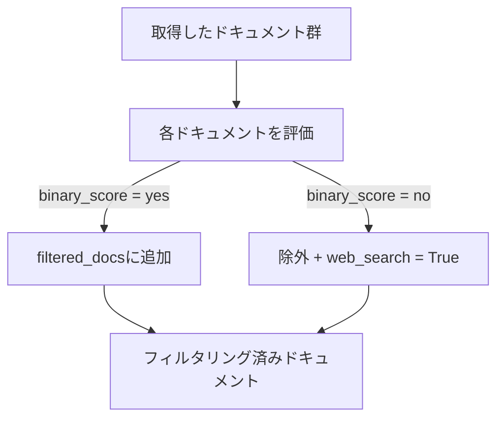

import Quiz from '@/components/content/Quiz.astro'

## 概要

このレクチャーでは，取得したドキュメントの関連性を評価するRetrieval Graderチェーンとノードを実装します．LangChainの`with_structured_output`を活用してPydanticモデルで構造化された出力を得ることで，各ドキュメントの関連性を判定します．

## Retrieval Graderチェーンの実装

### Pydanticモデルの定義

```python
from pydantic import BaseModel, Field


class GradeDocuments(BaseModel):
    """ドキュメントの関連性を評価するモデル"""
    binary_score: str = Field(
        description="Documents are relevant to the question, 'yes' or 'no'"
    )
```

### チェーンの構築

```python
from langchain_core.prompts import ChatPromptTemplate
from langchain_openai import ChatOpenAI

llm = ChatOpenAI(temperature=0)
structured_llm_grader = llm.with_structured_output(GradeDocuments)

system = """You are a grader assessing relevance of a retrieved document
to a user question. If the document contains keywords or semantic meaning
related to the question, grade it as relevant. Give a binary score 'yes'
or 'no' to indicate whether the document is relevant to the question."""

grade_prompt = ChatPromptTemplate.from_messages([
    ("system", system),
    ("human", "Retrieved document: \n\n {document} \n\n User question: {question}"),
])

retrieval_grader = grade_prompt | structured_llm_grader
```

## テストの実装

### 関連性ありのテスト

```python
def test_retrieval_grader_answer_yes():
    question = "agent memory"
    docs = retriever.invoke(question)
    doc_txt = docs[1].page_content
    res = retrieval_grader.invoke(
        {"question": question, "document": doc_txt}
    )
    assert res.binary_score == "yes"
```

### 関連性なしのテスト

```python
def test_retrieval_grader_answer_no():
    question = "agent memory"
    docs = retriever.invoke(question)
    doc_txt = docs[1].page_content
    res = retrieval_grader.invoke(
        {"question": "how to make pizza", "document": doc_txt}
    )
    assert res.binary_score == "no"
```

## Grade Documentsノードの実装



```python
def grade_documents(state: GraphState) -> Dict[str, Any]:
    """取得したドキュメントの関連性を評価するノード"""
    print("---CHECK DOCUMENT RELEVANCE TO QUESTION---")
    question = state["question"]
    documents = state["documents"]

    filtered_docs = []
    web_search = False

    for d in documents:
        score = retrieval_grader.invoke(
            {"question": question, "document": d.page_content}
        )
        if score.binary_score == "yes":
            filtered_docs.append(d)
        else:
            web_search = True
            continue

    return {
        "documents": filtered_docs,
        "question": question,
        "web_search": web_search,
    }
```

## LLMベースアプリケーションのテストに関する注意点

- LLMの出力は確率的であり，冪等性が保証されない
- サードパーティへの依存があるため，レート制限やサービス障害のリスクがある
- 各呼び出しにコスト（トークン消費）が発生する
- それでもテストを書くことはCI/CDパイプラインに組み込まなくても，サニティチェックとして重要

## まとめ

- `with_structured_output`を使用して，LLMの出力をPydanticモデルに構造化する
- 各ドキュメントの関連性を「yes」「no」で評価する
- 関連性のないドキュメントが見つかった場合，`web_search`フラグを`True`に設定する
- テスト駆動開発でチェーンの正確性を検証する

<Quiz questions={[
  {
    question: "GradeDocumentsモデルのbinary_scoreフィールドが取る値はどれですか?",
    options: [
      "true または false",
      "1 または 0",
      "yes または no",
      "relevant または irrelevant"
    ],
    answer: 2,
    explanation: "GradeDocumentsモデルのbinary_scoreは'yes'または'no'の文字列値を取り，ドキュメントの関連性を判定します．"
  },
  {
    question: "with_structured_outputの目的は何ですか?",
    options: [
      "LLMの出力を暗号化する",
      "LLMの出力をPydanticモデルに構造化する",
      "LLMの応答速度を向上させる",
      "LLMのトークン消費を削減する"
    ],
    answer: 1,
    explanation: "with_structured_outputは，LLMの出力をPydanticモデルで定義されたスキーマに従って構造化された形式で取得するために使用されます．"
  },
  {
    question: "web_searchフラグがTrueになる条件は何ですか?",
    options: [
      "全てのドキュメントが関連する場合",
      "関連性のないドキュメントが1つでも見つかった場合",
      "ドキュメントの数が閾値を超えた場合",
      "LLMの生成に失敗した場合"
    ],
    answer: 1,
    explanation: "関連性のないドキュメント（binary_score = 'no'）が1つでも見つかった場合，web_searchフラグがTrueに設定されます．"
  },
  {
    question: "LLMベースアプリケーションのテストで注意すべき点に含まれないものはどれですか?",
    options: [
      "LLMの出力は確率的で冪等性が保証されない",
      "各呼び出しにコスト（トークン消費）が発生する",
      "テストの実行にはインターネット接続が不要",
      "サードパーティへの依存によるレート制限リスク"
    ],
    answer: 2,
    explanation: "LLMベースアプリケーションのテストはAPI呼び出しを伴うため，インターネット接続が必要です．確率的出力，コスト，レート制限が主な注意点です．"
  },
  {
    question: "temperatureを0に設定する理由は何ですか?",
    options: [
      "LLMの応答速度を最大化するため",
      "出力の一貫性を高め，評価結果を安定させるため",
      "トークン消費を削減するため",
      "日本語の出力精度を向上させるため"
    ],
    answer: 1,
    explanation: "temperature=0に設定することで，LLMの出力がより決定論的になり，ドキュメントの関連性評価の結果が安定します．"
  }
]} />
