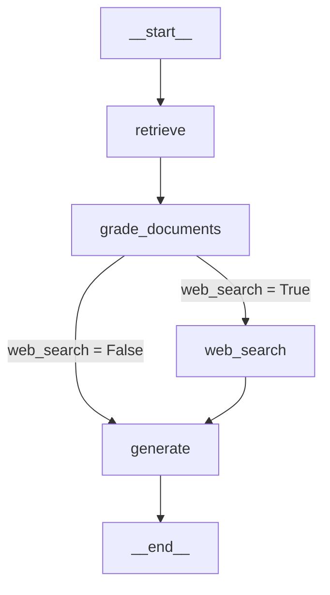

import Quiz from '@/components/content/Quiz.astro'

## 概要

このレクチャーでは，これまでに実装したすべてのノードとエッジを接続して，Corrective RAGグラフを完成させます．条件分岐エッジを使用して，ドキュメントの関連性に基づいてWeb検索と生成のどちらに進むかを決定します．

## 定数とインポートの設定

```python
# consts.py - ノード名の定数
RETRIEVE = "retrieve"
GRADE_DOCUMENTS = "grade_documents"
GENERATE = "generate"
WEB_SEARCH = "web_search"
```

## 条件分岐関数の実装

```python
def decide_to_generate(state: GraphState) -> str:
    """ドキュメントの関連性に基づいて次のノードを決定する

    Args:
        state: 現在のグラフ状態

    Returns:
        次に実行するノードの名前
    """
    if state["web_search"]:
        return WEB_SEARCH
    else:
        return GENERATE
```

## グラフの構築



```python
from langgraph.graph import StateGraph, END
from graph.state import GraphState

# ワークフローの作成
workflow = StateGraph(GraphState)

# ノードの追加
workflow.add_node(RETRIEVE, retrieve)
workflow.add_node(GRADE_DOCUMENTS, grade_documents)
workflow.add_node(GENERATE, generate)
workflow.add_node(WEB_SEARCH, web_search)

# エントリポイントの設定
workflow.set_entry_point(RETRIEVE)

# エッジの追加
workflow.add_edge(RETRIEVE, GRADE_DOCUMENTS)
workflow.add_conditional_edges(
    GRADE_DOCUMENTS,
    decide_to_generate,
    {
        WEB_SEARCH: WEB_SEARCH,
        GENERATE: GENERATE,
    },
)
workflow.add_edge(WEB_SEARCH, GENERATE)
workflow.add_edge(GENERATE, END)

# コンパイル
app = workflow.compile()
```

## 実行と動作確認

```python
# メインファイルでの実行
result = app.invoke({"question": "What is agent memory?"})
```

実行ログでは以下のフローが確認できます．
1. Retrieveノードでドキュメントを取得
2. Grade Documentsノードで関連性を評価
3. 関連性のないドキュメントがあればWeb Searchを実行
4. Generateノードで最終回答を生成

## まとめ

- `add_conditional_edges`を使用して，状態に基づく条件分岐を実装する
- `path_map`辞書で関数の戻り値とノード名のマッピングを定義できる
- グラフはRetrieve → Grade Documents → (Web Search | Generate)の順で実行される
- LangSmithでグラフ全体の実行トレースを確認できる

<Quiz questions={[
  {
    question: "decide_to_generate関数が返す値はどの情報に基づいていますか?",
    options: [
      "ドキュメントの文字数",
      "GraphStateのweb_searchフラグ",
      "LLMの生成結果",
      "ユーザーの質問の長さ"
    ],
    answer: 1,
    explanation: "decide_to_generate関数はGraphStateのweb_searchフラグの値に基づいて，WEB_SEARCHまたはGENERATEのいずれかを返します．"
  },
  {
    question: "add_conditional_edgesのpath_map辞書の役割は何ですか?",
    options: [
      "ノードの実行順序を指定する",
      "ルーティング関数の戻り値を実際のノード名にマッピングする",
      "エッジの重みを定義する",
      "ノード間のデータ変換を定義する"
    ],
    answer: 1,
    explanation: "path_map辞書は，条件分岐関数の戻り値を実際のノード名にマッピングし，グラフの可視化時にもエッジラベルとして表示されます．"
  },
  {
    question: "グラフの実行順序として正しいものはどれですか?",
    options: [
      "Generate → Retrieve → Grade Documents",
      "Retrieve → Grade Documents → (Web Search | Generate)",
      "Grade Documents → Retrieve → Generate",
      "Web Search → Retrieve → Generate"
    ],
    answer: 1,
    explanation: "グラフはRetrieve → Grade Documents → 条件分岐（Web SearchまたはGenerate）の順で実行されます．"
  },
  {
    question: "定数ファイル（consts.py）でノード名を管理する利点は何ですか?",
    options: [
      "コードの実行速度が向上する",
      "ノード名の一貫性を保ち，タイプミスを防ぐ",
      "自動テストが可能になる",
      "LLMの出力精度が向上する"
    ],
    answer: 1,
    explanation: "定数ファイルでノード名を管理することで，コード全体でノード名の一貫性を保ち，文字列のタイプミスによるバグを防ぎます．"
  },
  {
    question: "workflow.add_edge(WEB_SEARCH, GENERATE)の意味は何ですか?",
    options: [
      "Web検索の結果を生成ノードに送信する条件付きエッジ",
      "Web検索ノードの後は必ず生成ノードが実行される確定的エッジ",
      "生成ノードからWeb検索ノードへの逆方向のエッジ",
      "Web検索と生成を並列実行するエッジ"
    ],
    answer: 1,
    explanation: "add_edgeは確定的エッジを追加し，Web検索ノードの後は必ず生成ノードが実行されることを定義します．"
  }
]} />
