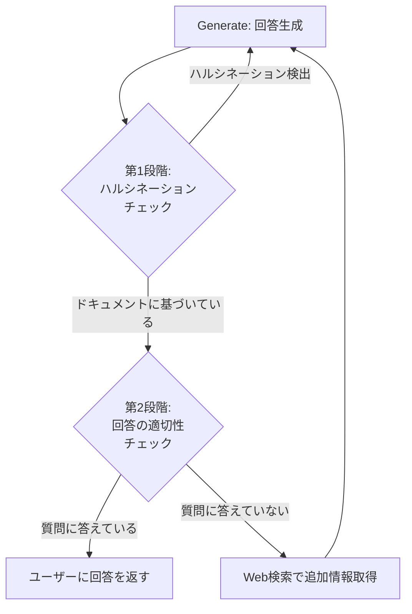

import Quiz from '@/components/content/Quiz.astro'

## 概要

このレクチャーでは，Self RAG論文に基づく回答のリフレクション（自己評価）機能の概要を紹介します．LLMの生成結果がドキュメントに基づいているか，またユーザーの質問に適切に答えているかを検証する仕組みです．

## Self RAGの2段階のリフレクション

### 第1段階: ハルシネーションチェック

生成された回答がドキュメントに基づいているか（グラウンディング）を検証します．

- 回答がドキュメントに基づいている場合 → 第2段階へ進む
- 回答がドキュメントに基づいていない場合（ハルシネーション） → 再生成を実行する

### 第2段階: 回答の適切性チェック

回答がユーザーの元の質問に適切に答えているかを検証します．

- 回答が質問に答えている場合 → ユーザーに回答を返す
- 回答が質問に答えていない場合 → Web検索で追加情報を取得する

## ワークフローへの統合

既存のCorrective RAGグラフのGenerateノードの後に，条件分岐として以下のロジックを追加します．

- ハルシネーション検出 → Generateノードへ戻って再生成
- 回答が質問に答えている → ENDノードへ（完了）
- 回答が質問に答えていない → Web Searchノードへ

## まとめ

- Self RAGは生成された回答の品質を2段階で評価する手法
- 第1段階でハルシネーション（ドキュメントに基づかない回答）を検出する
- 第2段階で回答がユーザーの質問に適切に答えているかを確認する
- 問題がある場合は再生成またはWeb検索で対処する

<Quiz questions={[
  {
    question: "Self RAGの第1段階で検証する内容は何ですか?",
    options: [
      "回答がユーザーの質問に答えているか",
      "回答がドキュメントに基づいているか（ハルシネーション検出）",
      "ドキュメントの関連性",
      "検索クエリの適切性"
    ],
    answer: 1,
    explanation: "Self RAGの第1段階では，生成された回答がドキュメントに基づいているか（グラウンディング）を検証し，ハルシネーションを検出します．"
  },
  {
    question: "ハルシネーションが検出された場合の対処は何ですか?",
    options: [
      "Web検索を実行する",
      "ユーザーにエラーを返す",
      "Generateノードへ戻って再生成する",
      "ドキュメントを追加で取得する"
    ],
    answer: 2,
    explanation: "ハルシネーションが検出された場合は，Generateノードへ戻って回答を再生成します．"
  },
  {
    question: "第2段階で回答が質問に答えていない場合の対処は何ですか?",
    options: [
      "再生成する",
      "ユーザーにエラーを返す",
      "Web検索で追加情報を取得する",
      "ドキュメントを全て入れ替える"
    ],
    answer: 2,
    explanation: "回答が質問に適切に答えていない場合は，Web Searchノードで追加情報を取得してから再度回答を生成します．"
  },
  {
    question: "Self RAGがCorrective RAGグラフに追加される位置はどこですか?",
    options: [
      "Retrieveノードの前",
      "Grade Documentsノードの後",
      "Generateノードの後",
      "Web Searchノードの前"
    ],
    answer: 2,
    explanation: "Self RAGの条件分岐は既存のCorrective RAGグラフのGenerateノードの後に追加され，生成結果の品質を検証します．"
  },
  {
    question: "Self RAGの第2段階を通過した回答はどうなりますか?",
    options: [
      "再度批評ループに入る",
      "ドキュメントグレーダーに送られる",
      "ENDノードへ進みユーザーに回答が返される",
      "Web検索で追加確認される"
    ],
    answer: 2,
    explanation: "両段階の検証を通過した回答はENDノードへ進み，ユーザーに最終回答として返されます．"
  }
]} />
