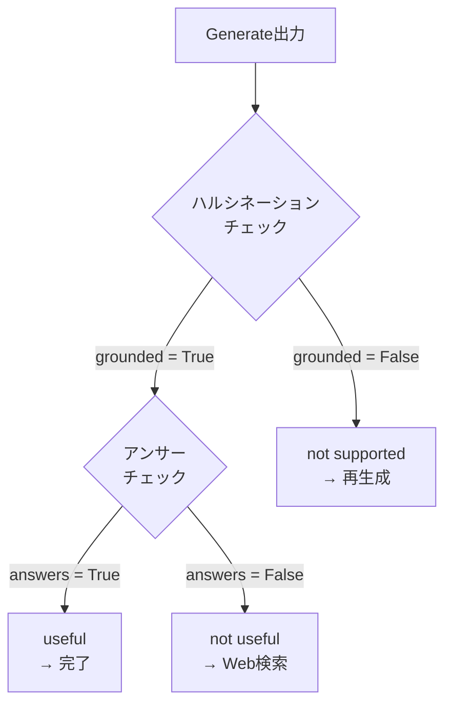

import Quiz from '@/components/content/Quiz.astro'

## 概要

このレクチャーでは，Self RAGのエンドツーエンド実装を行います．ハルシネーショングレーダーとアンサーグレーダーの2つのチェーンを実装し，テストを書き，条件分岐としてグラフに統合します．

## ハルシネーショングレーダーチェーンの実装

```python
from pydantic import BaseModel, Field

class GradeHallucinations(BaseModel):
    """生成された回答のハルシネーション評価"""
    binary_score: bool = Field(
        description="Answer is grounded in the facts, yes or no"
    )

llm = ChatOpenAI(temperature=0)
structured_llm_grader = llm.with_structured_output(GradeHallucinations)

system = """You are a grader assessing whether an LLM generation is
grounded in / supported by a set of documents. Give a binary score
of 'yes' or 'no'. 'Yes' means that the answer is grounded in /
supported by the facts."""

hallucination_prompt = ChatPromptTemplate.from_messages([
    ("system", system),
    ("human", "Set of facts: \n\n {documents} \n\n LLM generation: {generation}"),
])

hallucination_grader = hallucination_prompt | structured_llm_grader
```

## アンサーグレーダーチェーンの実装

```python
class GradeAnswer(BaseModel):
    """回答の適切性評価"""
    binary_score: bool = Field(
        description="Answer addresses the question, yes or no"
    )

structured_llm_grader = llm.with_structured_output(GradeAnswer)

system = """You are a grader assessing whether an answer addresses
and resolves the question. Give a binary score of 'yes' or 'no'.
'Yes' means that the answer resolves the question."""

answer_prompt = ChatPromptTemplate.from_messages([
    ("system", system),
    ("human", "User question: \n\n {question} \n\n LLM generation: {generation}"),
])

answer_grader = answer_prompt | structured_llm_grader
```

## テストの実装

```python
def test_hallucination_grader_answer_yes():
    question = "agent memory"
    docs = retriever.invoke(question)
    generation = generation_chain.invoke(
        {"context": docs, "question": question}
    )
    res = hallucination_grader.invoke(
        {"documents": docs, "generation": generation}
    )
    assert res.binary_score == True

def test_hallucination_grader_answer_no():
    res = hallucination_grader.invoke({
        "documents": docs,
        "generation": "In order to make pizza, we first need to start with the dough",
    })
    assert res.binary_score == False
```

## 条件分岐関数の実装



```python
def grade_generation_grounded_in_documents_and_question(
    state: GraphState,
) -> str:
    question = state["question"]
    documents = state["documents"]
    generation = state["generation"]

    # ハルシネーションチェック
    hallucination_grade = hallucination_grader.invoke(
        {"documents": documents, "generation": generation}
    ).binary_score

    if hallucination_grade:
        # 回答がドキュメントに基づいている場合
        answer_grade = answer_grader.invoke(
            {"question": question, "generation": generation}
        ).binary_score

        if answer_grade:
            return "useful"      # 質問に答えている
        else:
            return "not useful"  # 質問に答えていない
    else:
        return "not supported"   # ハルシネーション
```

## グラフへの統合

```python
workflow.add_conditional_edges(
    GENERATE,
    grade_generation_grounded_in_documents_and_question,
    {
        "not supported": GENERATE,   # 再生成
        "useful": END,               # 完了
        "not useful": WEB_SEARCH,    # Web検索
    },
)
```

`path_map`の辞書では，関数が返す文字列を実際のノード名にマッピングします．これにより，グラフの可視化時にエッジのラベルがわかりやすく表示されます．

## まとめ

- ハルシネーショングレーダーは生成がドキュメントに基づいているか検証する
- アンサーグレーダーは回答がユーザーの質問に答えているか検証する
- `path_map`を使用して，条件分岐のラベルとノードのマッピングを定義する
- Self RAGにより，ハルシネーション検出 → 再生成，不適切な回答 → Web検索という高品質なフローが実現する

<Quiz questions={[
  {
    question: "GradeHallucinationsモデルのbinary_scoreフィールドの型は何ですか?",
    options: [
      "str",
      "int",
      "bool",
      "float"
    ],
    answer: 2,
    explanation: "GradeHallucinationsモデルのbinary_scoreはbool型で，回答がドキュメントに基づいているかをTrue/Falseで判定します．"
  },
  {
    question: "条件分岐関数が返す3つの値はどれですか?",
    options: [
      "yes, no, maybe",
      "useful, not useful, not supported",
      "true, false, unknown",
      "pass, fail, retry"
    ],
    answer: 1,
    explanation: "条件分岐関数は'useful'（質問に回答済み），'not useful'（質問に未回答），'not supported'（ハルシネーション）の3つの値を返します．"
  },
  {
    question: "path_mapで'not supported'にマッピングされるノードはどれですか?",
    options: [
      "WEB_SEARCH",
      "END",
      "GENERATE",
      "RETRIEVE"
    ],
    answer: 2,
    explanation: "'not supported'（ハルシネーション検出）はGENERATEノードにマッピングされ，回答の再生成が実行されます．"
  },
  {
    question: "ハルシネーショングレーダーのテストで使用される偽の回答例は何ですか?",
    options: [
      "エージェントに関する一般的な回答",
      "ピザの作り方に関する回答",
      "天気予報に関する回答",
      "プログラミング言語の説明"
    ],
    answer: 1,
    explanation: "テストではエージェントメモリに関するドキュメントに対して'ピザを作るにはまず生地から始める必要がある'という無関係な回答を使い，ハルシネーション検出を検証します．"
  },
  {
    question: "アンサーグレーダーが評価する内容は何ですか?",
    options: [
      "回答の文法的な正確さ",
      "回答がユーザーの質問に対処し解決しているか",
      "回答のトークン数",
      "回答に含まれる引用の数"
    ],
    answer: 1,
    explanation: "アンサーグレーダーは，生成された回答がユーザーの質問に対処（address）し解決（resolve）しているかを評価します．"
  }
]} />
