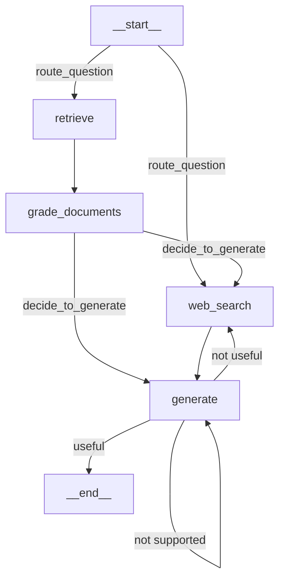

import Quiz from '@/components/content/Quiz.astro'

## 概要

このレクチャーでは，Adaptive RAG研究論文に基づく質問ルーターを実装します．ユーザーの質問を分析して，ベクトルストアでの検索とWeb検索のどちらにルーティングするかを決定する仕組みを構築します．

## 質問ルーターチェーンの実装

### Pydanticモデルの定義

```python
from typing import Literal
from pydantic import BaseModel, Field

class RouteQuery(BaseModel):
    """ルーティング先を決定するモデル"""
    datasource: Literal["vectorstore", "web_search"] = Field(
        ...,
        description="Given a user question, choose to route it to web search or a vectorstore.",
    )
```

`Literal`型を使用することで，`datasource`フィールドが`"vectorstore"`または`"web_search"`のいずれかの値のみを取ることを保証します．

### チェーンの構築

```python
llm = ChatOpenAI(temperature=0)
structured_llm_router = llm.with_structured_output(RouteQuery)

system = """You are an expert at routing a user question to a vectorstore
or web search. The vectorstore contains documents related to agents,
prompt engineering, and adversarial attacks. Use the vectorstore for
questions on those topics. For all else, use web search."""

route_prompt = ChatPromptTemplate.from_messages([
    ("system", system),
    ("human", "{question}"),
])

question_router = route_prompt | structured_llm_router
```

## テストの実装

```python
def test_router_to_vectorstore():
    question = "agent memory"
    res = question_router.invoke({"question": question})
    assert res.datasource == "vectorstore"

def test_router_to_web_search():
    question = "how to make pizza"
    res = question_router.invoke({"question": question})
    assert res.datasource == "web_search"
```

## 条件付きエントリポイントの実装

```python
def route_question(state: GraphState) -> str:
    """質問をルーティングする関数"""
    print("---ROUTE QUESTION---")
    question = state["question"]
    source = question_router.invoke({"question": question})

    if source.datasource == "web_search":
        return WEB_SEARCH
    elif source.datasource == "vectorstore":
        return RETRIEVE
```

### グラフへの統合

通常の`set_entry_point`の代わりに`set_conditional_entry_point`を使用します．

```python
workflow.set_conditional_entry_point(
    route_question,
    {
        WEB_SEARCH: WEB_SEARCH,
        RETRIEVE: RETRIEVE,
    },
)
```

これにより，グラフの最初のノードが質問の内容に応じて動的に決定されます．

## 完成したグラフのフロー



1. 条件付きエントリポイントで質問をルーティング
2. ベクトルストアルート: Retrieve → Grade Documents → (Web Search | Generate)
3. Web検索ルート: Web Search → Generate
4. Generateの後にSelf RAGのリフレクション

## まとめ

- Adaptive RAGは質問ルーターでクエリを適切なデータソースにルーティングする手法
- `Literal`型とStructured Outputで型安全なルーティングを実現する
- `set_conditional_entry_point`で条件付きエントリポイントを設定する
- ベクトルストアに情報がない質問は直接Web検索にルーティングされる
- テスト駆動開発で各チェーンの正確性を保証する

<Quiz questions={[
  {
    question: "RouteQueryモデルのdatasourceフィールドが取りうる値はどれですか?",
    options: [
      "vectorstore と database",
      "vectorstore と web_search",
      "local と remote",
      "chroma と tavily"
    ],
    answer: 1,
    explanation: "RouteQueryモデルのdatasourceフィールドはLiteral型で'vectorstore'または'web_search'のいずれかの値のみを取ります．"
  },
  {
    question: "Literal型を使用する利点は何ですか?",
    options: [
      "LLMの応答速度を向上させる",
      "フィールドの値を列挙された選択肢のみに制限し型安全にする",
      "自動テストを生成する",
      "ドキュメントを自動生成する"
    ],
    answer: 1,
    explanation: "Literal型を使用することで，datasourceフィールドが指定された値（vectorstoreまたはweb_search）のみを取ることを型レベルで保証します．"
  },
  {
    question: "set_conditional_entry_pointとset_entry_pointの違いは何ですか?",
    options: [
      "set_conditional_entry_pointは複数のノードを同時に実行する",
      "set_conditional_entry_pointは条件に基づいて最初に実行するノードを動的に決定する",
      "set_conditional_entry_pointはエラー時の代替ノードを指定する",
      "両者に違いはない"
    ],
    answer: 1,
    explanation: "set_conditional_entry_pointは条件に基づいてグラフの最初に実行するノードを動的に決定しますが，set_entry_pointは常に同じノードから開始します．"
  },
  {
    question: "質問ルーターがvectorstoreにルーティングするトピックはどれですか?",
    options: [
      "料理のレシピ",
      "エージェント，プロンプトエンジニアリング，敵対的攻撃",
      "天気予報",
      "株式市場の情報"
    ],
    answer: 1,
    explanation: "ベクトルストアにはエージェント，プロンプトエンジニアリング，敵対的攻撃に関するドキュメントが含まれているため，これらのトピックの質問がルーティングされます．"
  },
  {
    question: "Web検索ルートでの処理フローはどれですか?",
    options: [
      "Web Search → Grade Documents → Generate",
      "Web Search → Generate",
      "Web Search → Retrieve → Generate",
      "Web Search → Retrieve → Grade Documents → Generate"
    ],
    answer: 1,
    explanation: "Web検索ルートでは，Web Searchノードで検索を実行した後，直接Generateノードで回答を生成します．Grade Documentsは経由しません．"
  }
]} />
