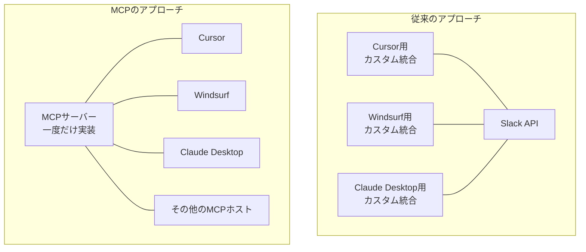

import Quiz from '@/components/content/Quiz.astro'

## 概要

このレクチャーでは，MCP（Model Context Protocol）が必要とされる理由を解説します．AIエージェントのツール統合における課題と，MCPが提供する標準化の価値を理解します．

## 従来のツール統合の課題

AIエージェントにSlackメッセージ送信，メール操作，DB問い合わせなどの機能を持たせたい場合，従来は以下のようなアプローチが必要でした．

1. 各APIの仕様を理解する（Slack API，Gmail APIなど）
2. カスタムコードでツールを実装する
3. エージェントフレームワーク（LangChainなど）に統合する

### 問題点

特定のアプリケーション（例: Cursor）向けにカスタム実装したエージェントを，別のアプリケーション（例: Windsurf，Claude Desktop，GitHub Copilot）でも使いたい場合，それぞれに対して個別の統合コードを書く必要がありました．

## MCPが解決すること

MCPは，コンピューターサイエンスの基本原則である「抽象化レイヤーの追加」によってこの問題を解決します．

### 「一度書けば，どこでも使える」

- MCPサーバーへの統合を一度だけ実装する
- MCPプロトコルをサポートするすべてのAIアプリケーションから利用可能になる
- Cursor向けに書いたエージェントが，Windsurf，Claude Desktop，その他のMCPホストでもそのまま動作する

### ネットワーク効果

MCPはソーシャルメディアのようなネットワーク効果を持ちます．利用者が増えるほど，利用可能なMCPサーバーが増え，エコシステム全体の価値が高まります．現在，多くのMCPサーバーが公開されており，その可能性は無限です．

## まとめ

- 従来のツール統合では，アプリケーションごとに個別の統合コードが必要だった
- MCPは抽象化レイヤーを追加することで，ツール統合を標準化する
- 一度MCPサーバーを実装すれば，MCPをサポートするすべてのAIアプリケーションから利用可能
- ネットワーク効果により，MCPエコシステムの価値は急速に拡大している

<Quiz questions={[
  {
    question: "MCPが解決する主な課題は何ですか?",
    options: [
      "LLMの推論速度の向上",
      "アプリケーションごとに個別のツール統合コードが必要な問題",
      "AIモデルのトレーニングコストの削減",
      "プログラミング言語の互換性問題"
    ],
    answer: 1,
    explanation: "従来はCursor，Windsurf，Claude Desktopなどのアプリケーションごとに個別の統合コードを書く必要がありましたが，MCPはこの問題を標準化で解決します．"
  },
  {
    question: "MCPの設計原則として最も適切なものはどれですか?",
    options: [
      "パフォーマンス最適化",
      "抽象化レイヤーの追加",
      "データベースの正規化",
      "マイクロサービスの分割"
    ],
    answer: 1,
    explanation: "MCPはコンピューターサイエンスの基本原則である「抽象化レイヤーの追加」によって，ツール統合を標準化します．"
  },
  {
    question: "MCPの「一度書けば，どこでも使える」とはどういう意味ですか?",
    options: [
      "1つのプログラミング言語で全ての開発ができる",
      "MCPサーバーを一度実装すれば全てのMCPホストから利用可能",
      "1つのLLMモデルで全てのタスクが処理できる",
      "1つのAPIキーで全てのサービスにアクセスできる"
    ],
    answer: 1,
    explanation: "MCPサーバーへの統合を一度だけ実装すれば，MCPプロトコルをサポートするすべてのAIアプリケーションから利用可能になります．"
  },
  {
    question: "MCPのネットワーク効果とは何ですか?",
    options: [
      "ネットワーク通信速度が向上すること",
      "利用者が増えるほどエコシステム全体の価値が高まること",
      "複数のサーバーで負荷分散すること",
      "ネットワークセキュリティが強化されること"
    ],
    answer: 1,
    explanation: "MCPはソーシャルメディアのようなネットワーク効果を持ち，利用者が増えるほど利用可能なMCPサーバーが増え，エコシステム全体の価値が高まります．"
  },
  {
    question: "従来のツール統合で必要だった手順に含まれないものはどれですか?",
    options: [
      "各APIの仕様を理解する",
      "カスタムコードでツールを実装する",
      "エージェントフレームワークに統合する",
      "MCPサーバーをデプロイする"
    ],
    answer: 3,
    explanation: "従来のアプローチではAPI仕様の理解，カスタム実装，フレームワーク統合が必要でしたが，MCPサーバーのデプロイはMCPの新しいアプローチです．"
  }
]} />
