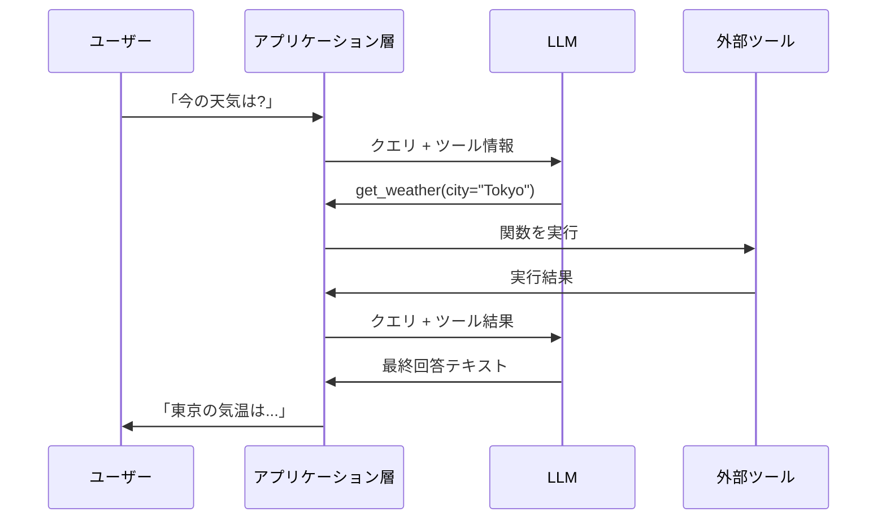

import Quiz from '@/components/content/Quiz.astro'

## 概要

このレクチャーでは，LLMが実際にどのようにツールを使用するのか，その内部メカニズムを解説します．LLMは本質的にはテキスト生成器であり，ツール使用はアプリケーション層で実現されるアドホックな機能であることを理解します．

## LLMの本質

LLMは単純なトークン生成器です．1つのトークンを次々と予測して，テキストを生成するだけです．マルチモーダルLLMであれば画像なども出力できますが，LLM自体がアクションを実行することはできません．

Web検索，深層リサーチ，Pythonの関数呼び出しなどの追加機能は，LLMを内包するアプリケーション層に組み込まれた外部ツールです．

## ツールコーリングの仕組み

### 基本的なフロー

1. ユーザーが「今の天気は？」と質問する
2. LLMは回答テキストを生成する代わりに，ツール呼び出しのテキストを生成する
   - 例: `get_weather(city="Tokyo")`
3. アプリケーション層がこの出力をパースして，実際のツールを実行する
4. ツールの実行結果をLLMに再度送信して，最終回答を生成する

### 仕組みの核心

ツールコーリングは，特殊なシステムプロンプトによって実現されます．このプロンプトにより，LLMは特定のユースケースに対して回答テキストではなく，パースしやすい形式のツール呼び出しテキストを出力するようになります．

各LLMベンダーによってツールコーリングの実装は異なりますが，本質的にはすべて特殊なシステムプロンプトに帰結します．コースの前半で学んだReActプロンプトもその一例です．

### 統計的な性質

LLMは統計的なモデルであるため，ツールコーリングが100%正確に動作する保証はありません．しかし，ほとんどの場合は十分にうまく機能し，エージェントアプリケーションに適用可能です．

## MCPとツールコーリングの関係

MCPは，ツールの実装と公開を標準化するプロトコルです．MCPで定義されたツールは，ツールコーリングをサポートするすべてのアプリケーション（ChatGPT，Claude Desktop，Cursorなど）で使用できます．

## まとめ

- LLMは本質的にテキスト生成器であり，ツール使用はアプリケーション層のアドホックな機能
- ツールコーリングは特殊なシステムプロンプトによって実現される
- アプリケーション層がLLMの出力をパースし，実際のツールを実行する
- MCPはこのツール定義を標準化し，複数のアプリケーション間で共有可能にする

<Quiz questions={[
  {
    question: "LLMの本質的な機能は何ですか?",
    options: [
      "Web検索を実行する",
      "トークンを次々と予測してテキストを生成する",
      "データベースを操作する",
      "外部APIを直接呼び出す"
    ],
    answer: 1,
    explanation: "LLMは本質的にはトークン生成器で，1つのトークンを次々と予測してテキストを生成するだけです．ツール使用はアプリケーション層で実現されます．"
  },
  {
    question: "ツールコーリングを実現する仕組みの核心は何ですか?",
    options: [
      "LLMの内部パラメータの変更",
      "特殊なシステムプロンプト",
      "外部ハードウェアの追加",
      "データベースのトリガー"
    ],
    answer: 1,
    explanation: "ツールコーリングは特殊なシステムプロンプトによって実現されます．このプロンプトにより，LLMは回答テキストではなくパース可能なツール呼び出しテキストを出力します．"
  },
  {
    question: "ツール呼び出し後の処理フローとして正しいものはどれですか?",
    options: [
      "ツール結果をそのままユーザーに返す",
      "ツール結果をLLMに再送信して最終回答を生成する",
      "ツール結果をデータベースに保存する",
      "ツール結果を次のツール呼び出しに渡す"
    ],
    answer: 1,
    explanation: "ツールの実行結果はLLMに再度送信され，ユーザーへの最終回答テキストが生成されます．"
  },
  {
    question: "LLMのツールコーリングの統計的な性質について正しいものはどれですか?",
    options: [
      "100%正確に動作することが保証されている",
      "全く信頼できず使用すべきでない",
      "100%正確ではないが，ほとんどの場合十分に機能する",
      "特定のLLMモデルでのみ動作する"
    ],
    answer: 2,
    explanation: "LLMは統計的なモデルであるため100%正確な保証はありませんが，ほとんどの場合十分にうまく機能し，エージェントアプリケーションに適用可能です．"
  },
  {
    question: "ツールの実行は誰が行いますか?",
    options: [
      "LLM自体が実行する",
      "ユーザーが手動で実行する",
      "アプリケーション層がLLMの出力をパースして実行する",
      "クラウドサービスが自動で実行する"
    ],
    answer: 2,
    explanation: "LLM自体はツールを実行できません．アプリケーション層がLLMの出力をパースし，実際のツールを実行して結果をLLMに返します．"
  }
]} />
