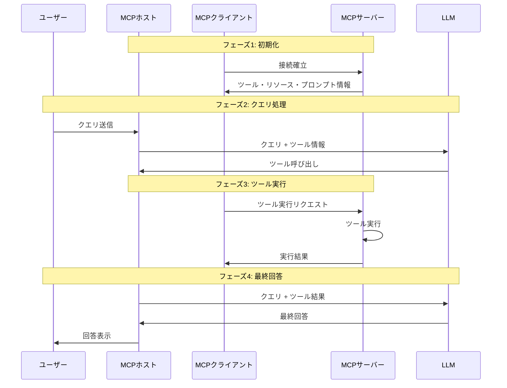

import Quiz from '@/components/content/Quiz.astro'

## 概要

このレクチャーでは，MCPプロトコルにおけるクライアントとサーバー間の対話フローを詳細に解説します．ユーザーのクエリからツール実行，最終回答までの一連の流れを理解します．

## MCPの主要コンポーネント

- ユーザー: クエリを送信する主体
- アプリケーション（ホスト）: Cursor，Windsurf，Claude Desktopなど
- MCPクライアント: アプリケーション内に存在し，MCPサーバーと通信する
- MCPサーバー: ツールの実装と実行を担当する
- LLM: テキスト生成とツール呼び出し判断を行う

## MCPの対話フロー

### フェーズ1: 初期化（アプリケーション起動時）

1. アプリケーション起動時にMCPクライアントがMCPサーバーへ接続を確立する
2. MCPサーバーが利用可能なツール・リソース・プロンプトの情報をクライアントに送信する
3. 複数のMCPサーバーがある場合，各サーバーに対して個別のクライアントが接続を確立する

### フェーズ2: ユーザークエリの処理

1. ユーザーがクエリを送信する
2. アプリケーションがクエリ + MCPサーバーのツール情報をLLMに送信する
3. LLMがテキスト回答またはツール呼び出しを返す

### フェーズ3: ツール実行

1. ツール呼び出しの場合，MCPクライアントがMCPサーバーにリクエストを送信する
2. MCPサーバー側でツールが実行される（アプリケーション内ではない）
3. 実行結果がMCPクライアント経由でアプリケーションに返される

### フェーズ4: 最終回答生成

1. ユーザークエリ + ツール実行結果をLLMに送信する
2. LLMが最終回答を生成する
3. ユーザーに回答を返す

## MCPとLangChainの違い

LangChainのReActエージェントでは，ツールの実行はアプリケーション内で行われます．一方MCPでは，ツール実行がMCPサーバー側で行われるため，オーケストレーション（エージェント）とツール実行が分離されます．

### 分離のメリット

- デバッグとロギングが容易になる
- サーバーの独立したスケーリングが可能
- 動的なツール更新が可能（サーバーの再デプロイ時にエージェントの変更不要）
- モニタリングと運用の分離

## まとめ

- MCPはアプリケーション起動時にツール情報の初期化を行い，クエリ処理時にツール実行を分離して行う
- MCPクライアントとMCPサーバーは1対1の接続関係にある
- ツール実行がMCPサーバー側で行われることで，オーケストレーションとの分離が実現する
- 動的ツール更新が可能になり，エージェントの柔軟性が向上する

<Quiz questions={[
  {
    question: "MCPにおけるツール実行の場所はどこですか?",
    options: [
      "アプリケーション（ホスト）内",
      "LLMの内部",
      "MCPサーバー側",
      "ユーザーのブラウザ内"
    ],
    answer: 2,
    explanation: "MCPでは，ツールの実行はMCPサーバー側で行われます．これにより，オーケストレーション（エージェント）とツール実行が分離されます．"
  },
  {
    question: "MCPクライアントとMCPサーバーの接続関係はどれですか?",
    options: [
      "1対多",
      "多対1",
      "1対1",
      "多対多"
    ],
    answer: 2,
    explanation: "MCPクライアントとMCPサーバーは1対1の接続関係にあります．複数のMCPサーバーがある場合は，各サーバーに対して個別のクライアントが接続します．"
  },
  {
    question: "MCPの初期化フェーズでMCPサーバーがクライアントに送信する情報は何ですか?",
    options: [
      "LLMのモデル設定",
      "利用可能なツール・リソース・プロンプトの情報",
      "ユーザーの認証情報",
      "過去のクエリ履歴"
    ],
    answer: 1,
    explanation: "初期化フェーズでは，MCPサーバーが利用可能なツール，リソース，プロンプトの情報をMCPクライアントに送信します．"
  },
  {
    question: "MCPでツール実行を分離するメリットに含まれないものはどれですか?",
    options: [
      "デバッグとロギングが容易になる",
      "サーバーの独立したスケーリングが可能",
      "LLMの応答速度が向上する",
      "動的なツール更新が可能"
    ],
    answer: 2,
    explanation: "ツール実行の分離はデバッグ容易性，独立スケーリング，動的更新などのメリットを提供しますが，LLMの応答速度自体の向上には直接関係しません．"
  },
  {
    question: "LangChainのReActエージェントとMCPの違いとして正しいものはどれですか?",
    options: [
      "ReActはツールを使えないが，MCPはツールを使える",
      "ReActはアプリ内でツール実行するが，MCPはサーバー側で実行する",
      "ReActは非同期だが，MCPは同期的である",
      "ReActはPythonのみだが，MCPはNode.jsのみ"
    ],
    answer: 1,
    explanation: "LangChainのReActエージェントではツール実行がアプリケーション内で行われますが，MCPではツール実行がMCPサーバー側で行われ，オーケストレーションと分離されます．"
  }
]} />
