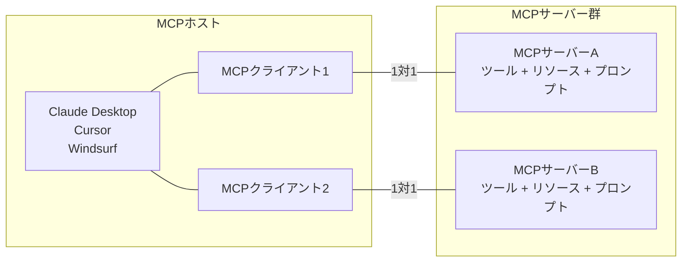

import Quiz from '@/components/content/Quiz.astro'

## 概要

このレクチャーでは，MCPの全体アーキテクチャを解説します．MCPの目的，MCPホスト・クライアント・サーバーの各コンポーネントの役割，そしてMCPエコシステムの将来の展望を紹介します．

## MCPの目的

MCPはアプリケーションがLLMにコンテキストを提供する方法を標準化するプロトコルです．ここでいう「コンテキスト」とは以下を含みます．

- プロンプトに追加する情報
- 呼び出すべきツール
- プロンプトテンプレート自体

## MCPの標準が普及することで可能になること

Uber Eatsへの食事注文をCursorから行うMCPサーバーの例のように，MCPの標準化により驚くべき応用が可能になります．あるアプリケーション向けに作ったMCPサーバーを，USB-Cのように別のアプリケーションに差し替えて使用できます．

## MCPの主要コンポーネント

### MCPホスト（左側）
- Claude Desktop，Cursor，Windsurf，独自のAIアプリケーションなど
- MCPプロトコルで拡張されるアプリケーション

### MCPサーバー（右側）
- ツール，リソース，プロンプトを公開する
- 特定のメソッドとプロトコルに従って機能を公開する

### MCPクライアント（中間）
- MCPホスト内に存在する
- MCPサーバーと通信を行う
- MCPクライアントとMCPサーバーは1対1の接続

## MCPの利点

- 膨大な数の統合とツールをプラグアンドプレイで利用可能
- LLMベンダーやAIアプリケーションビルダーに依存しない
- 一度ツールを書けば，異なるベンダー間で移行可能

## MCPの将来

- レジストリとディスカバリー: MCPサーバーの中央レジストリAPI
- 公式サーバーの検証: サプライチェーン攻撃への対策
- 自己進化エージェント: ランタイムで新しい能力を発見可能
- well-knownエンドポイント: Webサイトがエージェント向けに機能を公開
- 認証サポート: OAuth 2.0やセッショントークンによるセキュアなアクセス

## まとめ

- MCPはLLMへのコンテキスト提供方法を標準化するプロトコル
- MCPホスト，MCPクライアント，MCPサーバーの3つのコンポーネントで構成される
- MCPクライアントとMCPサーバーは1対1の接続関係にある
- 将来的にレジストリ，認証，動的ディスカバリーなどの機能が追加される予定

<Quiz questions={[
  {
    question: "MCPの目的として最も正確なものはどれですか?",
    options: [
      "LLMのトレーニング方法を標準化する",
      "アプリケーションがLLMにコンテキストを提供する方法を標準化する",
      "APIの認証方法を標準化する",
      "データベースのスキーマを標準化する"
    ],
    answer: 1,
    explanation: "MCPはアプリケーションがLLMにコンテキスト（ツール，リソース，プロンプト）を提供する方法を標準化するプロトコルです．"
  },
  {
    question: "MCPの3つの主要コンポーネントはどれですか?",
    options: [
      "フロントエンド，バックエンド，データベース",
      "MCPホスト，MCPクライアント，MCPサーバー",
      "プロデューサー，コンシューマー，ブローカー",
      "コントローラー，サービス，リポジトリ"
    ],
    answer: 1,
    explanation: "MCPはMCPホスト（AIアプリケーション），MCPクライアント（通信仲介），MCPサーバー（ツール提供）の3つのコンポーネントで構成されます．"
  },
  {
    question: "MCPの将来機能に含まれないものはどれですか?",
    options: [
      "レジストリとディスカバリー",
      "OAuth 2.0による認証サポート",
      "LLMのファインチューニング機能",
      "well-knownエンドポイント"
    ],
    answer: 2,
    explanation: "MCPの将来機能にはレジストリ，認証サポート，well-knownエンドポイントなどが含まれますが，LLMのファインチューニングはMCPの範囲外です．"
  },
  {
    question: "MCPをUSB-Cに例える理由は何ですか?",
    options: [
      "物理的な接続が必要だから",
      "標準化により異なるデバイス間で同じインターフェースが使えるから",
      "転送速度が速いから",
      "Apple製品でのみ使用できるから"
    ],
    answer: 1,
    explanation: "USB-Cが異なるデバイス間で同じ物理インターフェースを提供するように，MCPはAIアプリケーション間で同じツール統合インターフェースを提供します．"
  },
  {
    question: "MCPクライアントが存在する場所はどこですか?",
    options: [
      "MCPサーバーの内部",
      "MCPホスト（アプリケーション）の内部",
      "クラウド上の独立したサービス",
      "ユーザーのブラウザ拡張機能"
    ],
    answer: 1,
    explanation: "MCPクライアントはMCPホスト（Claude Desktop，Cursor等のアプリケーション）の内部に存在し，MCPサーバーとの通信を仲介します．"
  }
]} />
