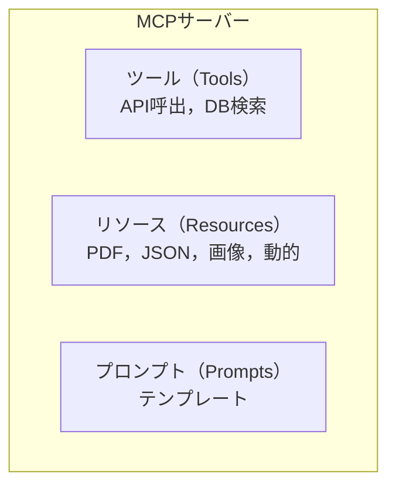

import Quiz from '@/components/content/Quiz.astro'

## 概要

このレクチャーでは，MCPサーバーの詳細を解説します．MCPサーバーが公開する3つの主要インターフェース（ツール，リソース，プロンプト），構築方法，実行方法について学びます．

## MCPサーバーの3つのインターフェース

### 1. ツール（Tools）
LLMが必要に応じて呼び出せる関数です．

- API呼び出し（天気取得，食事注文など）
- データベース検索
- 任意のカスタム機能

ツール内では自由にロジックを実装でき，データの読み書きが可能です．

### 2. リソース（Resources）
AIシステムに公開されるデータです．

- 静的データ: PDF，テキストファイル，画像，JSONなど
- 動的データ: API経由で動的に取得するデータ

### 3. プロンプト（Prompts）
ユーザーが呼び出せる定義済みのテンプレートです．

- 複雑なインタラクションの標準化に役立つ
- 定義済みのテンプレートとして利用可能

## MCPサーバーの構築方法

1. 手動で作成: PythonまたはNode.jsで数百行のコードを記述
2. AIで生成: CursorやMCPジェネレーターを使用
3. コミュニティ製サーバーを利用: オープンソースの既存サーバーをクローン・修正
4. 公式統合: Cloudflare，Stripeなどの企業が維持するサーバーを利用

### 重要な注意点

車輪の再発明をしないこと．サードパーティサービスのMCPサーバーが必要な場合は，まず公式サーバーが存在するか確認しましょう．

## MCPサーバーの実行方法

- ローカル実行: 標準入出力（Stdio）経由
- リモート実行: SSE（Server-Sent Events）またはSSH経由
- Docker: コンテナとして実行

## サンプリング機能

MCPサーバーからホストAIシステムにLLM補完の生成をリクエストできる機能です．強力ですが，セキュリティとプライバシーの影響に注意が必要です．

## コンポーザビリティ

アプリケーションやエージェントは，MCPクライアントとMCPサーバーの両方の役割を持つことができます．これにより，特殊化されたエージェントが特定のタスクに集中する多層的なエージェントアプリケーションが構築可能です．

## まとめ

- MCPサーバーはツール，リソース，プロンプトの3つのインターフェースを公開する
- 手動作成，AI生成，コミュニティ製，公式統合の4つの構築方法がある
- Stdio，SSE，Dockerの3つの実行方法がある
- 既存のMCPサーバーを活用し，車輪の再発明を避けることが重要

<Quiz questions={[
  {
    question: "MCPサーバーが公開する3つのインターフェースはどれですか?",
    options: [
      "API，データベース，ファイルシステム",
      "ツール，リソース，プロンプト",
      "認証，認可，監査",
      "入力，処理，出力"
    ],
    answer: 1,
    explanation: "MCPサーバーはツール（関数），リソース（データ），プロンプト（テンプレート）の3つの主要インターフェースを公開します．"
  },
  {
    question: "MCPサーバーの構築方法として推奨される最初のステップは何ですか?",
    options: [
      "手動でゼロからコードを書く",
      "AIに自動生成させる",
      "まず公式サーバーが存在するか確認する",
      "Dockerコンテナを作成する"
    ],
    answer: 2,
    explanation: "車輪の再発明を避けるため，サードパーティサービスのMCPサーバーが必要な場合は，まず公式サーバーが存在するか確認することが推奨されます．"
  },
  {
    question: "MCPサーバーのローカル実行で使用される通信方式はどれですか?",
    options: [
      "HTTP REST",
      "GraphQL",
      "標準入出力（Stdio）",
      "WebSocket"
    ],
    answer: 2,
    explanation: "MCPサーバーのローカル実行では標準入出力（Stdio）経由で通信します．リモート実行ではSSEやSSHが使用されます．"
  },
  {
    question: "MCPのコンポーザビリティとは何ですか?",
    options: [
      "複数のプログラミング言語を混在させること",
      "アプリケーションがMCPクライアントとサーバーの両方の役割を持てること",
      "MCPサーバーを自動的に生成すること",
      "複数のLLMを同時に使用すること"
    ],
    answer: 1,
    explanation: "コンポーザビリティにより，アプリケーションやエージェントはMCPクライアントとMCPサーバーの両方の役割を持つことができ，多層的なエージェントアプリケーションが構築可能です．"
  },
  {
    question: "MCPのリソース（Resources）に含まれるものはどれですか?",
    options: [
      "LLMのモデルパラメータ",
      "PDF，テキストファイル，画像，JSON，動的APIデータ",
      "ユーザーの認証トークン",
      "グラフのノード定義"
    ],
    answer: 1,
    explanation: "MCPのリソースには静的データ（PDF，テキスト，画像，JSON）と動的データ（API経由で取得するデータ）が含まれ，AIシステムに公開されます．"
  }
]} />
