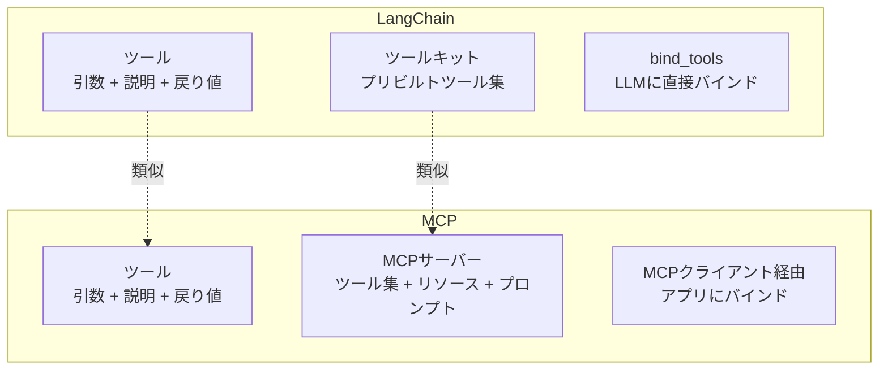

import Quiz from '@/components/content/Quiz.astro'

## 概要

このレクチャーでは，LangChainとMCPの類似点と相違点を比較し，LangChain MCPアダプターが両者を橋渡しする仕組みを解説します．

## LangChainとMCPの類似点

### ツールの概念

両者ともに「ツール」の概念を持ちます．ツールとは以下の要素を持つ外部関数です．

- 引数（Arguments）: 関数が受け取るパラメータ
- 説明（Description）: いつこの関数を呼ぶべきかの説明
- 戻り値（Return values）: 関数の出力

ツールの説明は非常に重要で，LLMがどのツールを呼ぶかの判断に使われます．

### ツールコレクション

- LangChain: ツールキット（Toolkit）= プリビルトツールのコレクション
- MCP: MCPサーバー = ツールのコレクション

## LangChainとMCPの相違点

### MCPの拡張機能

MCPはツールに加えて，リソース（ドキュメント，PDF，画像など）やプロンプトも公開できます．

### ツールのバインド先

- LangChain: `bind_tools`でLLMに直接バインドする
- MCP: AIアプリケーション（Cursor，Windsurf，Claude）にバインドする

MCPでは，MCPサーバー → MCPクライアント → アプリケーション内のLLMという複数の抽象化レイヤーを経由します．

## LangChain MCPアダプター

LangChainチームがリリースしたオープンソースパッケージで，MCPツールをLangChain/LangGraphエージェントで使用可能にします．

### 主な機能

- ツール互換性: MCPツールをLangChain/LangGraph互換のツールに変換
- マルチサーバークライアント: 複数のMCPサーバーへの接続をサポート

これにより，既存のMCPサーバーを手動で適応させることなく，LangChain/LangGraphエージェントで活用できます．

## まとめ

- LangChainとMCPは「ツール」の概念が類似しているが，公開範囲とバインド先が異なる
- MCPはツールに加えてリソースとプロンプトも公開可能
- LangChain MCPアダプターにより，MCPツールをLangChain/LangGraphエージェントで使用可能になる
- マルチサーバークライアントで複数のMCPサーバーに同時接続できる

<Quiz questions={[
  {
    question: "LangChainのツールキットに相当するMCPの概念はどれですか?",
    options: [
      "MCPクライアント",
      "MCPホスト",
      "MCPサーバー",
      "MCPプロトコル"
    ],
    answer: 2,
    explanation: "LangChainのツールキット（プリビルトツールのコレクション）は，MCPサーバー（ツールのコレクション）に相当します．"
  },
  {
    question: "LangChainとMCPでツールのバインド先が異なる点は何ですか?",
    options: [
      "LangChainはデータベースに，MCPはファイルにバインドする",
      "LangChainはLLMに直接バインドし，MCPはアプリケーションにバインドする",
      "LangChainはクラウドに，MCPはローカルにバインドする",
      "両者ともLLMに直接バインドする"
    ],
    answer: 1,
    explanation: "LangChainではbind_toolsでLLMに直接バインドしますが，MCPではMCPサーバー→MCPクライアント→アプリケーション内のLLMという複数の抽象化レイヤーを経由します．"
  },
  {
    question: "LangChain MCPアダプターの主な機能は何ですか?",
    options: [
      "LangChainのツールをMCPサーバーに変換する",
      "MCPツールをLangChain/LangGraph互換のツールに変換する",
      "MCPサーバーを自動生成する",
      "LLMモデルを最適化する"
    ],
    answer: 1,
    explanation: "LangChain MCPアダプターはMCPツールをLangChain/LangGraph互換のツールに変換し，既存のMCPサーバーをLangGraphエージェントで活用できるようにします．"
  },
  {
    question: "LangChainとMCPのツールが共通して持つ3つの要素はどれですか?",
    options: [
      "名前，型，デフォルト値",
      "引数，説明，戻り値",
      "入力，処理，出力",
      "ヘッダー，ボディ，フッター"
    ],
    answer: 1,
    explanation: "LangChainとMCPの両方のツールは，引数（Arguments），説明（Description），戻り値（Return values）の3つの要素を持ちます．"
  },
  {
    question: "MCPがLangChainと比べて追加で公開できるものは何ですか?",
    options: [
      "チェーンとグラフ",
      "リソースとプロンプト",
      "テストとドキュメント",
      "ログとメトリクス"
    ],
    answer: 1,
    explanation: "MCPはツールに加えて，リソース（ドキュメント，画像など）やプロンプト（定義済みテンプレート）も公開できる点がLangChainとの相違点です．"
  }
]} />
