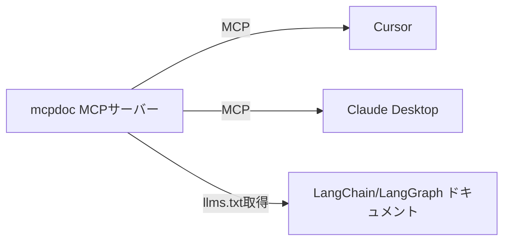

import Quiz from '@/components/content/Quiz.astro'

## 概要

このレクチャーでは，セクション16で取り組む内容の全体像を紹介します．プリビルトMCPサーバーをプリビルトMCPクライアントに統合する実践を通じて，MCPの理解を深めていきます．

## セクションの構成

MCPを完全に理解するために，以下のステップで進めます．

### プリビルトMCPサーバー: mcpdoc

LangChainチームがリリースした「mcpdoc」というMCPサーバーを使用します．このサーバーは，LangChainやLangGraphの最新ドキュメントにアクセスする機能を提供します．

これらのドキュメントは頻繁に更新されるため，手動で追跡するのは困難です．mcpdocを使えば，常に最新のドキュメントを自動的に取得できます．

### プリビルトMCPクライアント

以下の2つのプリビルトMCPクライアントにmcpdocを統合します．

1. Cursor: 組み込みのMCPクライアントを搭載
2. Claude Desktop: 同様にMCPクライアントを搭載

## 学習のゴール

セクション完了時には，以下を実現します．

- プリビルトMCPサーバー（mcpdoc）をプリビルトMCPクライアント（Cursor，Claude Desktop）に統合する
- 両コンポーネントがModel Context Protocolを通じて通信する仕組みを理解する

## まとめ

- mcpdocはLangChain/LangGraphの最新ドキュメントをリアルタイムで取得するMCPサーバー
- CursorとClaude Desktopの2つのMCPクライアントに統合する
- プリビルトコンポーネント同士の統合を通じて，MCPの実践的な理解を深める

<Quiz questions={[
  {
    question: "mcpdocが提供する主な機能は何ですか？",
    options: [
      "LLMのファインチューニングを行う",
      "LangChain/LangGraphの最新ドキュメントをリアルタイムで取得する",
      "Pythonコードの自動生成を行う",
      "MCPクライアントのインストールを自動化する"
    ],
    answer: 1,
    explanation: "mcpdocはLangChainチームがリリースしたMCPサーバーで，LangChainやLangGraphの最新ドキュメントにリアルタイムでアクセスする機能を提供します．"
  },
  {
    question: "このセクションで使用するプリビルトMCPクライアントはどれですか？",
    options: [
      "VS CodeとGitHub Copilot",
      "CursorとClaude Desktop",
      "WindsurfとChatGPT",
      "JetBrainsとGemini"
    ],
    answer: 1,
    explanation: "このセクションでは，CursorとClaude Desktopという2つのプリビルトMCPクライアントにmcpdocを統合します．"
  },
  {
    question: "MCPにおける「プリビルト」とはどのような意味ですか？",
    options: [
      "有料のプレミアム機能であること",
      "ユーザーがゼロから構築する必要がないこと",
      "クラウド上でのみ動作すること",
      "特定のプログラミング言語専用であること"
    ],
    answer: 1,
    explanation: "プリビルトとは，あらかじめ構築済みのコンポーネントを意味します．mcpdocはプリビルトMCPサーバー，CursorやClaude DesktopはプリビルトMCPクライアントとして，ユーザーがゼロから構築する必要なく利用できます．"
  },
  {
    question: "mcpdocを使う利点として最も適切なものはどれですか？",
    options: [
      "ドキュメントの更新を手動で追跡する必要がなくなる",
      "オフラインでもドキュメントにアクセスできる",
      "ドキュメントを自動翻訳できる",
      "ドキュメントのバージョン管理ができる"
    ],
    answer: 0,
    explanation: "LangChain/LangGraphのドキュメントは頻繁に更新されるため，手動で追跡するのは困難です．mcpdocを使えば常に最新のドキュメントを自動的に取得できます．"
  },
  {
    question: "MCPの正式名称は何ですか？",
    options: [
      "Machine Control Protocol",
      "Managed Communication Platform",
      "Model Context Protocol",
      "Multi-Channel Processing"
    ],
    answer: 2,
    explanation: "MCPはModel Context Protocolの略で，MCPサーバーとMCPクライアント間の通信を標準化するプロトコルです．"
  }
]} />
