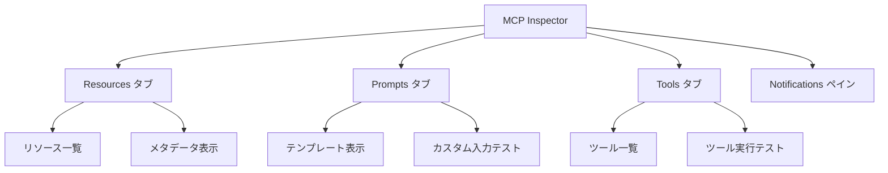

import Quiz from '@/components/content/Quiz.astro'

## 概要

このレクチャーでは，AnthropicチームによるオープンソースツールであるMCP Inspectorを紹介します．MCPサーバーの開発時にトラブルシュート，デバッグ，トレースを行うための重要なツールです．

## MCP Inspectorとは

MCP InspectorはMCPサーバーのテストとデバッグのためのインタラクティブな開発ツールです．以下の特徴があります．

- NPXからローカルで実行可能（インストール不要）
- MCPサーバーに接続して内容を検査できる
- StdioまたはSSE接続をサポート



## 主な機能

### Resourcesタブ
- 利用可能なリソースの一覧表示
- メタデータの表示
- コンテンツの検査

### Promptsタブ
- プロンプトテンプレートの表示
- プロンプト引数の確認
- カスタム入力でのテスト

### Toolsタブ
- 利用可能なツールの一覧表示
- ツールスキーマの確認
- カスタム入力でのツールテスト実行

### Notificationsペイン
- サーバーからのログとNotificationsの表示

## 使用例

MCP Inspectorを使ってドキュメントMCPサーバーに接続し，ツールの動作を確認する例を示します．

```bash
# MCP Inspectorの起動
npx @modelcontextprotocol/inspector
```

1. SSEサーバーに接続する
2. Toolsタブでツールを一覧表示する
3. `list_document_sources`ツールを実行して利用可能なドキュメントソースを確認する
4. `fetch_docs`ツールにURLを入力して，ドキュメントを取得してテストする

## まとめ

- MCP InspectorはMCPサーバーのデバッグに不可欠なツール
- Resources，Prompts，Toolsの3つのタブでサーバーの全機能を検査できる
- カスタム入力でのテスト実行が可能で，開発中のサニティチェックに役立つ
- インストール不要で，NPXから即座に実行可能

<Quiz questions={[
  {
    question: "MCP Inspectorの主な用途は何ですか？",
    options: [
      "MCPサーバーのデプロイを自動化する",
      "MCPサーバーのテストとデバッグを行う",
      "MCPクライアントのUI設計を行う",
      "MCPプロトコルのバージョン管理を行う"
    ],
    answer: 1,
    explanation: "MCP InspectorはMCPサーバーのテストとデバッグのためのインタラクティブな開発ツールです．トラブルシュートやトレースを行うことができます．"
  },
  {
    question: "MCP Inspectorを実行するために必要なインストール手順はどれですか？",
    options: [
      "pip install mcp-inspector",
      "インストール不要でNPXから直接実行できる",
      "Docker Composeでコンテナを起動する",
      "公式サイトからバイナリをダウンロードする"
    ],
    answer: 1,
    explanation: "MCP Inspectorはインストール不要で，npx @modelcontextprotocol/inspector コマンドで即座に実行できます．"
  },
  {
    question: "MCP InspectorのToolsタブでできないことはどれですか？",
    options: [
      "利用可能なツールの一覧表示",
      "ツールスキーマの確認",
      "カスタム入力でのツールテスト実行",
      "ツールのソースコードの編集"
    ],
    answer: 3,
    explanation: "Toolsタブではツールの一覧表示，スキーマ確認，カスタム入力でのテスト実行が可能ですが，ソースコードの編集機能はありません．"
  },
  {
    question: "MCP Inspectorがサポートする接続方式はどれですか？",
    options: [
      "HTTP/HTTPSのみ",
      "StdioとSSE",
      "WebSocketのみ",
      "gRPCとGraphQL"
    ],
    answer: 1,
    explanation: "MCP InspectorはStdio（標準入出力）とSSE（Server-Sent Events）の2つの接続方式をサポートしています．"
  },
  {
    question: "MCP Inspectorを開発したのはどの組織ですか？",
    options: [
      "LangChainチーム",
      "OpenAIチーム",
      "Anthropicチーム",
      "Google DeepMindチーム"
    ],
    answer: 2,
    explanation: "MCP InspectorはModel Context Protocolを策定したAnthropicチームによるオープンソースプロジェクトです．"
  }
]} />
