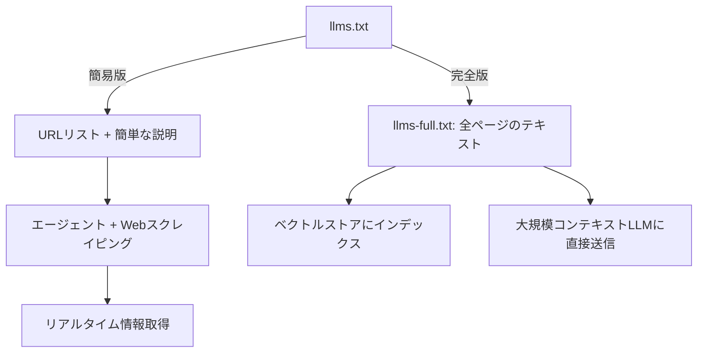
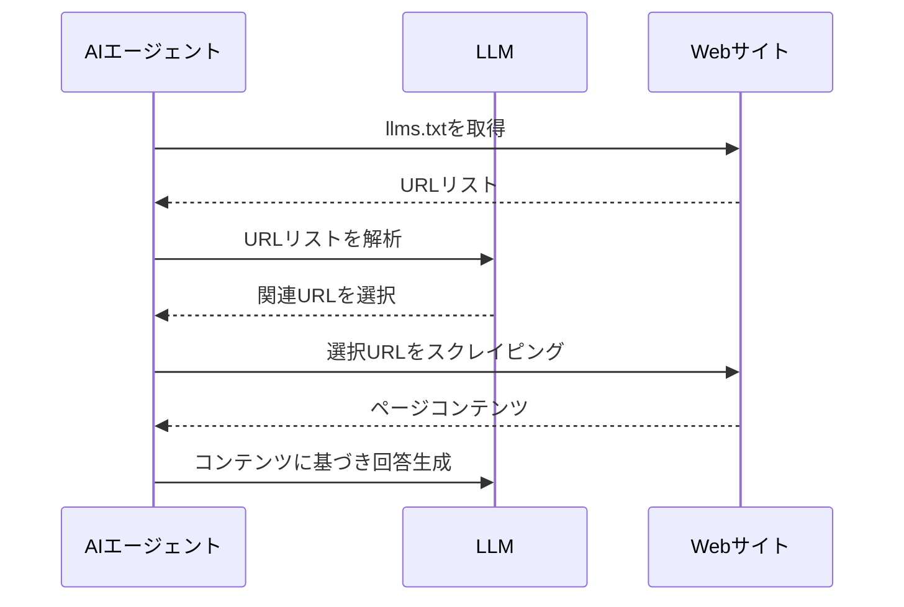

import Quiz from '@/components/content/Quiz.astro'

## 概要

このレクチャーでは，LLMやAIエージェントがWebサイトのコンテンツを効率的に理解するための`llms.txt`標準ファイルについて解説します．このファイルの2つのバリエーションと，それぞれの使い分けを学びます．

## llms.txtとは

`llms.txt`は，Webサイトのルートディレクトリに配置される標準ファイルで，サイトの最も重要なコンテンツと構造を機械可読なMarkdown形式で提供します．

### 目的

- AIシステム（ChatGPT，Google Gemini，独自エージェント）がWebコンテンツをより正確かつ効率的に処理できるようにする
- コンテンツの発見性を向上させる
- Webサイトの構造理解のためのコンテキストを提供する
- AI駆動の検索エンジンにおけるSEOを改善する

## 2つのバリエーション

### llms.txt（簡易版）
- URLとその簡単な説明のみを含む
- 書籍のインデックスページに相当する
- ファイルサイズが小さい

### llms-full.txt（完全版）
- すべてのページの完全なテキスト情報を含む
- 非常に大きなファイルになる

LangGraphのドキュメントでは，PythonとJavaScriptの両方で両バリエーションが提供されています．

## 使い分けのパターン

### llms.txt（簡易版）の使用パターン

エージェントにWebスクレイピングツール（Firecrawlなど）がある場合に最適です．

1. `llms.txt`をコンテキストとして読み込む
2. LLMが必要なURLを選択する
3. 選択したURLのコンテンツをスクレイピングして取得する

利点: リアルタイム情報の取得が可能
欠点: レイテンシーがやや高い（複数回のfetchが必要）

### llms-full.txt（完全版）の使用パターン

- ダウンロードしてチャンク化し，ベクトルストアにインデックスする
- 大きなコンテキストウィンドウを持つLLMに直接送信する
- コンテキストキャッシュを活用する

## まとめ

- `llms.txt`はAIシステムがWebサイトのコンテンツを効率的に理解するための標準ファイル
- 簡易版（URL + 説明）と完全版（全テキスト）の2つのバリエーションがある
- 簡易版はリアルタイム取得に，完全版はオフラインインデックスに適している
- MCPサーバーと組み合わせることで，リアルタイムのドキュメント取得が可能になる

<Quiz questions={[
  {
    question: "llms.txtファイルの主な目的は何ですか？",
    options: [
      "Webサイトのセキュリティを強化する",
      "AIシステムがWebサイトのコンテンツを効率的に理解・処理できるようにする",
      "検索エンジンのクローリングを制限する",
      "Webサイトのパフォーマンスを最適化する"
    ],
    answer: 1,
    explanation: "llms.txtはAIシステムがWebサイトのコンテンツをより正確かつ効率的に処理できるようにするための標準ファイルです．"
  },
  {
    question: "llms.txtとllms-full.txtの違いとして正しいものはどれですか？",
    options: [
      "llms.txtは英語のみ，llms-full.txtは多言語対応",
      "llms.txtはURLと簡単な説明のみ，llms-full.txtは全ページのテキスト情報を含む",
      "llms.txtはHTML形式，llms-full.txtはJSON形式",
      "llms.txtは無料版，llms-full.txtは有料版"
    ],
    answer: 1,
    explanation: "llms.txtはURLとその簡単な説明のみを含む簡易版で，llms-full.txtはすべてのページの完全なテキスト情報を含む完全版です．"
  },
  {
    question: "llms.txt（簡易版）の使用パターンで必要なツールはどれですか？",
    options: [
      "データベース管理ツール",
      "Webスクレイピングツール",
      "画像生成ツール",
      "音声認識ツール"
    ],
    answer: 1,
    explanation: "llms.txt（簡易版）はURLリストを提供するため，FirecrawlなどのWebスクレイピングツールを使って実際のコンテンツを取得する必要があります．"
  },
  {
    question: "llms-full.txtの活用方法として適切でないものはどれですか？",
    options: [
      "チャンク化してベクトルストアにインデックスする",
      "大きなコンテキストウィンドウを持つLLMに直接送信する",
      "リアルタイムのWeb情報を動的に取得する",
      "コンテキストキャッシュを活用する"
    ],
    answer: 2,
    explanation: "llms-full.txtは既にダウンロード済みの全テキスト情報であるため，リアルタイムの動的取得はllms.txt（簡易版）のユースケースです．"
  },
  {
    question: "llms.txtファイルは通常どこに配置されますか？",
    options: [
      "Webサイトの/api/ディレクトリ",
      "Webサイトのルートディレクトリ",
      "Webサイトの/docs/ディレクトリ",
      "Webサイトの/config/ディレクトリ"
    ],
    answer: 1,
    explanation: "llms.txtはWebサイトのルートディレクトリに配置される標準ファイルで，サイトの最も重要なコンテンツと構造を提供します．"
  }
]} />
