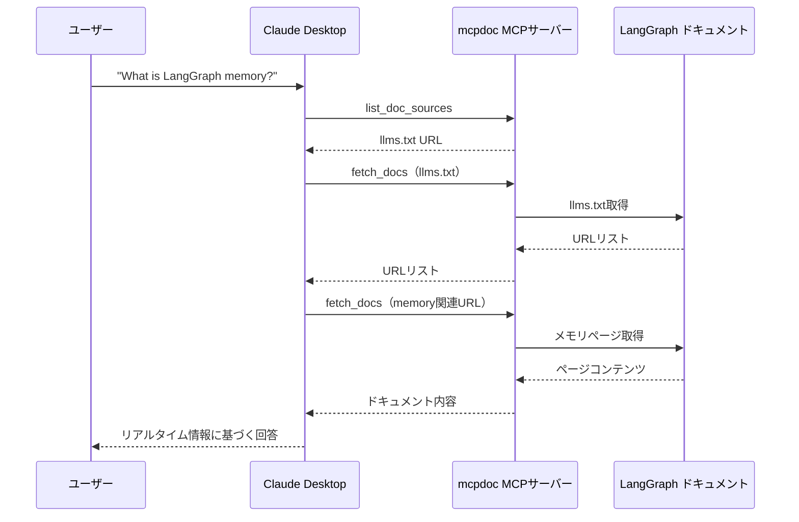

import Quiz from '@/components/content/Quiz.astro'

## 概要

このレクチャーでは，mcpdoc MCPサーバーの実際のセットアップと，MCP InspectorでのテストからClaude Desktopへの統合までを実践します．

## mcpdocの仕組み

mcpdocは以下の2ステップで動作するMCPサーバーです．

1. `llms.txt`にアクセスして，利用可能なドキュメントのURLリストを取得する
2. ユーザーの質問に関連するURLのコンテンツをスクレイピングして取得する

### 公開するツール

- `list_doc_sources`: `llms.txt`のURLを返すツール
- `fetch_docs`: 指定されたURLのコンテンツをスクレイピングするツール

## セットアップ手順

### リポジトリのクローンと依存関係のインストール

```bash
git clone <mcpdoc-repo-url>
cd mcpdoc
uv venv
source .venv/bin/activate
uv sync
```

### ローカルでの起動とMCP Inspectorでのテスト

```bash
# MCPサーバーの起動（SSE）
uv run mcpdoc --urls "https://langchain-ai.github.io/langgraph/llms.txt" \
  --transport sse --port 8082

# MCP Inspectorの起動
npx @modelcontextprotocol/inspector
```

MCP Inspectorで接続後，`list_doc_sources`でURLリストを確認し，`fetch_docs`でコンテンツ取得をテストできます．

## Claude Desktopへの統合

### 設定ファイルの編集

Claude Desktopの設定（Settings → Developer → MCP Settings）を開き，MCPサーバーの設定を追加します．

```json
{
  "mcpServers": {
    "llms-txt": {
      "command": "/path/to/uvx",
      "args": [
        "--from", "/path/to/mcpdoc",
        "mcpdoc",
        "--urls", "https://langchain-ai.github.io/langgraph/llms.txt",
        "--transport", "stdio",
        "--port", "8081"
      ]
    }
  }
}
```

注意: `command`にはUVXの絶対パス（`which uvx`で取得可能）を指定し，`args`にもコードの絶対パスを含める必要があります．

### 動作の流れ



「What is LangGraph memory?」と質問すると，以下のフローが実行されます．

1. `list_doc_sources`ツールでllms.txtのURLを取得
2. `fetch_docs`ツールでllms.txtの内容（URLリスト）を取得
3. メモリに関連するURLを特定
4. `fetch_docs`ツールで関連ページのコンテンツを取得
5. リアルタイムの情報に基づいて回答を生成

## MCPなしとの比較

MCPなしの場合，LLMは学習データに基づいて回答するため，最新のドキュメント変更が反映されません．MCPを使うことで，リアルタイムの公式ドキュメントに基づいた正確な回答が得られます．

## まとめ

- mcpdocはllms.txtを活用してリアルタイムでドキュメントを取得するMCPサーバー
- MCP Inspectorでツールの動作を事前にテストできる
- Claude Desktopへの統合にはJSON設定ファイルでの構成が必要
- UVXの絶対パスとコードディレクトリの絶対パスを指定することが重要
- リアルタイムの公式ドキュメントに基づいた回答が可能になる

<Quiz questions={[
  {
    question: "mcpdocが公開する2つのツールはどれですか？",
    options: [
      "search_docsとdownload_docs",
      "list_doc_sourcesとfetch_docs",
      "get_urlsとparse_content",
      "find_docsとread_docs"
    ],
    answer: 1,
    explanation: "mcpdocはlist_doc_sources（llms.txtのURLを返す）とfetch_docs（指定URLのコンテンツをスクレイピングする）の2つのツールを公開します．"
  },
  {
    question: "Claude Desktopの設定でUVXのパスを指定する際の注意点は何ですか？",
    options: [
      "相対パスで指定する必要がある",
      "絶対パスで指定する必要がある",
      "環境変数で指定する必要がある",
      "設定ファイルにパスは不要"
    ],
    answer: 1,
    explanation: "Claude DesktopのMCP設定では，UVXの絶対パスとコードディレクトリの絶対パスを指定する必要があります．相対パスでは実行ディレクトリが不明なためエラーになります．"
  },
  {
    question: "mcpdocの動作ステップとして正しい順序はどれですか？",
    options: [
      "URLスクレイピング → llms.txt取得 → 回答生成",
      "回答生成 → llms.txt取得 → URLスクレイピング",
      "llms.txt取得 → 関連URL特定 → コンテンツスクレイピング",
      "コンテンツスクレイピング → 関連URL特定 → llms.txt取得"
    ],
    answer: 2,
    explanation: "mcpdocはまずllms.txtにアクセスしてURLリストを取得し，次にユーザーの質問に関連するURLを特定し，そのコンテンツをスクレイピングして取得します．"
  },
  {
    question: "MCPなしでClaude Desktopに質問した場合の問題点は何ですか？",
    options: [
      "回答が生成されない",
      "英語でしか回答できない",
      "学習データに基づくため最新のドキュメント変更が反映されない",
      "回答に時間がかかりすぎる"
    ],
    answer: 2,
    explanation: "MCPなしの場合，LLMは学習データに基づいて回答するため，最新のドキュメント変更が反映されません．MCPを使えばリアルタイムの公式ドキュメントに基づいた回答が得られます．"
  },
  {
    question: "mcpdocの起動時に指定するtransportオプションとして正しいものはどれですか？",
    options: [
      "httpとwebsocketの2種類",
      "sseとstdioの2種類",
      "grpcとrestの2種類",
      "tcpとudpの2種類"
    ],
    answer: 1,
    explanation: "mcpdocはSSE（Server-Sent Events）とStdio（標準入出力）の2つのトランスポート方式をサポートしています．ローカルテストにはSSE，Claude Desktop統合にはStdioが使われます．"
  }
]} />
