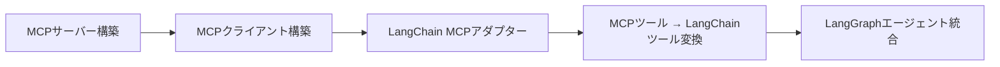

import Quiz from '@/components/content/Quiz.astro'

## 概要

このレクチャーでは，セクション17の全体像を紹介します．前セクションでプリビルトMCPサーバーとプリビルトMCPクライアントの統合を学んだ後，今度は自分でMCPサーバーとMCPクライアントを構築します．

## セクションの学習内容

### MCPサーバーの構築

自分でMCPサーバーを実装します．MCPサーバーはツールを公開し，クライアントからのリクエストに応じてツールを実行する役割を持ちます．

### MCPクライアントの構築

LangChain MCPアダプターパッケージを使用してMCPクライアントを実装します．このクライアントは以下の機能を提供します．

- MCPサーバーへの接続と初期化
- MCPツールからLangChainツールへの変換
- LangGraphエージェントとの統合

## 学習の流れ

1. MCPサーバーを実装する
2. MCPクライアントを実装する
3. 構築したMCPサーバーとMCPクライアントを統合する
4. MCPサーバーのツールをLangChainツールに変換して使用する

## まとめ

- このセクションではMCPの両側（サーバーとクライアント）を自分で構築する
- LangChain MCPアダプターパッケージを活用してツールの変換を行う
- MCPの理解がプリビルトの使用から自作へと深まる

<Quiz questions={[
  {
    question: "このセクションでMCPクライアントの構築に使用するパッケージはどれですか？",
    options: [
      "langchain-mcp-server",
      "langchain-mcp-adapters",
      "mcp-client-sdk",
      "langchain-tools"
    ],
    answer: 1,
    explanation: "LangChain MCPアダプターパッケージ（langchain-mcp-adapters）を使用してMCPクライアントを実装し，MCPツールをLangChainツールに変換します．"
  },
  {
    question: "MCPクライアントが提供する機能として正しくないものはどれですか？",
    options: [
      "MCPサーバーへの接続と初期化",
      "MCPツールからLangChainツールへの変換",
      "MCPサーバーのデプロイ自動化",
      "LangGraphエージェントとの統合"
    ],
    answer: 2,
    explanation: "MCPクライアントはサーバーへの接続・初期化，ツールの変換，エージェント統合の機能を提供しますが，サーバーのデプロイ自動化は含まれません．"
  },
  {
    question: "前セクション（S16）で学んだ内容は何ですか？",
    options: [
      "MCPサーバーとクライアントの自作",
      "プリビルトMCPサーバーとプリビルトMCPクライアントの統合",
      "MCPプロトコルの仕様策定",
      "LangSmithでのトレーシング設定"
    ],
    answer: 1,
    explanation: "前セクションではプリビルトMCPサーバー（mcpdoc）とプリビルトMCPクライアント（Cursor，Claude Desktop）の統合を学びました．"
  },
  {
    question: "MCPサーバーの主な役割は何ですか？",
    options: [
      "LLMモデルのトレーニングを行う",
      "ツールを公開し，クライアントからのリクエストに応じてツールを実行する",
      "Webサイトのフロントエンドを提供する",
      "データベースのバックアップを管理する"
    ],
    answer: 1,
    explanation: "MCPサーバーはツールを公開し，クライアントからのリクエストに応じてそのツールを実行する役割を持ちます．"
  },
  {
    question: "このセクションの学習順序として正しいものはどれですか？",
    options: [
      "クライアント構築 → サーバー構築 → 統合",
      "統合 → サーバー構築 → クライアント構築",
      "サーバー構築 → クライアント構築 → 統合",
      "サーバー構築 → 統合 → クライアント構築"
    ],
    answer: 2,
    explanation: "まずMCPサーバーを実装し，次にMCPクライアントを実装し，最後にそれらを統合するという順序で学習を進めます．"
  }
]} />
