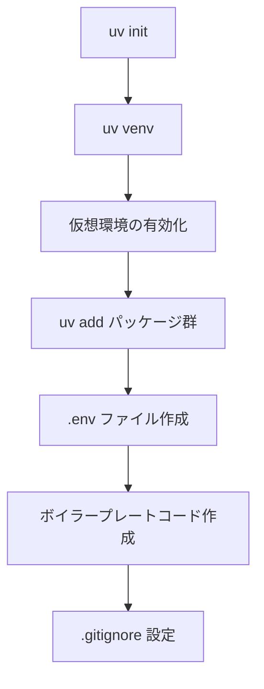

import Quiz from '@/components/content/Quiz.astro'

## 概要

このレクチャーでは，MCPサーバーとクライアントのプロジェクトセットアップを行います．UVでプロジェクトを初期化し，依存関係をインストールし，非同期プログラミングの基本的なボイラープレートを構築します．

## プロジェクトの初期化

### UVによる初期化

```bash
uv init
uv venv
source .venv/bin/activate
```



### 依存パッケージのインストール

```bash
uv add langchain-mcp-adapters langgraph langchain-openai python-dotenv
```

主要なパッケージの役割:
- `langchain-mcp-adapters`: MCPツールをLangChainツールに変換するアダプター（MCPパッケージも自動的にインストールされる）
- `langgraph`: グラフベースのエージェント構築
- `langchain-openai`: OpenAI LLMの統合
- `python-dotenv`: 環境変数の管理

### 環境変数の設定

`.env`ファイルを作成し，APIキーとトレーシング設定を記述します．

```bash
OPENAI_API_KEY=your-api-key
LANGCHAIN_TRACING_V2=true
LANGCHAIN_ENDPOINT=https://api.smith.langchain.com
LANGCHAIN_API_KEY=your-langsmith-api-key
LANGCHAIN_PROJECT=mcp-test
```

LangSmithトレーシングを使用しない場合は，`LANGCHAIN_TRACING_V2=false`に設定します．

### ボイラープレートコード

```python
import asyncio
import os
from dotenv import load_dotenv

load_dotenv()

async def main():
    print("Hello LangChain MCP")

if __name__ == "__main__":
    asyncio.run(main())
```

MCPクライアントは非同期で動作するため，`async`/`await`パターンを使用します．

### .gitignoreの設定

```
.env
```

`.env`ファイルをGitの追跡対象から除外し，APIキーの漏洩を防ぎます．

## まとめ

- UVを使ってプロジェクトの初期化と仮想環境の構築を行う
- `langchain-mcp-adapters`をインストールするとMCPパッケージも自動的にインストールされる
- MCPクライアントは非同期で動作するため，asyncioを使用する
- `.env`ファイルでAPIキーを管理し，`.gitignore`でGitから除外する

<Quiz questions={[
  {
    question: "langchain-mcp-adaptersパッケージの役割として正しいものはどれですか？",
    options: [
      "MCPサーバーのデプロイを自動化する",
      "MCPツールをLangChainツールに変換するアダプター",
      "MCPプロトコルの仕様を定義する",
      "MCPサーバーのUIを提供する"
    ],
    answer: 1,
    explanation: "langchain-mcp-adaptersはMCPツールをLangChainツールに変換するアダプターパッケージです．MCPパッケージも自動的にインストールされます．"
  },
  {
    question: "MCPクライアントが非同期で動作する理由として最も適切なものはどれですか？",
    options: [
      "Pythonのバージョン要件のため",
      "MCPサーバーとのネットワーク通信が含まれるため",
      "LangChainの制約のため",
      "OpenAI APIの仕様のため"
    ],
    answer: 1,
    explanation: "MCPクライアントはMCPサーバーとの通信を行うため，非同期（async/await）パターンを使用して効率的にI/O処理を行います．"
  },
  {
    question: "LangSmithのトレーシングを無効にするための設定はどれですか？",
    options: [
      "LANGCHAIN_TRACING_V2=false",
      "LANGCHAIN_TRACING=disabled",
      "LANGSMITH_ENABLED=false",
      "LANGCHAIN_TRACE=off"
    ],
    answer: 0,
    explanation: "LangSmithトレーシングを無効にするには，環境変数LANGCHAIN_TRACING_V2をfalseに設定します．"
  },
  {
    question: ".envファイルを.gitignoreに追加する理由は何ですか？",
    options: [
      "ファイルサイズを小さくするため",
      "ビルド速度を向上させるため",
      "APIキーの漏洩を防ぐため",
      "依存関係の競合を避けるため"
    ],
    answer: 2,
    explanation: ".envファイルにはAPIキーなどの機密情報が含まれるため，.gitignoreに追加してGitリポジトリへのコミットを防ぎ，情報漏洩を防止します．"
  },
  {
    question: "プロジェクトの初期化に使用するパッケージマネージャーはどれですか？",
    options: [
      "pip",
      "conda",
      "uv",
      "poetry"
    ],
    answer: 2,
    explanation: "このプロジェクトではUVをパッケージマネージャーとして使用し，uv init，uv venv，uv addなどのコマンドでプロジェクトの初期化と依存管理を行います．"
  }
]} />
