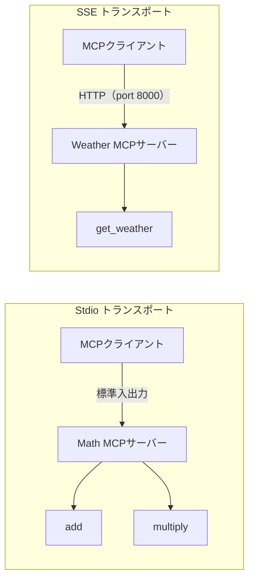

import Quiz from '@/components/content/Quiz.astro'

## 概要

このレクチャーでは，2つの異なるトランスポート方式を持つシンプルなMCPサーバーを実装します．Stdio（標準入出力）で通信する数学ツールサーバーと，SSE（Server-Sent Events）で通信する天気サーバーを構築します．

## 数学MCPサーバー（Stdio）

加算と乗算の2つのツールを公開するシンプルなMCPサーバーです．

```python
# servers/math_server.py
from mcp.server.fastmcp import FastMCP

mcp = FastMCP("Math")

@mcp.tool()
def add(a: int, b: int) -> int:
    """Add two numbers"""
    return a + b

@mcp.tool()
def multiply(a: int, b: int) -> int:
    """Multiply two numbers"""
    return a * b

if __name__ == "__main__":
    mcp.run(transport="stdio")
```

注意: ファイル名を`math.py`にすると，Pythonの組み込み`math`モジュールと衝突するため，`math_server.py`と命名します．

### 起動方法

```bash
uv run servers/math_server.py
```

## 天気MCPサーバー（SSE）

SSEトランスポートで通信するシンプルな天気サーバーです．

```python
# servers/weather_server.py
from mcp.server.fastmcp import FastMCP

mcp = FastMCP("Weather")

@mcp.tool()
def get_weather(city: str) -> str:
    """Get the weather for a given city"""
    return f"It's always hot as hell in {city}!"

if __name__ == "__main__":
    mcp.run(transport="sse")
```

### Stdioとの違い

SSEトランスポートではHTTP経由で通信するため，サーバーは特定のポート（デフォルト: 8000）でリッスンします．

```bash
uv run servers/weather_server.py
# サーバーがlocalhost:8000で起動
```

SSEサーバーの特徴:
- クライアントがHTTP POSTリクエストを送信する
- MCP SDKがトランスポートの詳細を抽象化する
- 単にフラグを変更するだけでトランスポート方式を切り替えられる



## 2つのトランスポート方式の比較

| 特徴 | Stdio | SSE |
|------|-------|-----|
| 通信方式 | 標準入出力 | HTTP |
| ネットワーク | ローカルのみ | ネットワーク越し可能 |
| デプロイ | ローカル実行 | クラウドデプロイ可能 |
| ポート | 不要 | 必要 |

## まとめ

- MCP SDKの`FastMCP`クラスを使用してMCPサーバーを簡単に構築できる
- `@mcp.tool()`デコレーターでツールを登録する
- `transport="stdio"`でStdio通信，`transport="sse"`でSSE通信を選択する
- Pythonの組み込みモジュール名との衝突を避けるファイル命名が重要

<Quiz questions={[
  {
    question: "MCPサーバーの構築に使用するクラスはどれですか？",
    options: [
      "MCPServer",
      "FastMCP",
      "MCPBuilder",
      "ServerMCP"
    ],
    answer: 1,
    explanation: "MCP SDKのFastMCPクラスを使用してMCPサーバーを構築します．mcp.server.fastmcpからインポートします．"
  },
  {
    question: "ツールをMCPサーバーに登録するために使うデコレーターはどれですか？",
    options: [
      "@mcp.register",
      "@mcp.function",
      "@mcp.tool",
      "@mcp.endpoint"
    ],
    answer: 2,
    explanation: "@mcp.tool()デコレーターを関数に付けることで，その関数をMCPサーバーのツールとして登録できます．"
  },
  {
    question: "ファイル名をmath.pyではなくmath_server.pyにする理由は何ですか？",
    options: [
      "MCPの命名規約に従うため",
      "Pythonの組み込みmathモジュールとの名前衝突を避けるため",
      "複数サーバーを区別するため",
      "UVパッケージマネージャーの要件のため"
    ],
    answer: 1,
    explanation: "Pythonの組み込みmathモジュールと同名のファイルを作成すると，インポート時に衝突が発生するため，math_server.pyと命名して回避します．"
  },
  {
    question: "SSEトランスポートのデフォルトポートは何番ですか？",
    options: [
      "3000",
      "5000",
      "8000",
      "8080"
    ],
    answer: 2,
    explanation: "SSEトランスポートではHTTP経由で通信し，デフォルトではポート8000でサーバーがリッスンします．"
  },
  {
    question: "Stdioトランスポートの特徴として正しいものはどれですか？",
    options: [
      "ネットワーク越しのアクセスが可能",
      "クラウドデプロイに最適",
      "ローカルのみで動作し，ポートが不要",
      "HTTPプロトコルを使用する"
    ],
    answer: 2,
    explanation: "Stdioトランスポートは標準入出力を使って通信するため，ローカルのみで動作し，ポートの指定は不要です．"
  }
]} />
