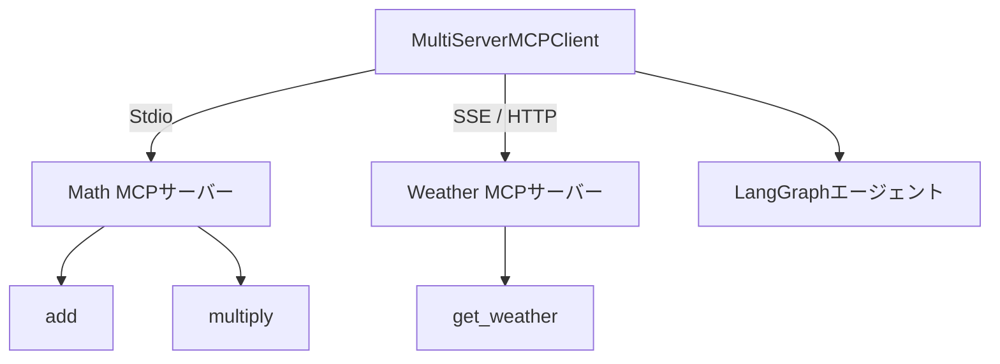

import Quiz from '@/components/content/Quiz.astro'

## 概要

このレクチャーでは，SSE MCPサーバーの統合について深く掘り下げます．LangChainのMultiServerMCPClientを使用して，複数のMCPサーバーに同時接続する方法を学びます．

## SSEサーバーの利点

SSEサーバーの一般的な使用パターンはクラウドデプロイです．

- エンタープライズクラウドにデプロイして，組織全体で共有可能
- ネットワーク越しのアクセスが可能
- スケーリングが容易

### 認証と認可に関する注意

現時点のMCPプロトコルでは，認証と認可のサポートは完全には実装されていません．クラウドデプロイの場合，アクセス制御（ログインユーザーの制限やRBACなど）が重要になりますが，これは今後追加される予定です．

## LangChainのMultiServerMCPClient

LangChainチームが提供するMultiServerMCPClientは，複数のMCPサーバーに同時接続するための便利な抽象化です．

### 特徴

- 内部的に複数のMCPクライアントを管理する
- MCPのクライアント-サーバー間の1対1接続の原則は維持される
- 開発者は個別のクライアントを明示的に書く必要がない

### 今回の接続構成

- SSEサーバー: 天気ツールサーバー（HTTP経由）
- Stdioサーバー: 数学ツールサーバー（標準入出力経由）

## まとめ

- SSEサーバーはクラウドデプロイに適しており，組織全体での共有が可能
- LangChainのMultiServerMCPClientで複数のMCPサーバーに簡単に接続できる
- 認証と認可のサポートは今後のMCPプロトコルの進化で追加される予定

<Quiz questions={[
  {
    question: "MultiServerMCPClientの主な機能は何ですか？",
    options: [
      "単一のMCPサーバーを高速に接続する",
      "複数のMCPサーバーに同時接続を一括管理する",
      "MCPサーバーの自動デプロイを行う",
      "MCPサーバーのモニタリングを行う"
    ],
    answer: 1,
    explanation: "MultiServerMCPClientは複数のMCPサーバーへの接続を一括管理し，内部的に各サーバーに対して個別のMCPクライアントを生成します．"
  },
  {
    question: "SSEサーバーのクラウドデプロイの利点として正しいものはどれですか？",
    options: [
      "認証・認可が完全にサポートされている",
      "組織全体でサーバーを共有可能",
      "Stdioよりも常に高速",
      "ローカル環境でのみ動作する"
    ],
    answer: 1,
    explanation: "SSEサーバーはHTTP経由で通信するため，エンタープライズクラウドにデプロイして組織全体で共有できます．"
  },
  {
    question: "現時点のMCPプロトコルで完全には実装されていない機能はどれですか？",
    options: [
      "ツールの登録と実行",
      "StdioとSSEのトランスポート",
      "認証と認可のサポート",
      "ツール一覧の取得"
    ],
    answer: 2,
    explanation: "現時点のMCPプロトコルでは，認証と認可のサポートは完全には実装されていません．今後追加される予定です．"
  },
  {
    question: "MCPのクライアント-サーバー接続の原則として正しいものはどれですか？",
    options: [
      "1つのクライアントが複数のサーバーに多対多で接続する",
      "クライアントとサーバーは1対1の接続を維持する",
      "複数のクライアントが1つのサーバーに接続する",
      "接続数に制限はない"
    ],
    answer: 1,
    explanation: "MCPではクライアントとサーバーの1対1接続の原則が維持されます．MultiServerMCPClientは内部的に各サーバーに対して個別のクライアントを生成してこの原則を守ります．"
  },
  {
    question: "今回の接続構成でSSEサーバーが提供するツールはどれですか？",
    options: [
      "addとmultiply",
      "get_weather",
      "fetch_docsとlist_doc_sources",
      "searchとretrieve"
    ],
    answer: 1,
    explanation: "SSEサーバーは天気ツールサーバーとして動作し，get_weatherツールを提供します．数学ツール（add，multiply）はStdioサーバーが提供します．"
  }
]} />
