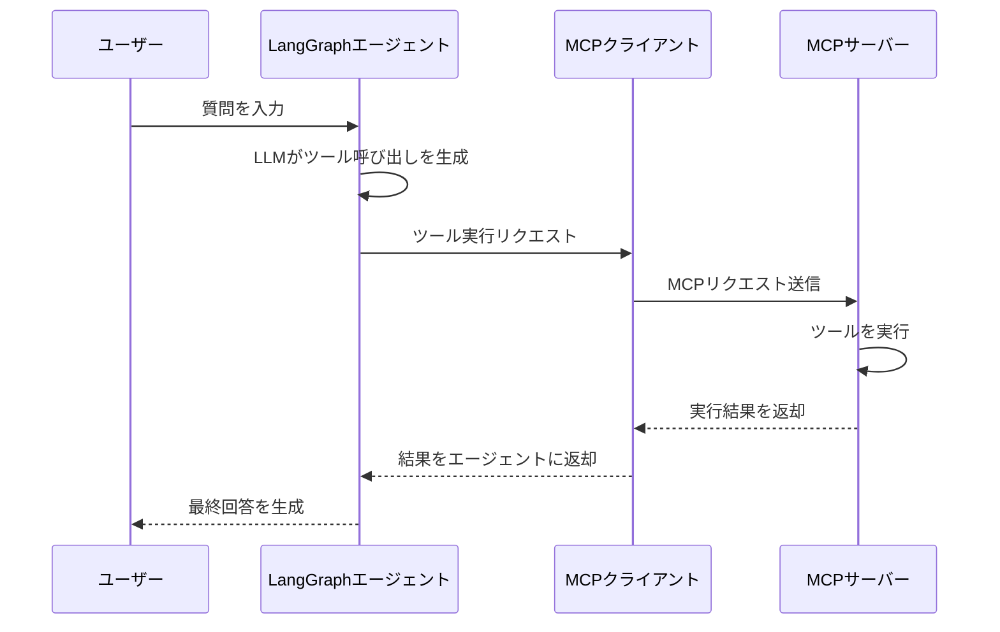

import Quiz from '@/components/content/Quiz.astro'

## 概要

このレクチャーでは，MCP SDKを使ってStdioクライアントを実装し，MCPサーバーのツールをLangGraphのReActエージェントに統合します．MCPツールからLangChainツールへの変換プロセスを詳細に理解します．

## MCPクライアントの実装

### 接続の確立

```python
from mcp import ClientSession, StdioServerParameters
from mcp.client.stdio import stdio_client

# サーバーの実行方法と通信方式を指定
server_params = StdioServerParameters(
    command="uv",
    args=["run", "servers/math_server.py"],
)

async with stdio_client(server_params) as (read, write):
    async with ClientSession(read, write) as session:
        # セッションの初期化
        await session.initialize()
        print("Session initialized")

        # 利用可能なツールの取得
        tools = await session.list_tools()
        print(tools)
```

### 各ステップの解説

1. `StdioServerParameters`: サーバーの起動コマンドとトランスポート方式（Stdio）を定義
2. `stdio_client`: コンテキストマネージャーとして使用し，read/writeトランスポートを取得
3. `ClientSession`: read/writeストリームを使ってクライアントセッションを作成
4. `session.initialize()`: MCPサーバーとの接続を初期化（ここでサーバーが利用可能なツールを通知）
5. `session.list_tools()`: サーバーが公開するツールの一覧を取得

## MCPツールからLangChainツールへの変換

MCPツールをそのままLangGraphの`create_react_agent`に渡すとエラーになります．MCPツールはLangChainツールとは異なる形式のため，変換が必要です．

```python
from langchain_mcp_adapters.tools import load_mcp_tools

# MCPツールをLangChainツールに変換
langchain_tools = await load_mcp_tools(session)
```

`load_mcp_tools`関数がMCPセッションからツール情報を取得し，LangChain互換のStructuredToolオブジェクトに変換します．

## LangGraphエージェントの構築

```python
from langgraph.prebuilt import create_react_agent
from langchain_openai import ChatOpenAI
from langchain_core.messages import HumanMessage

llm = ChatOpenAI()

# LangChainツールを使ってReActエージェントを作成
agent = create_react_agent(llm, langchain_tools)

# エージェントの実行
result = await agent.ainvoke({
    "messages": [HumanMessage(content="What is 54 plus 2 times 3?")]
})
```

## ツール実行の仕組み



エージェントがツールを呼び出すとき，以下のフローが実行されます．

1. LLMがツール呼び出しを生成する
2. MCPクライアントがMCPサーバーにリクエストを送信する
3. MCPサーバー側でツールが実行される（アプリケーション内ではない）
4. 結果がMCPクライアント経由でエージェントに返される

これにより，オーケストレーション（エージェント）とツール実行（MCPサーバー）が分離されます．

## まとめ

- `StdioServerParameters`でサーバーの起動方法を定義し，`ClientSession`で接続を確立する
- `load_mcp_tools`でMCPツールをLangChain互換のツールに変換する
- ツール実行はMCPサーバー側で行われ，エージェントとの分離が実現する
- LangSmithでトレースすることで，ツール呼び出しの詳細を確認できる

<Quiz questions={[
  {
    question: "MCPツールをLangChainツールに変換する関数はどれですか？",
    options: [
      "convert_mcp_tools",
      "transform_tools",
      "load_mcp_tools",
      "get_langchain_tools"
    ],
    answer: 2,
    explanation: "langchain_mcp_adapters.toolsのload_mcp_tools関数がMCPセッションからツール情報を取得し，LangChain互換のStructuredToolオブジェクトに変換します．"
  },
  {
    question: "StdioServerParametersで定義する情報はどれですか？",
    options: [
      "サーバーのIPアドレスとポート番号",
      "サーバーの起動コマンドとトランスポート方式",
      "サーバーの認証情報",
      "サーバーのログレベル"
    ],
    answer: 1,
    explanation: "StdioServerParametersでは，サーバーの起動コマンド（command）と引数（args）を定義し，Stdioトランスポート方式での通信を設定します．"
  },
  {
    question: "session.initialize()の役割として正しいものはどれですか？",
    options: [
      "MCPサーバーのコードをコンパイルする",
      "MCPサーバーとの接続を初期化し，ツール情報の通知を受ける",
      "LLMモデルをロードする",
      "データベースへの接続を確立する"
    ],
    answer: 1,
    explanation: "session.initialize()はMCPサーバーとの接続を初期化し，サーバーが利用可能なツール情報をクライアントに通知するステップです．"
  },
  {
    question: "MCPにおけるツール実行の特徴として正しいものはどれですか？",
    options: [
      "ツールはクライアント側のアプリケーション内で実行される",
      "ツールはLLM内部で実行される",
      "ツールはMCPサーバー側で実行され，アプリケーションから分離されている",
      "ツールはクラウド上の共有環境で実行される"
    ],
    answer: 2,
    explanation: "MCPではツール実行はMCPサーバー側で行われ，オーケストレーション（エージェント）とツール実行が分離されています．"
  },
  {
    question: "MCPクライアントの接続に使用されるPythonパターンはどれですか？",
    options: [
      "デコレーターパターン",
      "async withコンテキストマネージャー",
      "コールバック関数",
      "スレッドプール"
    ],
    answer: 1,
    explanation: "MCPクライアントはasync withコンテキストマネージャーパターンを使用して接続を管理し，リソースの適切なクリーンアップを保証します．"
  }
]} />
