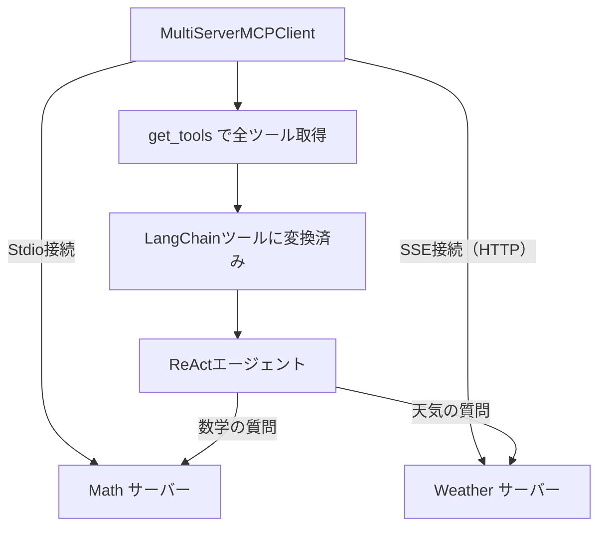

import Quiz from '@/components/content/Quiz.astro'

## 概要

このレクチャーでは，LangChainのMultiServerMCPClientを使用して，StdioサーバーとSSEサーバーの両方に同時接続するMCPクライアントを実装します．

## MultiServerMCPClientの実装

### インポートとセットアップ

```python
import asyncio
from dotenv import load_dotenv
from langchain_mcp_adapters.client import MultiServerMCPClient
from langgraph.prebuilt import create_react_agent
from langchain_openai import ChatOpenAI

load_dotenv()
llm = ChatOpenAI()
```

### クライアントの構築

MultiServerMCPClientは複数のMCPサーバーへの接続を一括管理します．内部的には各サーバーに対して個別のMCPクライアントを生成しますが，開発者はその詳細を意識する必要がありません．

```python
async def main():
    async with MultiServerMCPClient(
        {
            "math": {
                "command": "uv",
                "args": ["run", "servers/math_server.py"],
                "transport": "stdio",
            },
            "weather": {
                "url": "http://localhost:8000/sse",
                "transport": "sse",
            },
        }
    ) as client:
        # MCPツールをLangChainツールとして取得
        tools = client.get_tools()

        # ReActエージェントの作成
        agent = create_react_agent(llm, tools)

        # エージェントの実行
        result = await agent.ainvoke({
            "messages": [
                HumanMessage(content="What is 2 + 2 and what's the weather in Tokyo?")
            ]
        })
```

### 設定の構造

StdioサーバーとSSEサーバーで設定の形式が異なります．

Stdioサーバーの設定:
- `command`: サーバーの起動コマンド
- `args`: コマンド引数
- `transport`: `"stdio"`

SSEサーバーの設定:
- `url`: サーバーのSSEエンドポイントURL
- `transport`: `"sse"`



## 動作の流れ

1. MultiServerMCPClientが各MCPサーバーへの接続を確立する
2. 各サーバーから利用可能なツール情報を取得する
3. `get_tools()`ですべてのサーバーのツールをLangChain互換ツールとして取得する
4. ReActエージェントにツールを渡して作成する
5. エージェントがクエリを処理し，適切なツールを選択して実行する

## SSEサーバーの事前起動

SSEサーバーはHTTPサーバーとして動作するため，エージェント起動前に個別に起動しておく必要があります．

```bash
# ターミナル1: SSEサーバーの起動
uv run servers/weather_server.py

# ターミナル2: エージェントの実行
uv run langchain_client.py
```

Stdioサーバーはクライアントが自動的に起動します．

## まとめ

- MultiServerMCPClientで複数のMCPサーバーに一括接続できる
- StdioとSSEの異なるトランスポートを持つサーバーを同時に使用可能
- `get_tools()`ですべてのサーバーのツールをLangChain互換で取得する
- SSEサーバーは事前起動が必要，Stdioサーバーはクライアントが自動起動する

<Quiz questions={[
  {
    question: "MultiServerMCPClientでStdioサーバーを設定する際に必要なパラメータはどれですか？",
    options: [
      "url と transport",
      "command，args，transport",
      "host，port，transport",
      "endpoint と protocol"
    ],
    answer: 1,
    explanation: "Stdioサーバーの設定にはcommand（起動コマンド），args（コマンド引数），transport（stdio）の3つのパラメータが必要です．"
  },
  {
    question: "SSEサーバーを使用する場合に必要な追加ステップは何ですか？",
    options: [
      "SSEサーバーのコードをコンパイルする",
      "SSEサーバーをエージェント起動前に個別に起動しておく",
      "SSEサーバーの認証トークンを取得する",
      "SSEサーバーのDNS設定を行う"
    ],
    answer: 1,
    explanation: "SSEサーバーはHTTPサーバーとして動作するため，エージェント起動前に個別に起動しておく必要があります．Stdioサーバーはクライアントが自動起動します．"
  },
  {
    question: "get_tools()メソッドの機能として正しいものはどれですか？",
    options: [
      "特定のサーバーのツールのみを取得する",
      "すべての接続サーバーのツールをLangChain互換で取得する",
      "ツールのソースコードを取得する",
      "ツールの実行ログを取得する"
    ],
    answer: 1,
    explanation: "get_tools()メソッドはすべての接続サーバーのツールをLangChain互換のツールとして一括取得します．"
  },
  {
    question: "SSEサーバーの設定で指定するURLのパスはどれですか？",
    options: [
      "http://localhost:8000/api",
      "http://localhost:8000/sse",
      "http://localhost:8000/mcp",
      "http://localhost:8000/tools"
    ],
    answer: 1,
    explanation: "SSEサーバーの設定ではSSEエンドポイントURLとしてhttp://localhost:8000/sseを指定します．"
  },
  {
    question: "MultiServerMCPClientの内部動作として正しいものはどれですか？",
    options: [
      "1つのMCPクライアントですべてのサーバーに接続する",
      "各サーバーに対して個別のMCPクライアントを内部的に生成する",
      "サーバー間でクライアントを共有する",
      "接続プールを使ってクライアントを再利用する"
    ],
    answer: 1,
    explanation: "MultiServerMCPClientは内部的に各サーバーに対して個別のMCPクライアントを生成し，MCPの1対1接続の原則を維持します．"
  }
]} />
