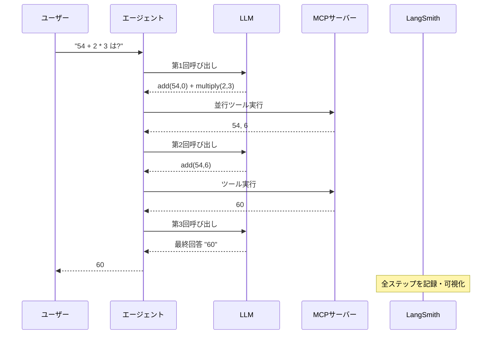

import Quiz from '@/components/content/Quiz.astro'

## 概要

このレクチャーでは，LangSmithを使用してMCPツール呼び出しのトレーシングと分析を行います．エージェントの実行フロー，ツール呼び出しの詳細，LLMへのリクエストとレスポンスを確認する方法を学びます．

## LangSmithでのトレース確認

### セットアップ

環境変数でLangSmithのトレーシングを有効にしておくことで，自動的にトレース情報が記録されます．

```bash
LANGCHAIN_TRACING_V2=true
LANGCHAIN_API_KEY=your-langsmith-api-key
LANGCHAIN_PROJECT=mcp-test
```

### トレースの構造

LangSmithのダッシュボードで，以下の情報を確認できます．

1. グラフエージェントの全体的な実行フロー
2. 各LLM呼び出しの入出力
3. ツール呼び出しのリクエストとレスポンス
4. 各ステップの実行時間



## トレース分析の例: 数学演算

「54 + 2 * 3」という質問に対するトレースを分析すると，以下のことがわかります．

### 第1回LLM呼び出し

- 入力: ユーザーの質問 + MCPサーバーのツール情報（add，multiply）
- 出力: 複数のツール呼び出し
  - `add(54, 0)` と `multiply(2, 3)` の2つが同時に生成される

### 並行ツール実行

LangGraphはツール呼び出しを並行実行します．2つのツール呼び出しが同じタイムスタンプで開始されることがトレースから確認できます．

### 第2回LLM呼び出し

- 入力: 元のクエリ + 前回のツール実行結果
- 出力: `add(54, 6)` のツール呼び出し

### 第3回LLM呼び出し

- 入力: 元のクエリ + すべてのツール実行結果
- 出力: 最終回答「60」

## MCPにおけるトレースの特徴

現時点のトレースでは，ツールがMCPサーバー側で実行されていることが明示的に表示されない場合があります．しかし，実際にはツール実行はMCPサーバー側で行われており，アプリケーション（グラフエージェント）から分離されています．

### 確認できる情報

- ツール呼び出しの入力引数と出力結果
- LLMがどのツールをどの引数で呼び出したか
- ツール呼び出しの順序と並行実行の状況
- 全体の実行時間とレイテンシー

## まとめ

- LangSmithでMCPを使ったエージェントの実行フローを詳細にトレースできる
- ツール呼び出しの入出力，順序，並行実行の状況を確認できる
- LangGraphは独立したツール呼び出しを並行実行してパフォーマンスを最適化する
- ツール実行はMCPサーバー側で行われ，オーケストレーションとの分離が実現されている

<Quiz questions={[
  {
    question: "LangSmithのトレーシングを有効にするために必要な環境変数はどれですか？",
    options: [
      "LANGSMITH_ENABLED=true",
      "LANGCHAIN_TRACING_V2=true",
      "TRACE_ENABLED=true",
      "LANGSMITH_TRACING=on"
    ],
    answer: 1,
    explanation: "LANGCHAIN_TRACING_V2=trueを設定することで，LangSmithのトレーシングが有効になり，自動的にトレース情報が記録されます．"
  },
  {
    question: "トレース分析で確認できないものはどれですか？",
    options: [
      "ツール呼び出しの入力引数と出力結果",
      "LLMがどのツールをどの引数で呼び出したか",
      "MCPサーバーの内部実装コード",
      "全体の実行時間とレイテンシー"
    ],
    answer: 2,
    explanation: "トレースではツール呼び出しの入出力や実行時間は確認できますが，MCPサーバーの内部実装コードは表示されません．"
  },
  {
    question: "LangGraphが独立したツール呼び出しを処理する方法として正しいものはどれですか？",
    options: [
      "順番に1つずつ実行する",
      "ランダムに選択して実行する",
      "並行実行してパフォーマンスを最適化する",
      "キューに入れてバッチ処理する"
    ],
    answer: 2,
    explanation: "LangGraphは独立したツール呼び出しを並行実行してパフォーマンスを最適化します．同じタイムスタンプで複数のツールが開始されることがトレースから確認できます．"
  },
  {
    question: "「54 + 2 * 3」の計算で，第1回LLM呼び出しの出力はどれですか？",
    options: [
      "add(54, 6)のみ",
      "multiply(54, 2, 3)のみ",
      "add(54, 0)とmultiply(2, 3)の2つ",
      "最終回答60"
    ],
    answer: 2,
    explanation: "第1回LLM呼び出しでは，add(54, 0)とmultiply(2, 3)の2つのツール呼び出しが同時に生成されます．演算の順序を正しく処理するための戦略です．"
  },
  {
    question: "現時点のトレースの制限として正しいものはどれですか？",
    options: [
      "ツール呼び出しの引数が表示されない",
      "LLMのレスポンスが記録されない",
      "ツールがMCPサーバー側で実行されていることが明示的に表示されない場合がある",
      "並行実行の状況が確認できない"
    ],
    answer: 2,
    explanation: "現時点のトレースでは，ツールがMCPサーバー側で実行されていることが明示的に表示されない場合があります．しかし実際にはツール実行はサーバー側で行われています．"
  }
]} />
