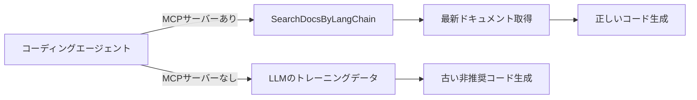

import Quiz from '@/components/content/Quiz.astro'

## 概要

LangChainのようなフレームワークは頻繁に変更されるため，コーディングエージェント（CursorやClaude Codeなど）が生成するコードが古いAPIに基づいていることがよくあります．このレクチャーでは，LangChainが提供する公式MCPサーバーを導入することで，常に最新のドキュメントに基づいたコードを生成できるようにする方法を学びます．

## なぜMCPサーバーが必要なのか

LLMはトレーニングデータが収集された時点のLangChainバージョンに基づいて学習しています．しかし，LangChainエコシステムは非常にダイナミックで，APIが頻繁に変更されたり，オブジェクトが非推奨になったりします．そのため，LLMに「LangChainでエージェントを書いて」と指示すると，古い非推奨のコードが生成される可能性があります．

この問題は，LangChainに限らずAI分野全体に共通する課題です．フレームワークの変更スピードが速く，LLMがそれに追いつけないのです．

## LangChain公式MCPサーバーの導入

LangChainチームはこの問題を認識し，公式のMCPサーバーを公開しました．このサーバーには以下の特徴があります:

- APIキー不要で利用可能
- 最新のドキュメントを常に提供
- `SearchDocsByLangChain` というツールを提供し，ドキュメント検索が可能

### Cursorでの設定方法

LangChainのドキュメントサイトで「Copy MCP Server」をクリックすると，Cursorに設定が追加されます．これはStreamable HTTPサーバーとして，LangChain Docs MCPに接続します．

```json
{
  "mcpServers": {
    "langchain-docs": {
      "type": "streamable-http",
      "url": "https://docs.langchain.com/mcp"
    }
  }
}
```



## MCPサーバーありとなしの比較

### MCPサーバーあり

MCPサーバーが有効な状態で「最新のドキュメントに基づいてLangChainエージェントを書いて」と依頼すると，`SearchDocsByLangChain` ツールが呼び出され，最新の `create_agent` 関数を使った正しいコードが返されます．

### MCPサーバーなし

MCPサーバーなしの場合，コーディングエージェントはデフォルトの検索ツールに頼ることになり，`initialized_agent` や `create_react_agent` のような非推奨のコードが生成される可能性が高くなります．

## chat.langchain.comとの連携

LangChainは `chat.langchain.com` というドキュメントヘルパーも提供しています．興味深いことに，このチャットアプリケーションも内部で同じ `SearchDocsByLangChain` MCPサーバーを使用しています．LangSmithのトレースを確認すると，同じMCPサーバーが呼び出されていることが確認できます．

## まとめ

- LangChainは頻繁に変更されるため，LLMが古いコードを生成するリスクがある
- LangChain公式MCPサーバーを使えば，常に最新ドキュメントを参照できる
- APIキー不要で，CursorやClaude Code，VS Codeなどに簡単に導入可能
- コーディングエージェントでLangChainコードを書く際は，このMCPサーバーの利用を強く推奨
- `chat.langchain.com` も同じMCPサーバーを内部で活用している

<Quiz questions={[
  {
    question: "LangChain公式MCPサーバーが提供するツールの名前は何ですか？",
    options: [
      "FetchLangChainDocs",
      "SearchDocsByLangChain",
      "LangChainDocSearch",
      "QueryLangChainAPI"
    ],
    answer: 1,
    explanation: "LangChain公式MCPサーバーはSearchDocsByLangChainというツールを提供し，最新のドキュメント検索が可能です．"
  },
  {
    question: "LangChain公式MCPサーバーの利用に必要なものはどれですか？",
    options: [
      "OpenAI APIキー",
      "LangSmith APIキー",
      "APIキー不要で利用可能",
      "LangChain有料プランの契約"
    ],
    answer: 2,
    explanation: "LangChain公式MCPサーバーはAPIキー不要で利用可能です．CursorやClaude Code，VS Codeなどに簡単に導入できます．"
  },
  {
    question: "MCPサーバーなしでLangChainコードを生成する場合の問題点は何ですか？",
    options: [
      "コードが全く生成されない",
      "実行速度が遅いコードが生成される",
      "古い非推奨のAPIに基づくコードが生成される可能性がある",
      "Python以外の言語でコードが生成される"
    ],
    answer: 2,
    explanation: "MCPサーバーなしの場合，LLMはトレーニングデータに基づいて回答するため，古い非推奨のAPIを使用したコードが生成される可能性があります．"
  },
  {
    question: "LangChain公式MCPサーバーのトランスポートタイプは何ですか？",
    options: [
      "Stdio",
      "SSE",
      "Streamable HTTP",
      "WebSocket"
    ],
    answer: 2,
    explanation: "LangChain公式MCPサーバーはStreamable HTTPサーバーとして提供されており，https://docs.langchain.com/mcp でアクセスできます．"
  },
  {
    question: "chat.langchain.comが内部で使用しているものは何ですか？",
    options: [
      "独自のRAGパイプライン",
      "同じSearchDocsByLangChain MCPサーバー",
      "GPT-4の組み込みWeb検索",
      "カスタムのベクトルデータベース"
    ],
    answer: 1,
    explanation: "chat.langchain.comは内部で同じSearchDocsByLangChain MCPサーバーを使用しており，LangSmithのトレースで確認できます．"
  }
]} />
