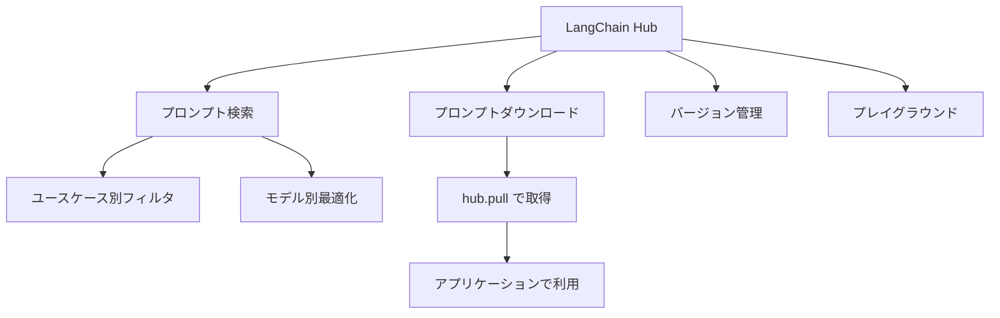

import Quiz from '@/components/content/Quiz.astro'

## 概要

LangChain Hubは，プロンプト，チェーン，エージェントなどを共有するためのリポジトリです．コミュニティが作成した高品質なプロンプトを検索・ダウンロードし，自分のアプリケーションで活用する方法を学びます．

## LangChain Hubとは

LLMから良い結果を得るための秘訣は，高品質なプロンプトとプロンプトエンジニアリングにあります．LangChain Hubは，よく使われるプロンプトをコミュニティで共有し，ダウンロードできるプラットフォームです．LangSmithの一部として提供されています．



## Hubの機能

### ユースケースによるフィルタリング

プロンプトはユースケースごとに分類されています:

- エージェント
- 自律型エージェント
- 分類タスク
- コード生成
- エンティティ抽出
- セルフチェック
- SQL
- その他

### モデル別の最適化

異なるLLMプロバイダー（Google，Meta，OpenAIなど）に対して，プロンプトを最適化する必要があります．あるモデルに最適なプロンプトが，別のモデルでは最適でない場合があるためです．

## プロンプトの利用方法

例えば，QAドキュメント用のRAGプロンプトを使う場合:

```python
from langchain import hub

# プロンプトをHubからダウンロード
prompt = hub.pull("rlm/rag-prompt")

# RetrievalQAチェーンで使用
from langchain.chains import RetrievalQA

qa_chain = RetrievalQA.from_chain_type(
    llm=llm,
    chain_type_kwargs={"prompt": prompt},
    retriever=retriever,
)
```

## プロンプトの詳細機能

### バージョン管理

各プロンプトにはコミット履歴があり，時間の経過とともにどのように変更されたかを追跡できます．

### プレイグラウンド

プロンプトをプレイグラウンドで開き，パラメータを差し込んで動作を確認できます．温度，長さ，ペナルティなどの異なるパラメータや，異なるベンダーでのプロンプトの動作を実験できます．

### 人気順ソート

ダウンロード数，いいね数，コメント数，ウォッチ数で並べ替えが可能です．

## まとめ

- LangChain Hubはプロンプトの共有リポジトリで，LangSmithの一部として提供
- ユースケースやモデル別にフィルタリングしてプロンプトを検索可能
- `hub.pull()` メソッドで簡単にプロンプトをダウンロードして利用可能
- バージョン管理機能でプロンプトの変更履歴を追跡可能
- プレイグラウンドでプロンプトの動作を実験・最適化できる

<Quiz questions={[
  {
    question: "LangChain Hubからプロンプトをダウンロードするメソッドはどれですか？",
    options: [
      "hub.download()",
      "hub.fetch()",
      "hub.pull()",
      "hub.get()"
    ],
    answer: 2,
    explanation: "hub.pull()メソッドを使ってLangChain Hubからプロンプトをダウンロードできます．例: hub.pull('rlm/rag-prompt')"
  },
  {
    question: "LangChain Hubが提供する機能として正しくないものはどれですか？",
    options: [
      "ユースケースによるフィルタリング",
      "プロンプトのバージョン管理",
      "LLMモデルの自動トレーニング",
      "プレイグラウンドでの動作確認"
    ],
    answer: 2,
    explanation: "LangChain Hubはプロンプトの共有・検索・バージョン管理・プレイグラウンドでのテストを提供しますが，LLMモデルのトレーニング機能は含まれません．"
  },
  {
    question: "LangChain Hubはどのサービスの一部として提供されていますか？",
    options: [
      "GitHub",
      "LangSmith",
      "Hugging Face",
      "OpenAI Platform"
    ],
    answer: 1,
    explanation: "LangChain HubはLangSmithの一部として提供されており，プロンプトの共有リポジトリとして機能します．"
  },
  {
    question: "異なるLLMプロバイダーに対してプロンプトを最適化する理由は何ですか？",
    options: [
      "APIの呼び出し方法が異なるため",
      "料金体系が異なるため",
      "あるモデルに最適なプロンプトが別のモデルでは最適でない場合があるため",
      "各プロバイダーが異なるプログラミング言語を使用するため"
    ],
    answer: 2,
    explanation: "LLMプロバイダーごとにモデルの特性が異なるため，あるモデルに最適なプロンプトが別のモデルでは最適でない場合があり，個別の最適化が必要です．"
  },
  {
    question: "LangChain Hubのプロンプトを並べ替えるために使用できる指標はどれですか？",
    options: [
      "ファイルサイズとトークン数",
      "ダウンロード数，いいね数，コメント数",
      "実行速度とレイテンシー",
      "精度スコアとF1値"
    ],
    answer: 1,
    explanation: "LangChain Hubではダウンロード数，いいね数，コメント数，ウォッチ数でプロンプトを並べ替えることが可能です．"
  }
]} />
