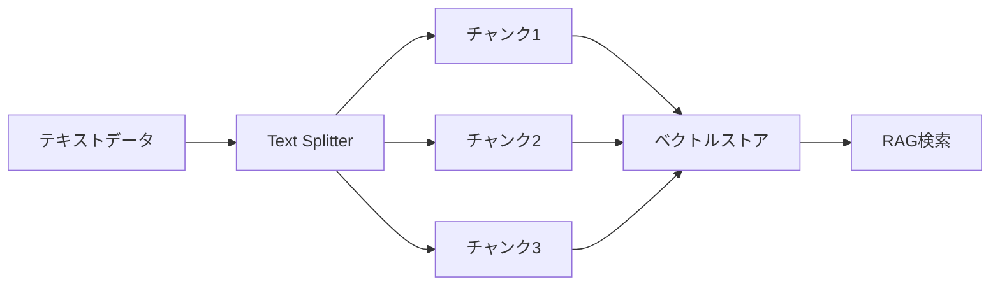

import Quiz from '@/components/content/Quiz.astro'

## 概要

RAGアプリケーションでは，テキストをベクトルストアに取り込む前に適切なサイズのチャンクに分割する必要があります．このレクチャーでは，LangChainが提供するText Splitter Playgroundを使って，チャンク分割戦略を視覚的に確認・最適化する方法を学びます．

## テキスト分割の重要性

LLMアプリケーションでは，外部データソースをLLMに接続する際，データをベクトルストアに取り込む必要があります．しかし，データをそのまま格納するわけにはいきません．トークン制限を超えないよう，小さなチャンクに分割する必要があります．

### チャンク分割の課題

テキスト分割は一見簡単に見えますが，実際には多くのニュアンスがあります:

- 各チャンクが意味的にまとまった情報を含む必要がある
- 文の途中で分割してはいけない
- 小さすぎず，大きすぎないサイズにする必要がある
- チャンクサイズ，チャンクオーバーラップの最適値はケースバイケース

正解は一つではなく，各ケースで個別に検討する必要があります．

## Text Splitter Playground

LangChainが提供するこのツールは，テキスト分割の結果を視覚的に確認できるStreamlitアプリケーションです．

### 使い方

1. Google検索で「langchain text splitting playground」を検索
2. GitHubリポジトリ（オープンソース）またはホスティングされたアプリにアクセス

### 設定可能なパラメータ

- チャンクサイズ（Chunk Size）
- チャンクオーバーラップ（Chunk Overlap）
- チャンクサイズの計算方法
- テキストスプリッターの種類（例: RecursiveCharacterTextSplitter）

パラメータを変更するたびに，対応するPythonコードが自動生成され，そのままコピー&ペーストで利用できます．

### 実践的な使い方

1. 分割したいテキスト（例: ブログ記事）を貼り付け
2. 「Split Text」をクリック
3. 各チャンクを視覚的に確認
4. チャンクが意味的にまとまっているか検証
5. チャンクオーバーラップの動作を確認（隣接チャンク間で重複する部分を確認）
6. パラメータを調整して最適な分割を見つける

## まとめ

- テキスト分割はRAGパイプラインの重要なステップだが，最適なパラメータはケースバイケース
- Text Splitter Playgroundを使えば，チャンク分割の結果を視覚的に確認できる
- チャンクサイズ，オーバーラップ，スプリッターの種類をインタラクティブに調整可能
- チャンク分割戦略の最適化に非常に有用なツール

<Quiz questions={[
  {
    question: "テキスト分割が必要な理由として最も適切なものはどれですか？",
    options: [
      "ファイルサイズを削減するため",
      "トークン制限を超えないよう適切なサイズに分割する必要があるため",
      "データの暗号化のため",
      "テキストの翻訳精度を向上させるため"
    ],
    answer: 1,
    explanation: "LLMにはトークン制限があるため，外部データをベクトルストアに取り込む際には適切なサイズのチャンクに分割する必要があります．"
  },
  {
    question: "チャンクオーバーラップの役割として正しいものはどれですか？",
    options: [
      "チャンクのサイズを均一にする",
      "隣接するチャンク間でテキストの一部を重複させ，文脈の連続性を保つ",
      "チャンクの数を減らす",
      "テキストの重複を排除する"
    ],
    answer: 1,
    explanation: "チャンクオーバーラップは隣接するチャンク間でテキストの一部を重複させることで，分割による文脈の断絶を防ぎます．"
  },
  {
    question: "Text Splitter Playgroundで設定できないパラメータはどれですか？",
    options: [
      "チャンクサイズ",
      "チャンクオーバーラップ",
      "テキストスプリッターの種類",
      "LLMモデルの選択"
    ],
    answer: 3,
    explanation: "Text Splitter Playgroundではチャンクサイズ，チャンクオーバーラップ，スプリッターの種類を設定できますが，LLMモデルの選択はこのツールの範囲外です．"
  },
  {
    question: "テキスト分割の課題として正しくないものはどれですか？",
    options: [
      "各チャンクが意味的にまとまった情報を含む必要がある",
      "文の途中で分割してはいけない",
      "すべてのケースで同じパラメータが最適である",
      "チャンクサイズの最適値はケースバイケースである"
    ],
    answer: 2,
    explanation: "テキスト分割に唯一の正解はなく，各ケースで個別にパラメータを検討する必要があります．すべてのケースで同じパラメータが最適ということはありません．"
  },
  {
    question: "Text Splitter Playgroundの提供形態は何ですか？",
    options: [
      "VS Code拡張機能",
      "コマンドラインツール",
      "Streamlitアプリケーション",
      "Jupyterノートブック"
    ],
    answer: 2,
    explanation: "Text Splitter PlaygroundはStreamlitアプリケーションとして提供されており，テキスト分割の結果を視覚的に確認できます．"
  }
]} />
