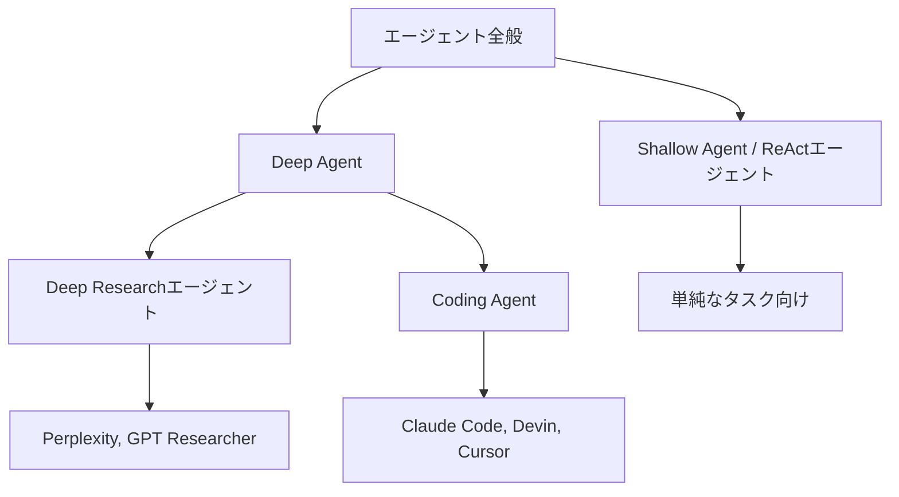
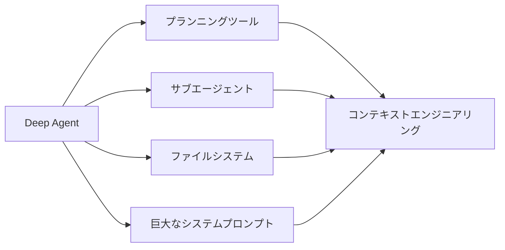

import Quiz from '@/components/content/Quiz.astro'

## 概要

このレクチャーでは，エージェントの分類体系（タクソノミー）を学び，ReActエージェント（Shallow Agent）の限界と，複雑なタスクを実行できるDeep Agentの特徴を理解します．さらに，Coding AgentがDeep Agentの一種としてどのように位置づけられるかを解説します．

## エージェントの全体像

現在の業界には様々な種類のエージェントが存在します:

- エージェント全般（ハイブリッドRAGアーキテクチャなどのエージェンティックアプリケーションを含む）
- ReActエージェント（Shallow Agent）
- Deep Agent（深層エージェント）
  - Deep Researchエージェント
  - Coding Agent

## Shallow Agent（ReActエージェント）

ReActエージェントは，LLMがツールを使うかどうかを判断し，ツールを実行し，十分な情報が得られるまでループを続ける仕組みです．このエージェントパラダイムの出発点となったReActアルゴリズムに基づいています．

### なぜ「Shallow」なのか

ReActエージェントが「浅い」と呼ばれる理由は，以下のアーキテクチャ上の制約にあります:

1. コンテキストウィンドウの制限: ツール実行のたびにコンテキストが膨張し，反復が増えるほどコンテキストが肥大化する
2. コンテキスト劣化: コンテキストの混乱，矛盾，汚染が発生し，LLMのパフォーマンスが低下する
3. コストの増大: 各呼び出しのトークン数が増加し，コストが上昇する
4. 応答速度の低下: トークン数の増加に伴い，レイテンシが増加する

Shallow Agentは「フライトを予約して」のような単純なタスクには適していますが，「機能を実装して」「あるトピックについて深い調査をして」のような複雑なタスクには向いていません．

ただし，多くの本番環境のユースケースではShallow Agentで十分であり，多くの企業がこのアーキテクチャを活用しています．

## Deep Agent（深層エージェント）

Deep Agentは，複雑で長時間にわたるタスク（long-horizon tasks）を実行できるエージェントです．

### 特徴

- 数分，数時間，場合によっては数日間実行可能
- ユーザーからの入力を受け付けて実行を一時停止・再開可能
- 複雑なタスクに対して高品質な結果を提供

### 代表的なDeep Agent

- Deep Researchエージェント: Perplexity，Claude Code，ChatGPTなどが提供するリサーチ機能
- オープンソースの例: GPT Researcher
- Coding Agent: Claude Code，Devin，Cursor，Gemini CLIなど

## Deep Agentを支える4つの要素

Deep Agentが複雑なタスクを実行できる理由は，以下の4つの機能にあります:

1. プランニングツール: 実行計画を立て，進捗を管理する
2. サブエージェント: 特化したワーカーを生成し，独立したコンテキストで並行作業する
3. ファイルシステム: 中間結果や共有状態をディスクに書き出し，コンテキストの肥大化を防ぐ
4. 巨大なシステムプロンプト: エージェントの動作を詳細に規定する

これらはすべて，コンテキストエンジニアリングとスマートなコンテキスト管理に帰結します．

## アプリケーション層の重要性

現在，LLMの性能向上は徐々に進んでいますが，飛躍的な改善は見られません．しかし，Deep Agentのようなアプリケーション層の技術が，AI技術の最前線を押し進めています．LLMをいかに賢く活用するかという「アプリケーション層の設計」が，現在のイノベーションの原動力です．

## まとめ

- ReActエージェント（Shallow Agent）はコンテキストの肥大化により複雑なタスクには不向き
- Deep Agentは長時間実行が可能で，複雑なタスクを高品質に処理できる
- Deep Agentはプランニングツール，サブエージェント，ファイルシステム，システムプロンプトの4要素で構成
- Coding Agent（Claude Code，Cursorなど）はDeep Agentの代表例
- 現在の技術革新はLLM自体よりもアプリケーション層（Deep Agent実装）が牽引している

<Quiz questions={[
  {
    question: "ReActエージェントが「Shallow」と呼ばれる主な理由は何ですか？",
    options: [
      "使用するLLMモデルが小さいため",
      "コンテキストウィンドウの肥大化により複雑なタスクに対応できないため",
      "ツールを1つしか使えないため",
      "実行時間が常に短いため"
    ],
    answer: 1,
    explanation: "ReActエージェントはツール実行のたびにコンテキストが膨張し，コンテキスト劣化，コスト増大，応答速度低下が発生するため，複雑なタスクには不向きです．"
  },
  {
    question: "Deep Agentを支える4つの要素に含まれないものはどれですか？",
    options: [
      "プランニングツール",
      "サブエージェント",
      "ベクトルデータベース",
      "ファイルシステム"
    ],
    answer: 2,
    explanation: "Deep Agentの4要素はプランニングツール，サブエージェント，ファイルシステム，巨大なシステムプロンプトです．ベクトルデータベースは含まれません．"
  },
  {
    question: "Coding Agentの具体例として正しいものはどれですか？",
    options: [
      "ChatGPTとPerplexity",
      "Claude CodeとCursor",
      "LangSmithとLangGraph",
      "HuggingFaceとWandB"
    ],
    answer: 1,
    explanation: "Coding AgentはDeep Agentの一種で，Claude Code，Devin，Cursor，Gemini CLIなどが代表例です．"
  },
  {
    question: "Shallow Agentが適しているタスクの例はどれですか？",
    options: [
      "大規模なコードベースのリファクタリング",
      "フライトの予約のような単純なタスク",
      "複数日にわたる深い調査",
      "マルチステップの機能実装"
    ],
    answer: 1,
    explanation: "Shallow Agentは「フライトを予約して」のような単純なタスクには適していますが，複雑で長時間にわたるタスクには向いていません．"
  },
  {
    question: "現在のAI技術のイノベーションを牽引しているのは何ですか？",
    options: [
      "LLMの大幅な性能向上",
      "新しいGPUアーキテクチャ",
      "アプリケーション層の設計（Deep Agentなど）",
      "トレーニングデータの増加"
    ],
    answer: 2,
    explanation: "LLMの性能向上は徐々に進んでいますが飛躍的ではありません．Deep Agentのようなアプリケーション層の技術が現在のイノベーションの原動力です．"
  }
]} />
