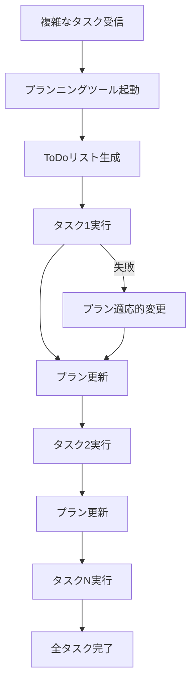

import Quiz from '@/components/content/Quiz.astro'

## 概要

Deep Agentの重要な特徴の一つであるプランニングツール（ToDoリスト）について詳しく解説します．Claude Codeなどの具体例を通じて，Deep Agentがどのようにタスクを計画・追跡・更新しながら複雑な作業を遂行するかを学びます．

## プランニングツールとは

すべてのDeep Agentにはプランニングツールが実装されています．これはLLMのChain-of-Thought推論による暗黙的な計画ではなく，明示的なプランニングツールです．

### Claude Codeでの例

Claude Codeでは，以下のようなタスクリストが表示されます:

- 完了済みのタスク
- 現在実行中のタスク
- まだ実行されていないタスク

### 実装の特徴

プランニングツールは通常，マークダウン形式のToDoリストとして実装されます:

```markdown
- [x] 認証パターンの調査
- [x] データベーススキーマの設計
- [ ] APIエンドポイントの実装  <- 現在実行中
- [ ] フロントエンドの統合
- [ ] テストの作成
```



## 動的なプラン更新

プランニングツールの最も重要な特徴は，高度に動的であることです:

1. 実行の合間にエージェントが積極的にプランをレビュー・更新する
2. タスクを「保留中」「進行中」「完了」とマーク
3. タスクが失敗した場合，オリジナルのReActアルゴリズムのように盲目的に再試行しない
4. ユーザーもタスクリストに影響を与えることができる

Claude Codeの作成者であるBoris Chernyが共有した例では，`update_todo` というプランニングツールの呼び出しが確認でき，ToDoリストが継続的に更新されている様子がわかります．

## なぜプランニングツールが効果的なのか

人間の行動とのアナロジーが非常に直感的です:

- 複雑なタスクに取り組むとき，人間も通常はタスクを分解する
- 達成したことを記録し，進捗を追跡する
- タスクの完了チェックは達成感（ドーパミンラッシュ）をもたらす
- プロジェクトの進捗を可視化できる

Deep Agentも同様に，複雑なタスクを管理可能な単位に分解し，進捗を追跡することで，より確実に目標を達成できるようになります．

## まとめ

- Deep Agentはすべて明示的なプランニングツール（ToDoリスト）を実装している
- ToDoリストはマークダウン形式で，タスクの状態を「保留」「進行中」「完了」で管理
- プランは高度に動的で，実行中に継続的に更新される
- 失敗したタスクは盲目的に再試行されず，プランが適応的に変更される
- 人間がタスクを分解して進捗を追跡するのと同じ直感的なアプローチ

<Quiz questions={[
  {
    question: "Deep Agentのプランニングツールの実装形式として一般的なものはどれですか？",
    options: [
      "JSONスキーマ",
      "マークダウン形式のToDoリスト",
      "SQLデータベース",
      "XMLドキュメント"
    ],
    answer: 1,
    explanation: "プランニングツールは通常，マークダウン形式のToDoリストとして実装され，タスクの状態をチェックボックスで管理します．"
  },
  {
    question: "プランニングツールの「動的」な特徴として正しいものはどれですか？",
    options: [
      "プランは最初に作成された後は変更されない",
      "実行の合間にエージェントが積極的にプランをレビュー・更新する",
      "ユーザーのみがプランを変更できる",
      "プランは毎回ゼロから再作成される"
    ],
    answer: 1,
    explanation: "プランニングツールの最も重要な特徴は高度に動的であることで，実行の合間にエージェントが積極的にプランをレビュー・更新します．"
  },
  {
    question: "タスクが失敗した場合のDeep Agentの対応として正しいものはどれですか？",
    options: [
      "同じ方法で盲目的に再試行する",
      "即座にエラーを返して停止する",
      "プランを適応的に変更して対応する",
      "すべてのタスクを最初からやり直す"
    ],
    answer: 2,
    explanation: "Deep Agentはタスクが失敗した場合，ReActアルゴリズムのように盲目的に再試行せず，プランを適応的に変更して対応します．"
  },
  {
    question: "Claude Codeのプランニングツールの名前は何ですか？",
    options: [
      "create_plan",
      "task_manager",
      "update_todo",
      "plan_executor"
    ],
    answer: 2,
    explanation: "Claude Codeではupdate_todoというプランニングツールが使用され，ToDoリストが継続的に更新されている様子が確認できます．"
  },
  {
    question: "プランニングツールとLLMのChain-of-Thought推論の違いは何ですか？",
    options: [
      "プランニングツールの方が計算コストが低い",
      "プランニングツールは明示的，Chain-of-Thoughtは暗黙的な計画",
      "Chain-of-Thoughtの方が常に優れた結果を出す",
      "両者に違いはない"
    ],
    answer: 1,
    explanation: "プランニングツールはLLMのChain-of-Thought推論による暗黙的な計画ではなく，明示的なツールとして実装されたプランニング機能です．"
  }
]} />
