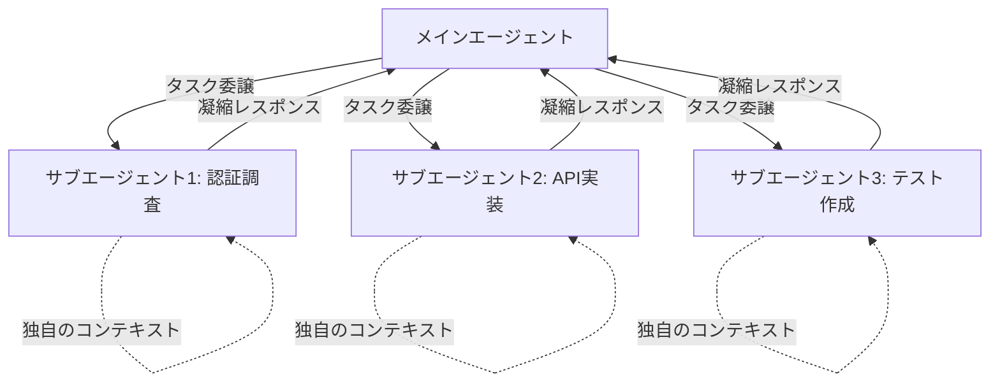

import Quiz from '@/components/content/Quiz.astro'

## 概要

Deep Agentのもう一つの重要な特徴であるサブエージェントについて解説します．サブエージェントによる階層的委譲（Hierarchical Delegation）が，コンテキスト分離と並列実行を実現し，Deep Agentの能力を大幅に拡張する仕組みを学びます．

## サブエージェントとは

Deep Agentは自分自身の新しいインスタンスを生成できますが，それぞれのインスタンスは特定のタスクに特化したサブエージェントとなります．各サブエージェントは以下を持ちます:

- 独自のシステムプロンプト
- 独自の説明（description）
- 独自のツールセット

## 現実世界のアナロジー

サブエージェントの概念は，日常生活での委譲と非常に似ています．

例えば，自分にはDIYのスキルがないため，屋根の修理を義父に依頼するケースを考えます:

1. タスクを説明するメッセージを送る（プロンプト）
2. 義父は自分のスキル（システムプロンプト）と工具（ツール）を持っている
3. 独立して作業を行い，作業中の詳細は知らない（コンテキスト分離）
4. 最終的に結果だけを受け取る（最終レスポンス）

## サブエージェントの技術的特徴

### コンテキスト分離

サブエージェントは独自のコンテキストウィンドウで動作し，メインエージェントのコンテキストを汚染しません．

### 専門化

各サブエージェントは独自のシステムプロンプトとツールセットを持ち，特定のタスクに最適化されます．

### 独立したツールコーリングループ

サブエージェントは内部で独自のReActループを実行し，最終レスポンスのみをメインエージェントに返します．中間結果は返されません．

### 並列実行

複数のサブエージェントを同時に実行でき，作業効率が大幅に向上します．

## Claude Codeでの実装例

Claude Codeでは，例えば「認証パターンを調査する探索エージェント」が生成され，メインエージェントの実行と並行して動作します．このように，Claude Codeはサブエージェントのアーキテクチャを実装しています．

## 委譲パターンの利点

1. コンテキスト分離: 専門的な作業がメインエージェントのアテンションを汚染しない
2. 並列実行: 複数のタスクを同時に実行可能
3. 品質向上: 特化したエージェントによるより高品質な結果
4. 効率性: 全体的な処理効率の大幅な改善
5. 深度: より深い分析と調査が可能

## まとめ

- サブエージェントは階層的委譲を可能にするDeep Agentの核心的な機能
- 各サブエージェントは独自のシステムプロンプト，ツール，コンテキストウィンドウを持つ
- コンテキスト分離により，メインエージェントのコンテキスト汚染を防ぐ
- 並列実行により，複数のタスクを同時に処理可能
- 最終レスポンスのみを返すことで，効率的なコンテキスト管理を実現

<Quiz questions={[
  {
    question: "サブエージェントが持つ独自の要素として正しくないものはどれですか？",
    options: [
      "独自のシステムプロンプト",
      "独自のツールセット",
      "メインエージェントの全会話履歴",
      "独自のコンテキストウィンドウ"
    ],
    answer: 2,
    explanation: "サブエージェントは独自のシステムプロンプト，ツールセット，コンテキストウィンドウを持ちますが，メインエージェントの全会話履歴は持ちません．渡されたプロンプトのみがコンテキストです．"
  },
  {
    question: "サブエージェントがメインエージェントに返すものは何ですか？",
    options: [
      "すべての中間結果と最終結果",
      "ツール呼び出しの全ログ",
      "最終レスポンスのみ",
      "使用したトークン数のレポート"
    ],
    answer: 2,
    explanation: "サブエージェントは内部で独自のReActループを実行し，最終レスポンスのみをメインエージェントに返します．中間結果は返されません．"
  },
  {
    question: "コンテキスト分離の利点として最も重要なものはどれですか？",
    options: [
      "サブエージェントの実行速度が向上する",
      "専門的な作業がメインエージェントのコンテキストを汚染しない",
      "サブエージェントが無制限にトークンを使用できる",
      "メインエージェントのシステムプロンプトが不要になる"
    ],
    answer: 1,
    explanation: "コンテキスト分離により，専門的な作業がメインエージェントのアテンション（コンテキスト）を汚染せず，メインスレッドをリーンに保てます．"
  },
  {
    question: "サブエージェントによる並列実行の利点は何ですか？",
    options: [
      "LLMのトークン制限が増加する",
      "複数のタスクを同時に実行でき，作業効率が大幅に向上する",
      "サブエージェント間でコンテキストを共有できる",
      "メインエージェントが不要になる"
    ],
    answer: 1,
    explanation: "複数のサブエージェントを同時に実行でき，作業効率が大幅に向上します．各サブエージェントは独立して動作するため並列処理が可能です．"
  },
  {
    question: "現実世界のアナロジーで，サブエージェントへの委譲を最もよく表しているのはどれですか？",
    options: [
      "自分で全作業を行う",
      "専門家にタスクを説明し，独立して作業してもらい，結果だけを受け取る",
      "作業の全工程を監視し続ける",
      "複数の人に同じタスクを依頼して結果を比較する"
    ],
    answer: 1,
    explanation: "サブエージェントへの委譲は，専門家にタスクを説明（プロンプト）し，独立して作業してもらい（コンテキスト分離），結果だけを受け取る（最終レスポンス）という流れに類似しています．"
  }
]} />
