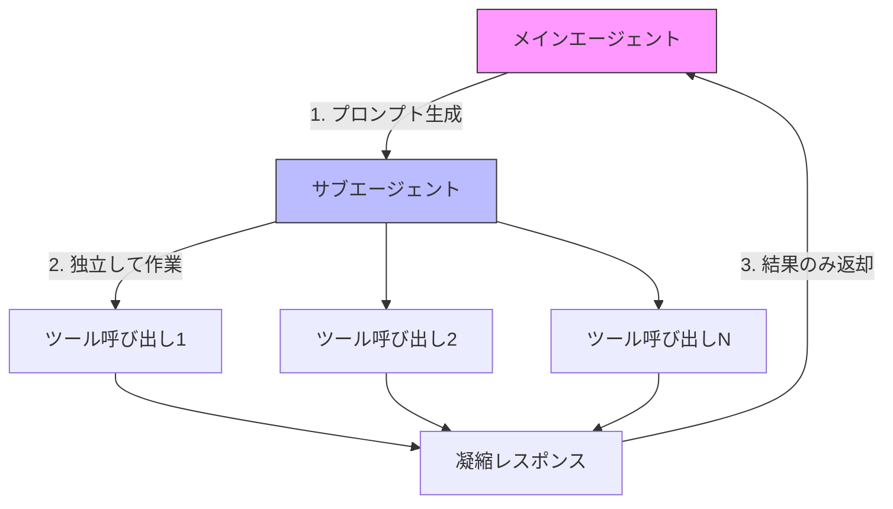

import Quiz from '@/components/content/Quiz.astro'

## 概要

このレクチャーでは，サブエージェントを使用する際のコンテキストフローを詳しく解説します．メインエージェントとサブエージェント間のコンテキスト受け渡しの仕組みと，コンテキスト分離がもたらす利点を視覚的に理解します．

## サブエージェントのコンテキストフロー

### 基本的な流れ

1. メインエージェントがサブエージェントを使用すると決定
2. メインエージェントが新しいプロンプトを生成
3. そのプロンプトだけがサブエージェントに渡される（これがサブエージェントの唯一のコンテキスト）
4. サブエージェントは独立して作業（ツール呼び出し，統合など）
5. 最終的に1つの凝縮されたレスポンスをメインエージェントに返す

重要なポイントは，サブエージェントはメインの会話の全履歴を知らないということです．渡されたプロンプトだけが，サブエージェントの持つコンテキストのすべてです．

### プロンプトの品質

サブエージェントの性能は，メインエージェントが生成するプロンプトの品質に大きく依存します．このプロンプトを操作して，サブエージェントがより良い結果を出せるように影響を与えることも可能です．



## コンテキストウィンドウの問題

### メインエージェントのみの場合

LLMにはトークン制限（200K，1Mなど）があります．メインエージェントとの対話が進むにつれ，コンテキストが膨張します:

```
ターン1: 10K トークン
ターン2: 30K トークン
ターン3: 50K トークン
ターン4: 75K トークン
ターン5: 100K トークン
```

トークン制限に近づくと:

- リクエストが失敗する可能性
- コストの増大
- レイテンシの増加
- コンテキスト汚染による品質低下

最終的に `/compact` コマンドでウィンドウを圧縮するか，新しいインスタンスを開始する必要があります．

### サブエージェントを活用した場合

サブエージェントを使用すると，各サブエージェントは独自のコンテキストウィンドウで動作します:

```
メインスレッド: 通常のやりとり（リーンなコンテキスト）
  |
  +-- サブエージェント1: 独自のコンテキスト -> 凝縮レスポンス（15-20K）
  |
  +-- サブエージェント2: 独自のコンテキスト -> 凝縮レスポンス（15-20K）
```

サブエージェントが消費するトークンは，メインエージェントのコンテキストにカウントされません．最終的に返されるのは凝縮されたレスポンス（要約とコード変更の概要）だけです．

## コンテキスト分離の利点

1. メインスレッドをリーンに保つ: 大量のコンテキストがサブエージェントに委譲される
2. `/compact` や `/clear` が不要に: コンテキストの蓄積が抑えられる
3. 各サブエージェントは特化したシステムプロンプトを持つ: メインエージェントよりも特定のタスクに適している
4. コスト効率: メインエージェントの呼び出しあたりのトークン数を削減
5. パフォーマンス: リーンなコンテキストにより，LLMの推論品質が維持される

## 入出力の構造

```
メインエージェント
  ↓ (1つの入力: プロンプト)
サブエージェント
  ↓ (内部で複数のツール呼び出し)
  ↓ (1つの出力: 凝縮レスポンス)
メインエージェント
```

この「1入力 → 1出力」の構造が，コンテキスト圧縮の非常にスマートな方法です．

## まとめ

- サブエージェントはメインエージェントから渡されたプロンプトのみをコンテキストとして受け取る
- サブエージェントのトークン消費はメインエージェントのコンテキストに影響しない
- 最終レスポンスのみが返されるため，コンテキストが効率的に圧縮される
- メインスレッドをリーンに保つことで，LLMの推論品質とコスト効率が向上
- コンテキストエンジニアリングの非常にエレガントなソリューション

<Quiz questions={[
  {
    question: "サブエージェントが受け取るコンテキストは何ですか？",
    options: [
      "メインエージェントの全会話履歴",
      "メインエージェントが生成した1つのプロンプトのみ",
      "過去のすべてのサブエージェントの結果",
      "ユーザーの全入力履歴"
    ],
    answer: 1,
    explanation: "サブエージェントはメインエージェントが生成した1つのプロンプトのみをコンテキストとして受け取ります．メインの会話の全履歴は知りません．"
  },
  {
    question: "メインエージェントのみで作業を続けた場合に発生する問題はどれですか？",
    options: [
      "ツールが使えなくなる",
      "コンテキストの膨張によるコスト増大と品質低下",
      "LLMモデルが切り替わる",
      "ネットワーク接続が切断される"
    ],
    answer: 1,
    explanation: "メインエージェントのみで対話を続けると，コンテキストが膨張し，コスト増大，レイテンシ増加，コンテキスト汚染による品質低下が発生します．"
  },
  {
    question: "サブエージェントの「1入力 → 1出力」構造の利点は何ですか？",
    options: [
      "エラーが発生しにくい",
      "コンテキスト圧縮の非常にスマートな方法",
      "処理速度が常に速い",
      "メモリ使用量がゼロになる"
    ],
    answer: 1,
    explanation: "サブエージェントは1つのプロンプトを入力として受け取り，凝縮された1つのレスポンスを出力する構造により，コンテキストを効率的に圧縮できます．"
  },
  {
    question: "サブエージェントが消費するトークンの扱いとして正しいものはどれですか？",
    options: [
      "メインエージェントのコンテキストにカウントされる",
      "メインエージェントのコンテキストにカウントされない",
      "両方のコンテキストに均等に分配される",
      "サブエージェントにはトークン制限がない"
    ],
    answer: 1,
    explanation: "サブエージェントが消費するトークンはメインエージェントのコンテキストにカウントされません．メインエージェントが受け取るのは凝縮されたレスポンスだけです．"
  },
  {
    question: "コンテキストがトークン制限に近づいた場合の対処法として正しいものはどれですか？",
    options: [
      "LLMモデルを変更する",
      "/compactコマンドでウィンドウを圧縮するか，新しいインスタンスを開始する",
      "すべてのツールを無効にする",
      "サブエージェントの数を増やす"
    ],
    answer: 1,
    explanation: "コンテキストがトークン制限に近づいた場合，/compactコマンドでウィンドウを圧縮するか，新しいインスタンスを開始する必要があります．"
  }
]} />
