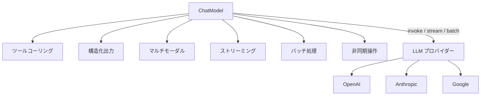

import Quiz from '@/components/content/Quiz.astro'

## 概要

LangChainのChatModelオブジェクトは，LLM（GPT-4，Claude，Geminiなど）とやりとりするための主要なインターフェースです．このレクチャーでは，ChatModelの役割，主要な機能，初期化パラメータ，そしてメッセージの入出力構造について包括的に解説します．

## ChatModelの基本

ChatModelは，LLMと対話するための標準的な方法を提供します．歴史的にはLLMは単一の文字列を入出力としていましたが，現代のLLMは会話形式で動作し，メッセージのリストを入力として受け取り，メッセージを返します．

### 入力と出力

- 入力: システム指示，ユーザーの質問，応答などの構造化されたメッセージのリスト
- 出力: LLMの応答を表すAIメッセージ



## ChatModelの主要機能

### 1. ツールコーリング

LLMが外部世界とやりとりする機能です．例えば，数学の計算をLLMに依頼した場合，ツールコーリングなしではハルシネーションが発生する可能性がありますが，ツールコーリングを使えば，数学ツールを選択・実行して正確な回答を提供できます．

### 2. 構造化出力（Structured Output）

LLMの応答をJSON形式やPydanticオブジェクトなど，アプリケーションが処理しやすい予測可能なフォーマットで取得する機能です．

```python
# with_structured_output を使用した例
class ContactInfo(BaseModel):
    name: str
    email: str
    phone: str

llm_with_structure = llm.with_structured_output(ContactInfo)
```

### 3. マルチモーダル

テキストだけでなく，画像や動画などの他のデータタイプも処理できる機能です．テキストプロンプトと一緒に画像を送信し，内容の分析を依頼できます．

## LangChainの抽象化レイヤー

LangChainは異なるモデルプロバイダー間の抽象化レイヤーとして機能します:

- OpenAI用のコード，Anthropic用のコード，Google用のコードを個別に書く必要がない
- 一貫したインターフェースでモデルを利用可能
- `langchain-openai`，`langchain-anthropic`，`langchain-google-vertexai` などのパッケージで統合

### 追加機能

- 非同期操作（複数の呼び出しを並行実行）
- バッチ処理（複数のリクエストを一度に送信）
- ストリーミングAPI（トークンごとにリアルタイムで出力）
- LangSmithとのシームレスな統合

## ChatModelの主要メソッド

| メソッド | 説明 |
|---|---|
| `invoke` | メッセージリストを受け取り，単一のレスポンスメッセージを返す |
| `stream` | リアルタイムアプリケーション向けに，生成されたチャンクを逐次返す |
| `batch` | 複数のプロンプトを効率的にグループで送信 |
| `bind_tools` | 外部ツールをモデルにアタッチし，ツールコーリングを有効化 |
| `with_structured_output` | 構造化フォーマットで直接レスポンスを取得するラッパー |

## 初期化パラメータ

ChatModelを初期化する際に設定する主要なパラメータ:

```python
from langchain_openai import ChatOpenAI

llm = ChatOpenAI(
    model="gpt-4",           # モデル名
    temperature=0.0,          # 創造性の制御（0.0=決定的，1.0=ランダム）
    max_tokens=1000,          # レスポンスの最大長
    timeout=30,               # タイムアウト設定
    max_retries=3,            # 最大リトライ回数
    api_key="your-api-key",   # APIキー
)
```

- `temperature`: 低い値ほど決定的で集中した出力，高い値ほどランダムで創造的
- `max_tokens`: レスポンスの長さを制限（コスト制御とサイズ最適化に有用）
- `stop`: テキスト生成を停止するシーケンスを指定
- `timeout` / `max_retries`: ネットワーク問題やプロバイダーの一時的障害に対するロバスト性

## まとめ

- ChatModelはLangChainでLLMとやりとりするための主要インターフェース
- ツールコーリング，構造化出力，マルチモーダルなどの機能をサポート
- LangChainはプロバイダー間の抽象化レイヤーとして，一貫したインターフェースを提供
- `invoke`，`stream`，`batch`，`bind_tools` などのメソッドで柔軟な操作が可能
- `temperature`，`max_tokens` などのパラメータで動作を制御

<Quiz questions={[
  {
    question: "ChatModelの入力として受け取るデータ形式はどれですか？",
    options: [
      "単一の文字列のみ",
      "構造化されたメッセージのリスト",
      "JSONオブジェクト",
      "バイナリデータ"
    ],
    answer: 1,
    explanation: "現代のChatModelはメッセージのリスト（システム指示，ユーザーの質問，応答など）を入力として受け取り，AIメッセージを返します．"
  },
  {
    question: "temperatureパラメータの値を0.0に設定した場合の出力特性はどれですか？",
    options: [
      "最もランダムで創造的な出力",
      "最も決定的で集中した出力",
      "エラーが発生する",
      "出力が生成されない"
    ],
    answer: 1,
    explanation: "temperatureが0.0の場合，最も決定的で集中した出力が生成されます．値が高いほどランダムで創造的な出力になります．"
  },
  {
    question: "with_structured_outputメソッドの用途は何ですか？",
    options: [
      "LLMの応答をストリーミングする",
      "LLMの応答をJSON形式やPydanticオブジェクトなどの構造化フォーマットで取得する",
      "LLMにツールをバインドする",
      "複数のプロンプトをバッチ送信する"
    ],
    answer: 1,
    explanation: "with_structured_outputは，LLMの応答をJSON形式やPydanticオブジェクトなど，アプリケーションが処理しやすい予測可能なフォーマットで取得するメソッドです．"
  },
  {
    question: "LangChainが提供する抽象化レイヤーの利点は何ですか？",
    options: [
      "特定のLLMプロバイダーに最適化される",
      "異なるモデルプロバイダーに対して一貫したインターフェースを提供する",
      "LLMの推論速度が向上する",
      "APIキーが不要になる"
    ],
    answer: 1,
    explanation: "LangChainは異なるモデルプロバイダー（OpenAI，Anthropic，Googleなど）間の抽象化レイヤーとして機能し，一貫したインターフェースでモデルを利用可能にします．"
  },
  {
    question: "streamメソッドの特徴として正しいものはどれですか？",
    options: [
      "複数のプロンプトをグループで送信する",
      "生成されたチャンクを逐次的にリアルタイムで返す",
      "外部ツールをモデルにアタッチする",
      "モデルの初期化パラメータを変更する"
    ],
    answer: 1,
    explanation: "streamメソッドはリアルタイムアプリケーション向けに，LLMが生成したトークンのチャンクを逐次的に返します．"
  }
]} />
