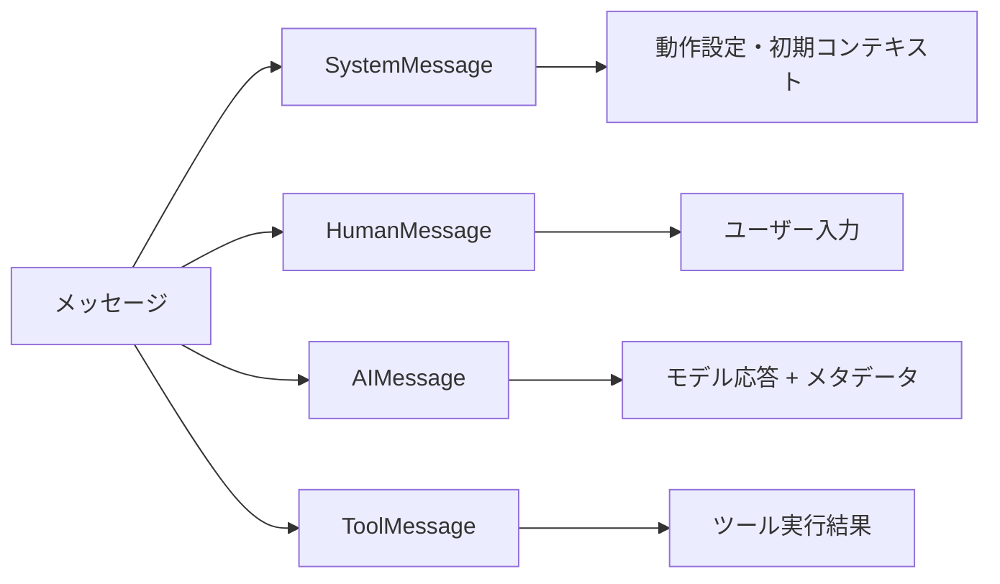

import Quiz from '@/components/content/Quiz.astro'

## 概要

メッセージはLLMとのコミュニケーションにおける基本単位です．このレクチャーでは，LangChainが提供するメッセージの種類（システム，ヒューマン，AI，ツール），それぞれの役割と構造，そしてメッセージの正しい使い方を学びます．

## メッセージの基本構造

すべてのメッセージは2つの本質的な部分で構成されます:

1. ロール（Role）: メッセージの送信者が誰かを示す
2. コンテンツ（Content）: 実際の情報（通常はテキスト，マルチモーダルモデルでは画像やその他のデータも可能）

LangChainはメッセージを標準化し，異なるプロバイダーでも一貫したフォーマットで利用できるようにしています．



## メッセージの種類

### 1. SystemMessage（システムロール）

AIの動作を設定したり，初期コンテキストを提供するために使用します．

```python
from langchain_core.messages import SystemMessage

system_msg = SystemMessage(
    content="あなたは親切なアシスタントです．複雑なドキュメントを簡潔に要約してください．"
)
```

すべてのモデルがシステムメッセージを同じ方法で処理するわけではありません:
- 専用パラメータを使用するモデル
- メッセージ履歴に統合するモデル
- サポートしていないモデル

LangChainはこれらの違いを吸収し，単一のインターフェースを提供します．

### 2. HumanMessage（ユーザーロール）

ユーザーまたはシステムからの入力を表します．

```python
from langchain_core.messages import HumanMessage

human_msg = HumanMessage(content="LangChainとは何ですか？")
```

LangChainでは，単純な文字列でモデルを呼び出すと，自動的にHumanMessageとして扱われるショートカットもあります．

### 3. AIMessage（アシスタントロール）

モデルの応答を表します．メインのコンテンツに加えて，以下の情報も含まれます:

- メタデータ
- ツールコール情報
- トークン使用情報
- デバッグ用の一意な識別子

```python
from langchain_core.messages import AIMessage

# モデルの応答として自動的に生成される
response = llm.invoke([human_msg])  # AIMessageが返される
```

### 4. ToolMessage（ツールロール）

ツールの実行結果をAIに伝えるために使用します．例えば，天気取得ツールの結果をToolMessageオブジェクトに格納してモデルに渡し，最終的な回答を生成させます．

```python
from langchain_core.messages import ToolMessage

tool_msg = ToolMessage(
    content="東京の現在の気温は22度です",
    tool_call_id="call_abc123"
)
```

## メッセージの順序

一貫した会話のために，メッセージの順序は重要です:

### 基本的な会話フロー

```
HumanMessage -> AIMessage -> HumanMessage -> AIMessage -> ...
```

### ツールを含む場合のフロー

```
HumanMessage
  -> AIMessage（ツールコール付き）
  -> ToolMessage（ツール結果）
  -> AIMessage（ツール結果を使った応答）
  -> ...
```

## まとめ

- メッセージはLLMとの通信の基本単位で，ロールとコンテンツで構成される
- SystemMessage: AIの動作を設定する指示
- HumanMessage: ユーザーからの入力
- AIMessage: モデルの応答（メタデータ，ツールコール情報を含む）
- ToolMessage: ツールの実行結果をAIに伝える
- LangChainはプロバイダー間の違いを吸収し，一貫したメッセージフォーマットを提供

<Quiz questions={[
  {
    question: "すべてのメッセージを構成する2つの要素は何ですか？",
    options: [
      "タイトルとボディ",
      "ロールとコンテンツ",
      "ヘッダーとペイロード",
      "キーとバリュー"
    ],
    answer: 1,
    explanation: "すべてのメッセージはロール（送信者が誰か）とコンテンツ（実際の情報）の2つの部分で構成されます．"
  },
  {
    question: "ToolMessageの用途として正しいものはどれですか？",
    options: [
      "LLMに新しいツールを登録する",
      "ツールの実行結果をAIに伝える",
      "ツールのスキーマを定義する",
      "ツールの実行をキャンセルする"
    ],
    answer: 1,
    explanation: "ToolMessageはツールの実行結果をAIに伝えるために使用します．ツール実行後の結果をモデルに渡して最終回答の生成に活用します．"
  },
  {
    question: "SystemMessageの役割として正しいものはどれですか？",
    options: [
      "ユーザーからの入力を表す",
      "AIの動作を設定したり初期コンテキストを提供する",
      "ツールの実行結果を格納する",
      "エラーメッセージを表示する"
    ],
    answer: 1,
    explanation: "SystemMessageはAIの動作を設定したり，初期コンテキストを提供するために使用します．例えば「あなたは親切なアシスタントです」のような指示です．"
  },
  {
    question: "AIMessageに含まれる追加情報として正しくないものはどれですか？",
    options: [
      "メタデータ",
      "ツールコール情報",
      "ユーザーの個人情報",
      "トークン使用情報"
    ],
    answer: 2,
    explanation: "AIMessageにはメタデータ，ツールコール情報，トークン使用情報，デバッグ用の識別子が含まれますが，ユーザーの個人情報は含まれません．"
  },
  {
    question: "ツールを含む会話フローの正しい順序はどれですか？",
    options: [
      "HumanMessage → ToolMessage → AIMessage",
      "HumanMessage → AIMessage（ツールコール付き） → ToolMessage → AIMessage",
      "ToolMessage → HumanMessage → AIMessage",
      "AIMessage → ToolMessage → HumanMessage"
    ],
    answer: 1,
    explanation: "ツールを含む場合は，HumanMessage → AIMessage（ツールコール付き） → ToolMessage（ツール結果） → AIMessage（最終応答）の順序です．"
  }
]} />
