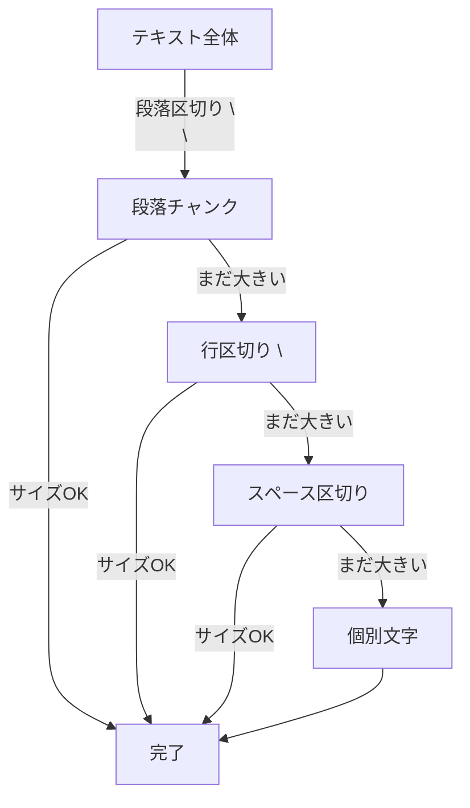

import Quiz from '@/components/content/Quiz.astro'

## 概要

RecursiveCharacterTextSplitterは，大きなドキュメントを小さなチャンクに分割するためのユーティリティクラスです．文字の再帰的な処理によってテキストを分割し，意味的なまとまりをできるだけ保持しようとする仕組みを解説します．

## 再帰的分割の仕組み

「再帰的」とは，テキストを階層的なセパレータで段階的に分割していく戦略を指します．まず大きなセマンティック単位に対応するセパレータで分割を試み，チャンクが十分に小さくなるまで処理を続けます．



### 分割の階層

1. 段落区切り（`\n\n`） - 最も大きなセマンティック単位
2. 行区切り（`\n`） - 文レベルの分割
3. スペース（` `） - 単語レベルの分割
4. 個別の文字 - 最小単位

### 処理の流れ

```
テキスト全体
  ↓ \n\n で分割（段落単位）
  ↓ まだ大きいチャンクがあれば
  ↓ \n で分割（行単位）
  ↓ まだ大きいチャンクがあれば
  ↓ スペースで分割（単語単位）
  ↓ 最終手段として個別文字で分割
```

## 固定長分割との違い

RecursiveCharacterTextSplitterは，単純な固定長分割（文字数やトークン数で機械的に分割）とは異なり:

- テキストの本来の構造を尊重する
- チャンク内のセマンティックな整合性を維持しようとする
- 文の途中で分割されるリスクを最小化する

## 使い方の例

```python
from langchain.text_splitter import RecursiveCharacterTextSplitter

text_splitter = RecursiveCharacterTextSplitter(
    chunk_size=1000,       # チャンクの最大サイズ
    chunk_overlap=200,     # チャンク間のオーバーラップ
    separators=["\n\n", "\n", " ", ""],  # セパレータの階層
)

chunks = text_splitter.split_text(long_document)
```

## 注意点

この分割はヒューリスティックなアプローチであり，常に完璧に意味的にまとまったチャンクが生成されるわけではありません．しかし，単純な固定長分割よりも遥かに優れた結果が得られることが多いです．

## まとめ

- RecursiveCharacterTextSplitterは再帰的にセパレータを試して最適な分割を行う
- 段落 → 行 → 単語 → 文字の順に階層的に分割を試みる
- テキストの自然な構造を尊重し，セマンティックな整合性を維持
- ヒューリスティックなアプローチのため，完璧ではないが実用的
- RAGパイプラインで最もよく使われるテキスト分割手法

<Quiz questions={[
  {
    question: "RecursiveCharacterTextSplitterの「再帰的」とはどういう意味ですか？",
    options: [
      "同じ処理を無限に繰り返す",
      "階層的なセパレータで段階的に分割していく戦略",
      "分割後に元に戻す処理を行う",
      "テキストを逆順に処理する"
    ],
    answer: 1,
    explanation: "再帰的とは，まず大きなセマンティック単位（段落区切り）で分割を試み，チャンクが十分に小さくなるまでより小さな単位（行，スペース，文字）で段階的に処理を続ける戦略です．"
  },
  {
    question: "分割の階層で最初に試みられるセパレータはどれですか？",
    options: [
      "スペース",
      "個別の文字",
      "行区切り（\\n）",
      "段落区切り（\\n\\n）"
    ],
    answer: 3,
    explanation: "まず最も大きなセマンティック単位に対応する段落区切り（\\n\\n）で分割を試み，必要に応じてより小さい単位に進みます．"
  },
  {
    question: "固定長分割と比較したRecursiveCharacterTextSplitterの利点は何ですか？",
    options: [
      "処理速度が常に速い",
      "テキストの本来の構造を尊重しセマンティックな整合性を維持する",
      "メモリ使用量が少ない",
      "すべてのチャンクが同じサイズになる"
    ],
    answer: 1,
    explanation: "RecursiveCharacterTextSplitterはテキストの本来の構造を尊重し，チャンク内のセマンティックな整合性を維持しようとします．文の途中で分割されるリスクも最小化されます．"
  },
  {
    question: "RecursiveCharacterTextSplitterの注意点として正しいものはどれですか？",
    options: [
      "日本語テキストには対応していない",
      "ヒューリスティックなアプローチのため常に完璧ではない",
      "chunk_overlapの設定が必須",
      "1000文字以上のテキストには使用できない"
    ],
    answer: 1,
    explanation: "この分割はヒューリスティックなアプローチであり，常に完璧に意味的にまとまったチャンクが生成されるわけではありませんが，固定長分割よりも優れた結果が得られます．"
  },
  {
    question: "chunk_overlapパラメータの役割は何ですか？",
    options: [
      "チャンクの最大サイズを制限する",
      "隣接するチャンク間の重複部分を指定する",
      "分割に使用するセパレータを定義する",
      "並列処理のスレッド数を設定する"
    ],
    answer: 1,
    explanation: "chunk_overlapは隣接するチャンク間の重複部分のサイズを指定し，分割による文脈の断絶を防ぎます．"
  }
]} />
