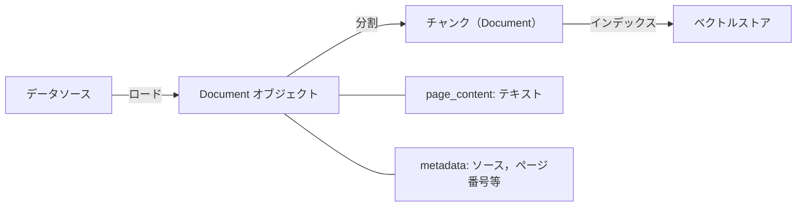

import Quiz from '@/components/content/Quiz.astro'

## 概要

LangChainのDocumentクラスは，テキストを扱うための標準的なコンテナであり，コアビルディングブロックの一つです．テキスト本体と付随するメタデータをパッケージ化する構造について解説します．

## Documentの構造

すべてのDocumentオブジェクトは2つの主要な部分で構成されます:

### 1. page_content

実際のテキストを保持します:

- 記事の段落
- PDFのページ
- その他のテキストデータ

### 2. metadata

テキストに関する追加情報を辞書形式で格納します:

- ソース（ファイル名，URL）
- ページ番号
- カスタムタグ
- その他のコンテキスト情報

```python
from langchain_core.documents import Document

doc = Document(
    page_content="LangChainはLLMアプリケーション構築のためのフレームワークです．",
    metadata={
        "source": "https://docs.langchain.com",
        "page": 1,
        "topic": "introduction",
    }
)
```



## RAGワークフローにおける役割

Documentクラスは，LangChainのRAGパイプラインにおいて非常に重要な役割を果たします:

### データロード

様々なソースからデータを読み込むと，Documentオブジェクトのリストに変換されます．LangChainは多数のデータソースとの統合をサポートしています．

### チャンク分割

Documentオブジェクトをテキストスプリッターで小さなチャンクに分割する際，分割後のチャンクもDocumentインスタンスとして扱われます．

### メタデータの活用

付随するメタデータは，後の処理で非常に有用です:

- フィルタリングロジック
- 検索結果の絞り込み
- ソースの追跡

```python
# メタデータを使ったフィルタリングの例
from langchain.text_splitter import RecursiveCharacterTextSplitter

splitter = RecursiveCharacterTextSplitter(chunk_size=500)
chunks = splitter.split_documents([doc])

# 各チャンクはDocumentインスタンスで，元のメタデータを継承
for chunk in chunks:
    print(chunk.metadata["source"])  # ソース情報が保持されている
```

## まとめ

- Documentは `page_content`（テキスト）と `metadata`（付随情報）で構成される
- LangChainのRAGワークフローにおける標準的なデータコンテナ
- データローダーからの出力はDocumentオブジェクトのリスト
- テキスト分割後のチャンクもDocumentインスタンス
- メタデータはフィルタリングや検索ロジックで活用される

<Quiz questions={[
  {
    question: "Documentオブジェクトを構成する2つの主要な部分は何ですか？",
    options: [
      "titleとbody",
      "page_contentとmetadata",
      "headerとfooter",
      "textとattributes"
    ],
    answer: 1,
    explanation: "Documentオブジェクトはpage_content（テキスト本体）とmetadata（付随情報の辞書）の2つで構成されます．"
  },
  {
    question: "metadataに格納される情報の例として正しくないものはどれですか？",
    options: [
      "ファイル名やURL",
      "ページ番号",
      "LLMの応答履歴",
      "カスタムタグ"
    ],
    answer: 2,
    explanation: "metadataにはソース（ファイル名，URL），ページ番号，カスタムタグなどの付随情報が格納されますが，LLMの応答履歴は含まれません．"
  },
  {
    question: "テキスト分割後のチャンクのデータ型は何ですか？",
    options: [
      "文字列（str）",
      "辞書（dict）",
      "Documentインスタンス",
      "リスト（list）"
    ],
    answer: 2,
    explanation: "テキストスプリッターで分割後のチャンクもDocumentインスタンスとして扱われ，元のメタデータを継承します．"
  },
  {
    question: "RAGワークフローにおけるDocumentの流れとして正しいものはどれですか？",
    options: [
      "ベクトルストア → データロード → チャンク分割",
      "データロード → チャンク分割 → ベクトルストアへのインデックス",
      "チャンク分割 → データロード → 検索",
      "検索 → データロード → チャンク分割"
    ],
    answer: 1,
    explanation: "RAGワークフローでは，まずデータソースからDocumentをロードし，チャンクに分割してからベクトルストアにインデックスします．"
  },
  {
    question: "Documentのmetadataを活用する場面として最も適切なものはどれですか？",
    options: [
      "LLMのtemperatureを調整する",
      "検索結果のフィルタリングやソースの追跡",
      "テキスト分割のパラメータ設定",
      "APIキーの管理"
    ],
    answer: 1,
    explanation: "metadataはフィルタリングロジック，検索結果の絞り込み，ソースの追跡などに活用されます．"
  }
]} />
