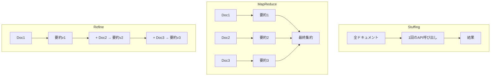

import Quiz from '@/components/content/Quiz.astro'

## 概要

LLMにはトークン制限があり，実際のアプリケーションではこの制限に達することが避けられません．このレクチャーでは，LangChainが提供するStuffing，MapReduce，Refineの3つの戦略を，ドキュメント要約の例を通じて解説します．

## トークン制限の基本

すべてのLLMにはトークン制限があります．このトークン数は，入力プロンプトと生成されるレスポンスの両方を含みます．

- 合計がトークン制限を超えなければ問題ない
- 入力と出力の配分はLLMに任意
- トークン制限を超えるとエラーが発生

## 1. Stuffing（スタッフィング）戦略

ぬいぐるみに綿を詰め込むように，すべてのコンテキストをそのままプロンプトに「詰め込む」戦略です．

```python
from langchain.chains.summarize import load_summarize_chain

chain = load_summarize_chain(llm, chain_type="stuff")
```

### 特徴

- 最も直感的なアプローチ
- 1回のAPI呼び出しで完了
- ドキュメントが少ない場合に有効

### 制限

- ドキュメントが多いとトークン制限に達する
- 仮に無制限のトークンを処理できるLLMがあっても，サーバーへのペイロードサイズ制限に達する

## 2. MapReduce（マップリデュース）戦略

関数型プログラミングの概念を応用した戦略です．

```python
chain = load_summarize_chain(llm, chain_type="map_reduce")
```

### 処理の流れ

1. Map（マッピング）: 各ドキュメントから個別のプロンプトを作成
2. Map（変換）: 各プロンプトをLLMに送信し，個別の要約を取得
3. Reduce（集約）: すべての個別要約を統合して最終要約を生成

```
ドキュメント1 -> プロンプト1 -> LLM -> 要約1 ─┐
ドキュメント2 -> プロンプト2 -> LLM -> 要約2 ─┤ -> 最終要約
ドキュメント3 -> プロンプト3 -> LLM -> 要約3 ─┘
```

### 利点

- 大量のドキュメントにスケール可能
- 各ドキュメントは独立しているため並列実行が可能
- パフォーマンスが最適化される

### 欠点

- 多数のAPI呼び出しが必要でコストが増大
- マッピング過程で情報が失われる可能性がある

## 3. Refine（リファイン）戦略

関数型プログラミングの `foldl`（左畳み込み）関数の概念に基づく戦略です．

```python
chain = load_summarize_chain(llm, chain_type="refine")
```

### foldl関数の概念

`foldl` は以下の3つのパラメータを取ります:

1. 適用する関数
2. 初期値
3. 適用するリスト

```
foldl(multiply, 1, [1, 2, 3, 4])
  = 1 * 1 = 1
  -> 1 * 2 = 2
  -> 2 * 3 = 6
  -> 6 * 4 = 24
```

### Refine戦略への適用

この概念をドキュメント要約に適用すると:

1. 空のドキュメント + ドキュメント1 → 最初の要約
2. 最初の要約 + ドキュメント2 → 改良された要約
3. 改良された要約 + ドキュメント3 → さらに改良された要約
4. ...最終的な要約が完成

```
空文字列 + Doc1 -> 要約v1
要約v1 + Doc2 -> 要約v2（改良）
要約v2 + Doc3 -> 要約v3（さらに改良）
```

各ステップで要約が「精練」され，最終的に全ドキュメントの要約が完成します．



## 3つの戦略の比較

| 戦略 | API呼び出し | スケーラビリティ | 情報保持 | 並列実行 |
|---|---|---|---|---|
| Stuffing | 1回 | 低 | 高 | 不可 |
| MapReduce | 多数 | 高 | 中（情報損失の可能性） | 可能 |
| Refine | ドキュメント数分 | 中 | 高 | 不可 |

## まとめ

- LLMのトークン制限は避けられない課題で，LangChainは3つの戦略を提供
- Stuffing: 全データをプロンプトに詰め込む（少量データ向け）
- MapReduce: 各ドキュメントを個別に処理し集約（大量データ向け，並列実行可能）
- Refine: 逐次的にドキュメントを統合して精練（情報保持に優れる）
- LangChainは `chain_type` パラメータの変更だけでこれらの戦略を切り替え可能

<Quiz questions={[
  {
    question: "Stuffing戦略の特徴として正しいものはどれですか？",
    options: [
      "複数回のAPI呼び出しが必要",
      "すべてのコンテキストをプロンプトに詰め込み1回のAPI呼び出しで完了",
      "並列実行が可能",
      "大量のドキュメントに最適"
    ],
    answer: 1,
    explanation: "Stuffing戦略はすべてのコンテキストをそのままプロンプトに詰め込み，1回のAPI呼び出しで処理します．ドキュメントが少ない場合に有効です．"
  },
  {
    question: "MapReduce戦略の「Map」フェーズで行われることは何ですか？",
    options: [
      "すべてのドキュメントを結合する",
      "各ドキュメントから個別のプロンプトを作成しLLMに送信する",
      "最終要約を生成する",
      "ドキュメントをフィルタリングする"
    ],
    answer: 1,
    explanation: "Mapフェーズでは各ドキュメントから個別のプロンプトを作成し，LLMに送信して個別の要約を取得します．"
  },
  {
    question: "Refine戦略の元になっている関数型プログラミングの概念は何ですか？",
    options: [
      "map関数",
      "filter関数",
      "foldl（左畳み込み）関数",
      "reduce関数"
    ],
    answer: 2,
    explanation: "Refine戦略はfoldl（左畳み込み）関数の概念に基づいており，逐次的にドキュメントを統合して要約を精練していきます．"
  },
  {
    question: "並列実行が可能な戦略はどれですか？",
    options: [
      "Stuffing",
      "MapReduce",
      "Refine",
      "すべての戦略"
    ],
    answer: 1,
    explanation: "MapReduce戦略では各ドキュメントが独立しているため，Mapフェーズの処理を並列実行できます．StuffingとRefineは逐次的な処理です．"
  },
  {
    question: "LangChainで戦略を切り替えるために変更するパラメータは何ですか？",
    options: [
      "model_type",
      "chain_type",
      "strategy_type",
      "method_type"
    ],
    answer: 1,
    explanation: "LangChainではchain_typeパラメータを変更するだけで，stuff，map_reduce，refineの戦略を簡単に切り替えられます．"
  }
]} />
