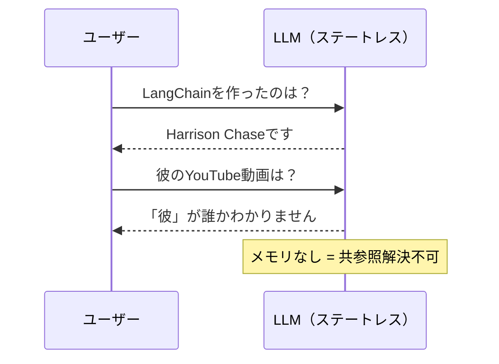

import Quiz from '@/components/content/Quiz.astro'

## 概要

LLMはステートレスであり，会話の履歴を自動的に保持しません．このレクチャーでは，共参照解決（Co-reference Resolution）の問題を通じて，なぜメモリが必要なのかを理解し，LangChainのメモリソリューションの基礎を学びます．

## LLMのステートレス性

LLMはステートレスです．これは，以前の会話の情報を保存しないことを意味します．

### 共参照解決の問題

```
ユーザー: LangChainを作ったのは誰ですか？
LLM: Harrison Chaseによって作られました．

ユーザー: 彼に関連するYouTube動画を知っていますか？
LLM: 申し訳ありません，「彼」が誰を指しているのかわかりません．
     もう少しコンテキストを提供してください．
```

共参照解決（Co-reference Resolution）とは，テキスト中の異なる単語やフレーズが同じエンティティを指していることを特定するタスクです．上の例では「彼」がHarrison Chaseを指していますが，LLMは状態を持たないためこの解決ができません．



## メモリの基本アプローチ

LangChainのメモリソリューションは，プロンプトにデータや情報を巧妙に組み込むことで，LLMが共参照解決を行えるようにするものです．

```
プロンプト: 過去の会話を踏まえて質問に答えてください．

過去の会話:
ユーザー: コールドブリューコーヒーが好きです．どこで飲めますか？
ボット: スターバックスやコーヒービーンで飲めます．

現在の質問: 他にどこで見つけられますか？
```

この方法により，LLMは「それ」がコールドブリューコーヒーを指していること，スターバックスやコーヒービーン以外の場所を求めていることを理解できます．

## トークン制限の課題

1時間の会話の履歴をすべてプロンプトに含めると，トークン制限を超えてしまいます．この問題に対処するために，LangChainは様々なメモリ戦略を提供しています．

## まとめ

- LLMはステートレスで，会話の履歴を自動的に保持しない
- 共参照解決（「彼」「それ」などの参照の解決）にはコンテキストが必要
- メモリの基本は，過去の会話情報をプロンプトに組み込むこと
- 長い会話ではトークン制限の問題が発生するため，戦略的なメモリ管理が必要

<Quiz questions={[
  {
    question: "LLMが「ステートレス」であるとはどういう意味ですか？",
    options: [
      "インターネットに接続できない",
      "以前の会話の情報を自動的に保持しない",
      "テキストしか処理できない",
      "1つの言語しか理解できない"
    ],
    answer: 1,
    explanation: "LLMがステートレスとは，以前の会話の情報を自動的に保存しないことを意味します．各リクエストは独立して処理されます．"
  },
  {
    question: "共参照解決（Co-reference Resolution）とは何ですか？",
    options: [
      "テキストの文法エラーを修正するタスク",
      "テキスト中の異なる単語やフレーズが同じエンティティを指していることを特定するタスク",
      "テキストを異なる言語に翻訳するタスク",
      "テキストの要約を生成するタスク"
    ],
    answer: 1,
    explanation: "共参照解決は「彼」「それ」などの参照が何を指しているかを特定するタスクで，会話のコンテキストがないとLLMには解決できません．"
  },
  {
    question: "LangChainのメモリの基本的なアプローチは何ですか？",
    options: [
      "LLMの重みを更新する",
      "プロンプトに過去の会話情報を組み込む",
      "外部データベースを直接参照する",
      "別のLLMに問い合わせる"
    ],
    answer: 1,
    explanation: "LangChainのメモリソリューションは，プロンプトにデータや情報を巧妙に組み込むことで，LLMが共参照解決を行えるようにするアプローチです．"
  },
  {
    question: "メモリを使わない場合に発生する問題の例はどれですか？",
    options: [
      "LLMが応答を生成できない",
      "「彼」「それ」などの代名詞の参照先を解決できない",
      "APIキーが無効になる",
      "テキストが文字化けする"
    ],
    answer: 1,
    explanation: "メモリがない場合，LLMは前の会話を記憶していないため，「彼」などの代名詞が誰を指しているのか解決できません．"
  },
  {
    question: "全会話履歴をプロンプトに含める際の課題は何ですか？",
    options: [
      "応答の品質が必ず向上する",
      "トークン制限を超えてしまう可能性がある",
      "LLMが履歴を無視する",
      "APIコストが無料になる"
    ],
    answer: 1,
    explanation: "長い会話の全履歴をプロンプトに含めると，トークン制限を超えてしまう問題が発生します．そのため戦略的なメモリ管理が必要です．"
  }
]} />
