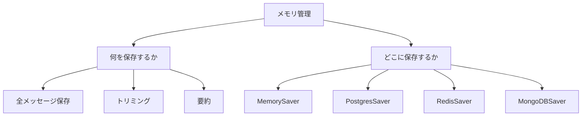

import Quiz from '@/components/content/Quiz.astro'

## 概要

LangChainのメモリ管理は多くのイテレーションを経てきました．このレクチャーでは，最新のベストプラクティスとして，メッセージの保存戦略（全保存，トリミング，要約），LangGraphチェックポインターによる永続化，そしてそれらの実践的な使い方を包括的に解説します．



## メモリ管理の3つの戦略

### 1. 全メッセージをそのまま保存（Stuffing）

すべてのメッセージをLLMコンテキストに詰め込む最も単純な方法です．

```python
from langchain_core.prompts import ChatPromptTemplate, MessagesPlaceholder

prompt = ChatPromptTemplate.from_messages([
    ("system", "あなたは親切なアシスタントです．"),
    MessagesPlaceholder(variable_name="messages"),
])

# 過去の会話履歴を渡す
chain.invoke({
    "messages": [
        HumanMessage(content="こんにちは"),
        AIMessage(content="こんにちは！何かお手伝いできますか？"),
        HumanMessage(content="LangChainについて教えてください"),
    ]
})
```

- 短い会話に適している
- 最も簡単な開始方法
- トークン制限に達する可能性がある

ただし，大きなコンテキストウィンドウ（例: Gemini 1.5 Proの100万トークン）を使用しても:
- コストが増大する
- 応答が遅くなる
- 不要な情報が多いと品質が低下する（ゴミを入れればゴミが出る）

### 2. トリミング（古いメッセージを除去）

古いメッセージを除去して，関連性の高い最近のメッセージのみを保持します．

```python
from langchain_core.messages import trim_messages

trimmer = trim_messages(
    strategy="last",       # 最新のメッセージを保持
    max_tokens=1000,       # 最大トークン数
    token_counter=len,     # トークンカウンターの関数
)

# メッセージをトリムしてからLLMに送信
trimmed = trimmer.invoke(all_messages)
```

- トークン数やメッセージ数でトリミング可能
- 多様なオプションが用意されている
- ヒューリスティックなアプローチ（古いメッセージが重要な場合もある）

### 3. 要約（サマライゼーション）

すべてのメッセージを要約し，要約のみを保存します．

```python
summary_prompt = """
以下の会話履歴を簡潔に要約してください:
{history}
"""

# 会話履歴を要約
summary = llm.invoke(summary_prompt.format(history=all_messages))

# 要約を保存し，元のメッセージは削除
```

- トークンを最も効率的に節約
- 要約後に元のメッセージを削除可能
- コンテキストの精度を維持しつつコストを削減

## メッセージの永続化: LangGraphチェックポインター

メッセージの保存場所と永続化方法について，LangGraphのチェックポインター（Checkpointer）が最新の推奨手法です．

### チェックポインターとは

ユーザーのメッセージやAIの応答が送信されるたびに，自動的にデータベースに永続化する仕組みです．

### 利用可能なチェックポインター

| チェックポインター | 保存先 |
|---|---|
| MemorySaver | メモリ（永続化なし，開発用） |
| PostgresSaver | PostgreSQL |
| MySQLSaver | MySQL |
| RedisSaver | Redis |
| MongoDBSaver | MongoDB |

```python
from langgraph.checkpoint.memory import MemorySaver

# チェックポインターを作成
checkpointer = MemorySaver()

# LangGraphグラフに渡す
graph = create_graph(checkpointer=checkpointer)
```

チェックポインターオブジェクトを作成してグラフに渡すだけで，すべての永続化処理が自動的に行われます．

## 全体の構成

メモリ管理は2つの側面から成ります:

1. 何を保存するか: 全メッセージ / トリムされたメッセージ / 要約
2. どこに保存するか: LangGraphチェックポインターによる永続化

独自の処理ロジックを追加することも容易で，アプリケーションに最適なメモリ戦略をカスタマイズできます．

## まとめ

- メモリ管理には全保存，トリミング，要約の3つの戦略がある
- 全保存は簡単だがトークン制限に達するリスクがある
- トリミングは古いメッセージを除去してトークンを節約
- 要約は最もトークン効率が高い
- メッセージの永続化にはLangGraphのチェックポインターが推奨
- PostgreSQL，MySQL，Redis，MongoDBなど複数のストレージに対応

<Quiz questions={[
  {
    question: "メモリ管理のトリミング戦略の特徴として正しいものはどれですか？",
    options: [
      "すべてのメッセージを保存する",
      "古いメッセージを除去して最近のメッセージのみ保持する",
      "メッセージを要約して保存する",
      "メッセージをバイナリ形式で圧縮する"
    ],
    answer: 1,
    explanation: "トリミング戦略は古いメッセージを除去して，関連性の高い最近のメッセージのみを保持することでトークンを節約します．"
  },
  {
    question: "MemorySaverチェックポインターの用途として正しいものはどれですか？",
    options: [
      "本番環境でのメッセージ永続化",
      "開発・テスト用のメモリ内保存（永続化なし）",
      "分散システムでのデータ同期",
      "暗号化されたメッセージの保存"
    ],
    answer: 1,
    explanation: "MemorySaverはメモリ内に保存するだけで永続化されないため，開発・テスト用途に適しています．本番環境ではPostgresSaverなどを使います．"
  },
  {
    question: "大きなコンテキストウィンドウを使用しても全メッセージ保存が問題になる理由は何ですか？",
    options: [
      "モデルが大きなコンテキストを処理できない",
      "コスト増大，応答遅延，不要な情報による品質低下",
      "APIキーの制限に達する",
      "メッセージが暗号化されてしまう"
    ],
    answer: 1,
    explanation: "大きなコンテキストウィンドウでも，コストが増大し，応答が遅くなり，不要な情報が多いと品質が低下する問題があります．"
  },
  {
    question: "LangGraphチェックポインターの動作として正しいものはどれですか？",
    options: [
      "手動でメッセージを保存する必要がある",
      "メッセージやAIの応答が送信されるたびに自動的にデータベースに永続化する",
      "一定時間ごとにバッチで保存する",
      "セッション終了時にのみ保存する"
    ],
    answer: 1,
    explanation: "LangGraphチェックポインターはメッセージやAIの応答が送信されるたびに自動的にデータベースに永続化します．"
  },
  {
    question: "要約（サマライゼーション）戦略の最大の利点は何ですか？",
    options: [
      "実装が最も簡単",
      "トークンを最も効率的に節約できる",
      "メッセージの原文を完全に保持できる",
      "API呼び出しが不要"
    ],
    answer: 1,
    explanation: "要約戦略はすべてのメッセージを要約して保存するため，トークンを最も効率的に節約できます．要約後に元のメッセージを削除することも可能です．"
  }
]} />
