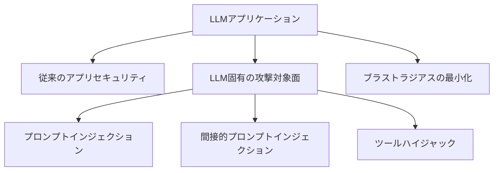

import Quiz from '@/components/content/Quiz.astro'

## 概要

LLMアプリケーションのセキュリティは，従来のアプリケーションセキュリティに加えて，LLMという新しいオブジェクトが導入することで生まれる新たな攻撃対象面に対処する必要があります．このレクチャーでは，LLMアプリケーションセキュリティの基礎と，このセクションで学ぶ内容の全体像を紹介します．

## LLMアプリケーションの特殊性

LLMアプリケーションは依然として「アプリケーション」です．従来のアプリケーションセキュリティの知識はすべて適用されますが，LLMという新しいオブジェクトの導入により，新たな攻撃対象面が生まれます．

### 新たな攻撃対象面

LLMは以下を受け取り，出力します:

- 入力: テキスト，画像，動画，音声など
- 出力: テキスト，画像，動画など

このLLMを導入するだけで，悪意のあるアクターがシステムを攻撃するための新しい攻撃対象面が生まれます．

## LLMアプリケーションの2つの種類

### 1. エージェンティックアプリケーション（AIエージェント）

LLMが意思決定者・推論エンジンとして機能し，後続の実行内容を決定するアプリケーションです．

- 完全自律型（例: Claude Code）
- 制限付き型（フローは開発者が定義，LLMがフロー内の選択を行う）

### 2. アジェンティックアプリケーション

ユーザーがフローを定義しつつ，LLMにフロー内の分岐の選択を委ねるアプリケーションです．

## このセクションで学ぶ内容

### 脆弱性の種類

- プロンプトインジェクション
- 間接的プロンプトインジェクション
- ツールハイジャック
- その他のLLM固有の脆弱性

### セキュリティのベストプラクティス

安全なアプリケーションを「デフォルトで安全」にするための厳格なルールとアーキテクチャを学びます．

## ブラストラジアス（爆発半径）

攻撃者がシステムに侵入した場合，何ができてしまうかの範囲を「ブラストラジアス」と呼びます:

- ユーザーのファイルにアクセスできるか？
- 悪意のあるコードを実行できるか？
- データベースにアクセスできるか？

アプリケーション開発の目標は，このブラストラジアスを最小限に抑えることです．

## セキュリティの重要性

多くのエンジニアにとって，セキュリティは優先度が低くなりがちです．機能の実装とデプロイを急ぐあまり，セキュリティが後回しになることが多いです．しかし，LLMアプリケーションの場合:

- 新しい攻撃ベクトルが存在する
- 従来のセキュリティ知識だけでは不十分
- セキュリティを意識した開発が不可欠

## まとめ

- LLMアプリケーションは従来のアプリセキュリティに加え，LLM固有の攻撃対象面を持つ
- プロンプトインジェクション，ツールハイジャックなどの新しい脆弱性がある
- ブラストラジアス（被害範囲）を最小化することがセキュリティの目標
- セキュリティを「デフォルトで安全」にするアーキテクチャとベストプラクティスが重要
- 機能開発だけでなく，セキュリティも同時に考慮する必要がある

<Quiz questions={[
  {
    question: "LLMアプリケーションセキュリティが従来のアプリセキュリティと異なる点は何ですか？",
    options: [
      "従来のセキュリティ知識が不要になる",
      "LLMという新しいオブジェクトの導入により新たな攻撃対象面が生まれる",
      "セキュリティが自動的に保証される",
      "ネットワークセキュリティが不要になる"
    ],
    answer: 1,
    explanation: "LLMアプリケーションは従来のアプリセキュリティに加えて，LLMの導入により生まれる新たな攻撃対象面（プロンプトインジェクションなど）に対処する必要があります．"
  },
  {
    question: "ブラストラジアス（爆発半径）とは何ですか？",
    options: [
      "LLMの出力トークン数の上限",
      "攻撃者がシステムに侵入した場合にできることの範囲",
      "アプリケーションの処理速度",
      "ユーザー数の上限"
    ],
    answer: 1,
    explanation: "ブラストラジアスは攻撃者がシステムに侵入した場合に何ができてしまうかの範囲を指し，これを最小限に抑えることがセキュリティの目標です．"
  },
  {
    question: "このセクションで学ぶ脆弱性の種類に含まれないものはどれですか？",
    options: [
      "プロンプトインジェクション",
      "間接的プロンプトインジェクション",
      "ツールハイジャック",
      "DNSスプーフィング"
    ],
    answer: 3,
    explanation: "このセクションではプロンプトインジェクション，間接的プロンプトインジェクション，ツールハイジャックなどのLLM固有の脆弱性を学びます．DNSスプーフィングは従来のネットワーク攻撃です．"
  },
  {
    question: "エージェンティックアプリケーションの特徴として正しいものはどれですか？",
    options: [
      "ユーザーがすべての処理を手動で制御する",
      "LLMが意思決定者・推論エンジンとして機能し後続の実行内容を決定する",
      "LLMを使用しないアプリケーション",
      "セキュリティが自動的に保証されるアプリケーション"
    ],
    answer: 1,
    explanation: "エージェンティックアプリケーションではLLMが意思決定者・推論エンジンとして機能し，後続の実行内容を決定します．完全自律型と制限付き型があります．"
  },
  {
    question: "セキュリティの「デフォルトで安全」とはどのような意味ですか？",
    options: [
      "セキュリティ対策を後から追加すること",
      "アーキテクチャとベストプラクティスにより最初からセキュリティが組み込まれていること",
      "ファイアウォールだけで保護すること",
      "セキュリティテストを省略すること"
    ],
    answer: 1,
    explanation: "デフォルトで安全とは，厳格なルールとアーキテクチャにより，最初からセキュリティが組み込まれた状態でアプリケーションを設計・開発することを指します．"
  }
]} />
