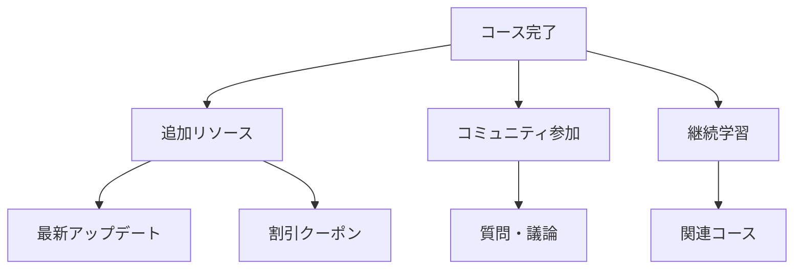

import Quiz from '@/components/content/Quiz.astro'

## 概要

このレクチャーは記事形式のボーナスコンテンツです．コースの追加リソース，今後の学習パス，コミュニティへの参加方法などが紹介されています．

## ボーナスコンテンツ

コースを完了した受講生向けに，以下のような追加リソースが提供されています:

- コースの最新アップデート情報
- 関連する追加学習リソース
- コミュニティグループへのリンク
- 講師への連絡方法
- 他のコースへの割引クーポン

## まとめ

- コースの補足資料や追加リソースが提供されている
- コミュニティを通じて継続的な学習が可能
- 講師と直接連絡を取り，質問や議論ができる

<Quiz questions={[
  {
    question: "このコースで学んだLangChainの主要な用途はどれですか？",
    options: [
      "Webサイトのフロントエンド構築",
      "LLMアプリケーションの構築とAIエージェントの開発",
      "データベースの管理と最適化",
      "モバイルアプリの開発"
    ],
    answer: 1,
    explanation: "このコースではLangChainとLangGraphを使ったLLMアプリケーションの構築とAIエージェントの開発を学びました．"
  },
  {
    question: "コースで紹介された2つの主要なフレームワークはどれですか？",
    options: [
      "ReactとVue.js",
      "DjangoとFlask",
      "LangChainとLangGraph",
      "TensorFlowとPyTorch"
    ],
    answer: 2,
    explanation: "このコースではLangChain（LLMアプリケーション構築フレームワーク）とLangGraph（グラフベースのエージェント構築フレームワーク）を中心に学びました．"
  },
  {
    question: "コースで学んだMCPの正式名称は何ですか？",
    options: [
      "Machine Control Protocol",
      "Model Context Protocol",
      "Multi-Client Platform",
      "Managed Code Pipeline"
    ],
    answer: 1,
    explanation: "MCPはModel Context Protocolの略で，MCPサーバーとMCPクライアント間の標準的な通信プロトコルです．"
  },
  {
    question: "コースで強調されたセキュリティに関する重要な教訓はどれですか？",
    options: [
      "LLMが自動的にセキュリティを保証する",
      "セキュリティは後から追加すればよい",
      "セキュリティの責任は開発者にあり，エージェントに委ねるべきではない",
      "セキュリティテストは不要"
    ],
    answer: 2,
    explanation: "コーディングエージェントはプロアクティブにセキュリティ制御を導入しないため，セキュリティの責任は開発者にあります．"
  },
  {
    question: "継続学習のために活用できるリソースとして正しいものはどれですか？",
    options: [
      "コースの追加リソースとコミュニティグループ",
      "有料の認定試験のみ",
      "講師の個人ブログのみ",
      "YouTubeの無関係な動画"
    ],
    answer: 0,
    explanation: "コース完了後は追加リソース，コミュニティグループ，講師との直接連絡などを活用して継続的に学習を進めることができます．"
  }
]} />
